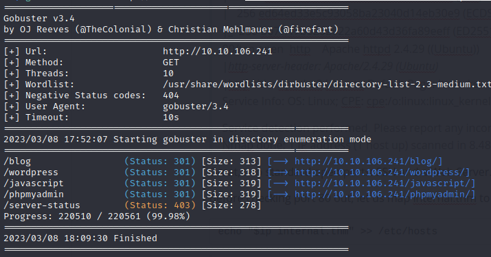
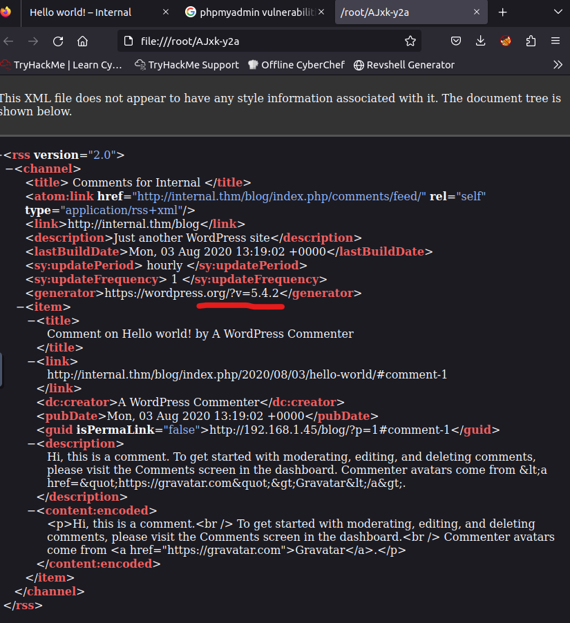

# Internal

"The client requests that an engineer conducts an external, web app, and internal assessment of the provided virtual environment. The client has asked that minimal information be provided about the assessment, wanting the engagement conducted from the eyes of a malicious actor (black box penetration test).  The client has asked that you secure two flags (no location provided) as proof of exploitation":

- User.txt
- Root.txt

## Information

Let's start by performing an nmap scan on the target in order to enumerate its services:

```
nmap $ip -p-
nmap $ip -p 22, 80 -A 
```

> Starting Nmap 7.93 ( https://nmap.org ) at 2023-03-08 17:51 EST
> Nmap scan report for 10.10.106.241
> Host is up (0.045s latency).
>
> PORT   STATE SERVICE VERSION
> 22/tcp open  ssh     OpenSSH 7.6p1 Ubuntu 4ubuntu0.3 (Ubuntu Linux; protocol 2.0)
> | ssh-hostkey: 
> |   2048 6efaefbef65f98b9597bf78eb9c5621e (RSA)
> |   256 ed64ed33e5c93058ba23040d14eb30e9 (ECDSA)
> |_  256 b07f7f7b5262622a60d43d36fa89eeff (ED25519)
> 80/tcp open  http    Apache httpd 2.4.29 ((Ubuntu))
> |_http-server-header: Apache/2.4.29 (Ubuntu)
> |_http-title: Apache2 Ubuntu Default Page: It works
> Service Info: OS: Linux; CPE: cpe:/o:linux:linux_kernel
>
> Service detection performed. Please report any incorrect results at https://nmap.org/submit/ .
> Nmap done: 1 IP address (1 host up) scanned in 8.48 seconds

Great, two standard open ports: SSH and a Web Server. 

Before checking port 80 out, let us map internal.thm to the ip address of the target

```
echo "$ip internal.thm" >> /etc/hosts
```

> The /etc/hosts file is a plain-text file used by the operating system to map hostnames to IP addresses. It is present in most Unix-like operating systems, including Linux, macOS, and BSD.


## Web Enumeration

Since the landing page of the website showcases the Apache2 Ubuntu Default Page, let us perform web enumeration with GoBuster in order to find some hidden resources.

```
gobuster dir -u http://$ip -w /usr/share/wordlists/dirbuster/directory-list-2.3-medium.txt -t 10
```



Wordpress


