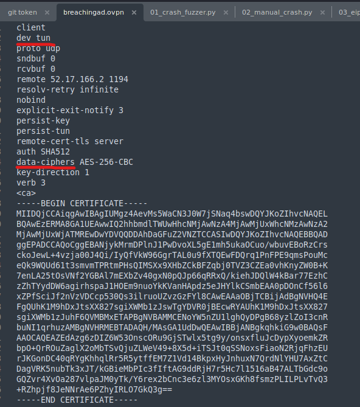
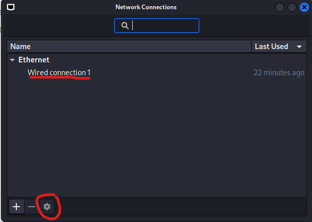
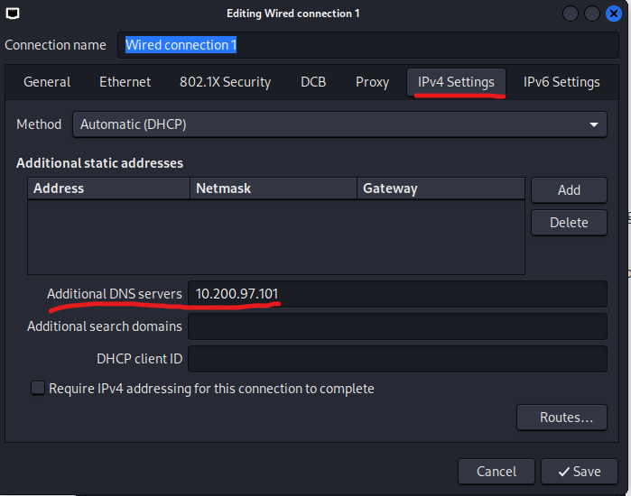

# Breaching AD

Before we can exploit AD misconfigurations for privilege escalation, lateral movement, and goal execution, you need initial access first. You need to acquire an initial set of valid AD credentials. Due to the number of AD services and features, the attack surface for gaining an initial set of AD credentials is usually **significant**.

### VPN Setup

Connect to the VPN:

```
sudo openvpn breachingad.ovpn
```

There are two fixes I had to perform in order to get the connection to work:

1. I had to change the **dev breachad** to **dev tun** in the configuration file.
2. I had to change the **cipher AES-256-CBC** to **data-ciphers AES-256-CBC**. (only needed if you are on openvpn version 2.6)




### DNS Configuration

Now that we have access to the network, we still need to configure DNS. Right now we are only able to ping the IPs of the AD environemnt, in my case: 10.200.97.101 (Domain Controler) and 10.200.97.201 (IIS Server).

In order to be able to ping the hostnames we need to configure the DNS server to the 10.200.97.101. To do this we have to go to Kali's Advanced Network Configuration > IPv4 Settings > Additional DNS servers.






Now you can easily ping thmdc.za.tryhackme.com, thmiis.za.tryhackme.com, etc...


### NTLM Authenticated Services

Since most AD environments have account lockout configured, we won't be able to run a full brute-force attack. Instead, we need to perform a password spraying attack. Instead of trying multiple different passwords, which may trigger the account lockout mechanism, we choose and use one password and attempt to authenticate with all the usernames we have acquired.

In this example, we are going to target http://ntlmauth.za.tryhackme.com/, which hosts a portal where users can login using their AD Credentials and the authentication process is performed using NTLM.

> The script uses the requests python library with the HttpNtlmAuth authentication to perform NTLM (NT LAN Manager) authentication with a remote server. As we have seen, NTLM is a Microsoft authentication protocol used for authentication on Windows-based systems.

THM provides us with a script to perform the password spraying attack, basically we have a list of usernames and a password and we are going to use the script to automatically try the password on all users.


Great! After executing the script we know what users have that password.


After logging in we can see the following content of the login page.

**Question** What is the name of the challenge-response authentication mechanism that uses NTLM?

> NetNtlm

**Question** What is the username of the third valid credential pair found by the password spraying script?

> gordon.stevens

**Question** How many valid credentials pairs were found by the password spraying script?

> 4

**Question** What is the message displayed by the web application when authenticating with a valid credential pair?

> Hello World


### LDAP Bind Credentials

Another method of AD authentication that applications can use is Lightweight Directory Access Protocol (LDAP) authentication. LDAP authentication is similar to NTLM authentication. However, with LDAP authentication, the application directly verifies the user's credentials. The application has a pair of AD credentials that it can use first to query LDAP and then verify the AD user's credentials.

There is a network printer in this network where the administration website does not even require credentials. We can navigate to http://printer.za.tryhackme.com/settings.aspx to find the settings page of the printer.

In this page, we have a set of AD Credentials but we cannot extract the password from its field. But if we press "Test Settings" we can see that the printer authenticates to the Domain Controller with their set of AD Credentials.


In order to exploit this server, if we substitute the IP address with our IP and open a netcat port to LDAP 389, maybe we can extract more information.


The **supportedCapabilitiesresponse** tells us we have a problem. Essentially, before the printer sends over the credentials, it is trying to negotiate the LDAP authentication method details. Before the printer sends over the credentials, it is trying to negotiate the LDAP authentication method details. It will use this negotiation to select the most secure authentication method that both the printer and the LDAP server support.

We will need to create a rogue LDAP server and configure it insecurely to ensure the credentials are sent in plaintext.

Run the commands below and follow the configuration steps on THM:

```
#Install and Start
sudo apt-get update && sudo apt-get -y install slapd ldap-utils && sudo systemctl enable slapd

#Configure Server
sudo dpkg-reconfigure -p low slapd

#Substitute .ldif file
sudo ldapmodify -Y EXTERNAL -H ldapi:// -f ./olcSaslSecProps.ldif && sudo service slapd restart

#Check Configuration
ldapsearch -H ldap:// -x -LLL -s base -b "" supportedSASLMechanisms

#Listen for connection
sudo tcpdump -SX -i tun tcp port 389
```

After launching tcpdum we can substitute the Server in the browser with our ip and press "Test Settings".

After inspecting the output we can recover the password!

> If  after checking the configuration the LOGIN and PLAIN authentication methods do not appear, do not worry you will be able to recover the password anyways after inspecting the traffic

**Question**

> LDAP Pass-back Attack

**Question** What two authentication mechanisms do we allow on our rogue LDAP server to downgrade the authentication and make it clear text?

> LOGIN,PLAIN

**Question** What is the password associated with the svcLDAP account?

> \<Redacted\>


### Authentication Relays

In Windows networks, there are a significant amount of services talking to each other, allowing users to make use of the services provided by the network.

These services have to use built-in authentication methods to verify the identity of incoming connections.

In this task we are going to intercept an NetNTLM Challenge using a tool called **Responder**. This tools is used to capture network authentication credentials passed over SMB, HTTP, and other protocols. It is designed to be used in environments where the network is configured to allow direct communication between devices, and it can be used to capture credentials from protocols such as NTLMv1/NTLMv2, HTTP Basic, and others.

Responder works by listening for network traffic and responding to authentication requests with a spoofed response that forces the client to send its credentials. It can be used to launch man-in-the-middle (MITM) attacks on network authentication processes, allowing the attacker to capture sensitive information such as usernames and passwords.

Responder can also be used to perform other types of attacks, such as LLMNR/NBT-NS poisoning and SMB Relay attacks, which can be used to escalate privileges and gain access to sensitive resources on the network.

Hence, if we intercept traffic using the command below we will be able to potentially trick a server on the network into trying to authenticate with its credentials to our spoofed server.

```
sudo responder -I tun0
```

After waiting a bit we get the following response:


After this you should copy the entirety of the NTLMv2-SSP Hash to the hash.txt file and run the command:

```
hashcat -m 5600 hash.txt passwordlist.txt --force
```

Great! We have a set of AD credentials.

**Question** What is the name of the tool we can use to poison and capture authentication requests on the network?

> Responder

**Question** What is the username associated with the challenge that was captured?

> \<Redacted\>

**Question** What is the value of the cracked password associated with the challenge that was captured?

> \<Redacted\>


### Microsoft Deployment Toolkit

Microsoft Deployment Toolkit (MDT) is a Microsoft service that assists with automating the deployment of Microsoft Operating Systems (OS). Usually, MDT is integrated with Microsoft's System Center Configuration Manager (SCCM), which manages all updates for all Microsoft applications, services, and operating systems. MDT is used for new deployments.

In the task at hand, there is an MDT server that we are going to take advantage of to extract the boot image and get the AD credentials from it.

Large organisations use PXE boot to allow new devices that are connected to the network to load and install the OS directly over a network connection. MDT can be used to create, manage, and host PXE boot images.

We can see a set of .bcd files in http://pxeboot.za.tryhackme.com/. We can use PowerPXE and its Get-WimFile powerpxe to recover the locations of the PXE Boot images from the BCD file. Finally we are going to extract the credentials from the PXE Boot file with the Get-FindCredentials function from PowerPXE.

> BCD files are used by the Windows bootloader to store configuration data about how the operating system should be loaded. On the other hand, WIM files are a file-based disk image format used by Windows for backup, deployment, and installation purposes.
>
> WIM files are a file-based disk image format used by Windows for backup, deployment, and installation purposes. WIM files are similar to other disk image formats, such as ISO files, but they offer greater flexibility and compression options. WIM files can contain one or more Windows images, and they can be deployed using a variety of tools, such as the Windows Deployment Services (WDS), System Center Configuration Manager (SCCM), or the Deployment Image Servicing and Management (DISM) tool.


First thing is to extract the IP of the MDT server by checking the diagram or running `nslookup thmdt.za.tryhackme.com`. After this we are going to connect to the THMJMP1 server using ssh

```
ssh thm@THMJMP1.za.tryhackme.com
```

Next, we are going to download the .bcd file using Trivial File Transfer Protocol (TFTP):

```
tftp -i 10.200.97.202 GET "\Tmp\x64{39...28}.bcd" conf.bcd
```

Next we are going to set the powershell execution policy to bypass and load the PowerPXE module to complete the task at hand.

```
powershell -executionpolicy bypass
```

> The -ExecutionPolicy Bypass parameter can be added to a PowerShell command or script to bypass the execution policy set on the system and allow the execution of the script or command without any restrictions. This can be useful when running scripts or commands that are not signed or when running scripts or commands that require elevated privileges.


This command will load the PowerPXE module which is already stored on the target machine and extract the location of the PXE file from the the BCD file:

```
Import-Module C:\powerpxe\PowerPXE.ps1
Get-WimFile -bcdFile conf.bcd
```

Finally all we have to do is download the .wim file and use the Get-FindCredentials module to extract the Credentials from it.

```
 tftp -i 10.200.97.202 GET "<WIM File Location>" pxeboot.wim
 Get-FindCredentials -WimFile pxeboot.wim
```


**Question** What Microsoft tool is used to create and host PXE Boot images in organisations?

> Microsoft Deployment Toolkit

**Question** What network protocol is used for recovery of files from the MDT server?

> TFTP

**Question** What is the username associated with the account that was stored in the PXE Boot image?

> \<Redacted\>

**Question** What is the password associated with the account that was stored in the PXE Boot image?

> \<Redacted\>


### Configuration Files

In this task we are going to recover AD credentials from McAfee Enterprise Endpoint Security configuration files.

McAfee embeds the credentials used during installation to connect back to the orchestrator in a file called ma.db. This database file can be retrieved and read with local access to the host to recover the associated AD service account.

The ma.db file is stored in a fixed location: C:/ProgramData/McAfee/Agent/DB/ma.db

```
scp thm@THMJMP1.za.tryhackme.com:C:/ProgramData/McAfee/Agent/DB/ma.db .
```

After copying the file to our machine with the command above we can analyze it using `sqlitebrowser`

```
sqlitebrowser ma.db
```

We can find a set of credentials in the AGENT_REPOSITORIES table, but in order to decrypt the password we have to use a python2 script. In my case, I had to connect to the Attack Box to make it work since I was missing one of the libraries it required.

```
python2 mcafee_sitelist_pwd_decrypt.py <ENCRYPTED PASSWORD>
```


**Question** What type of files often contain stored credentials on hosts?

> Configuration Files

**Question** What is the name of the McAfee database that stores configuration including credentials used to connect to the orchestrator?

> ma.db

**Question** What table in this database stores the credentials of the orchestrator?

> AGENT_REPOSITORIES

**Question** What is the username of the AD account associated with the McAfee service?

> \<Redacted\>

**Question** What is the password of the AD account associated with the McAfee service?

> \<Redacted\>

Great! We have completed Breaching AD!
