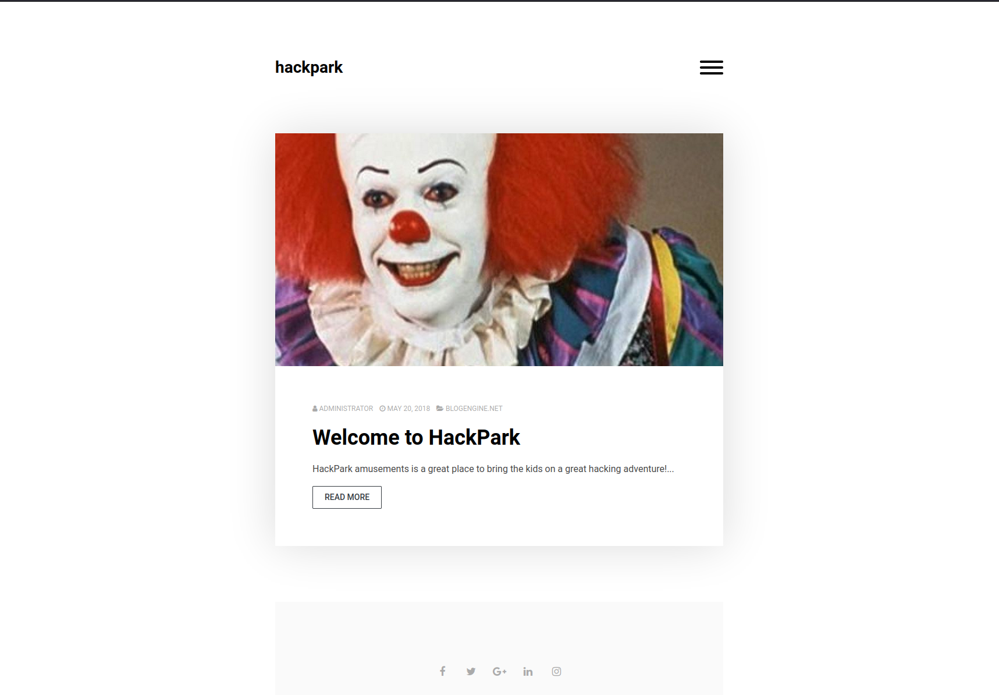
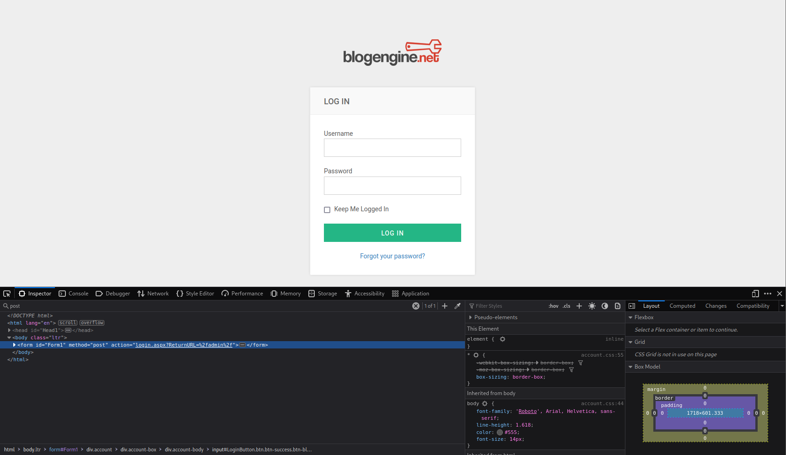
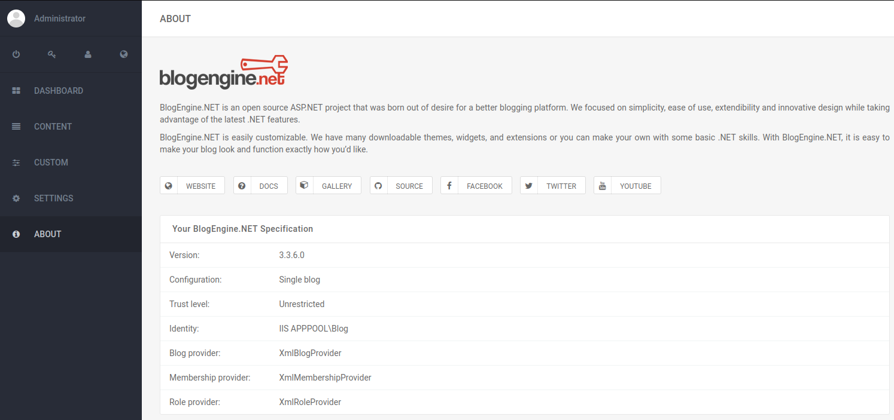

# HackPark

[TOC]

## Introduction

According to THM "This room will cover brute-forcing an accounts credentials, handling public exploits, using the Metasploit framework and privilege escalation on Windows".

Let's get started!

## Service Scanning

After deploying the machine the first order of business would be performing a port scan on the target in order to check for active services.

```
nmap $ip
```

> Starting Nmap 7.93 ( https://nmap.org ) at 2023-02-20 15:42 EST
> Nmap scan report for 10.10.121.195
> Host is up (0.046s latency).
> Not shown: 998 filtered tcp ports (no-response)
> PORT     STATE SERVICE
> **80/tcp   open  http**
> **3389/tcp open  ms-wbt-server**

We can see that the target is hosting RDP and HTTP. Since we do not have credentials to log in via RDP, let us explore the web page.

We can navigate to the web server using http://$ip.



**Question** What is the name of the clown displayed on the homepage?

> Pennywise

We can save the image and perform a reverse image search to easily find out the answer to this question (eg: using Google Reverse image search by pressing the camera icon below).


## Using Hydra to Brute-force a login

The web page has a log in page which can be accessible after providing correct username and password credentials.



**Question** What request type is the Windows website login form using?

> Post
>
> If we check the form element it has a method type post.

THM already provides us with the hint that we should use Hydra to brute force the log in credentials to this page.

In order to do this, we need to know the body of the request. We can use the browser or alternatively Burp Suite to achieve this goal.

By going in the **Network Tab**, we can select the Post Request, go to 

```
c
```


Great! Now we just have to build our Hydra command using this information:

```
hydra $ip http-post-form "/Account/login.aspx?ReturnURL=/admin/:__VIEWSTATE=WpID4%2FU5w%2F2%2FqqbnSVa4dh64FAH%2BMtHTZAh2b15CxaXhtdfbgarzcTTAWB5wFqmRq3rzJDUk4jjy9ZVoEIVzOkxmAqKP4PQPqk%2BuV3xVCJB1xMn62TX3wLdsay88KKdPK5A46LbZsXt3%2BMcqx0d8Ss9vWnF6a49s%2FT5UCNNYbyKr3tcs&__EVENTVALIDATION=TrlLhwjD5ZI1cL0Bmbq9OYy3fHFIVndZioS3cGeGANWeyIL3K6zxiIOlUxkyB5pvhmgYUBBY8Em6IsGTyK9cRjOcqiwNcsDhWurDE0dZEtWc2KRDbtWRuMxXyxKcl5CtE0ZVe8KHpeZ2l8bkNvsdmFsLWqJKxqdGndDinJA8A6oHTfGN&ctl00%24MainContent%24LoginUser%24UserName=^USER^&ctl00%24MainContent%24LoginUser%24Password=^PASS^&ctl00%24MainContent%24LoginUser%24LoginButton=Log+in:Login failed" -l admin -P /usr/share/wordlists/rockyou.txt -f -V 
```

> $ip: The target IP address 
>
> http-post-form: Method which will be used in the requests
>
> /Account/login.aspx?ReturnURL=/admin/: Specify path to attack, the login Post request in our case
>
> __VIEWSTATE .... =Log+in: Body of the requests which contains a ^USER^ and a ^PASS^ fields which will be replaced with wordlists or static values
>
> -l: static username value to use in the requests performed by hydra
>
> -P: Password wordlist of values to use in the requests performed by hydra
>
> -f: Quit after a hit
>
> -V: Verbose output


Great as you can see we got a hit!

**Question** Guess a username, choose a password wordlist and gain credentials to a user account!

> <Redacted>


## Compromise the Machine

After logging we can explore a little bit and one of the pieces of information we can extract in the software being used for this backend area as well as its version.



**Question** Now you have logged into the website, are you able to identify the version of the BlogEngine?

> 3.3.6.0

Now that we know the software version of the backend framework let us search for an existing exploit using searchsploit in the command line or exploit-db.com.


