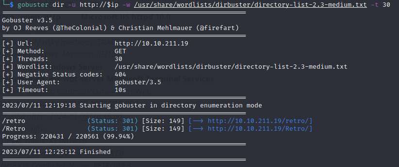
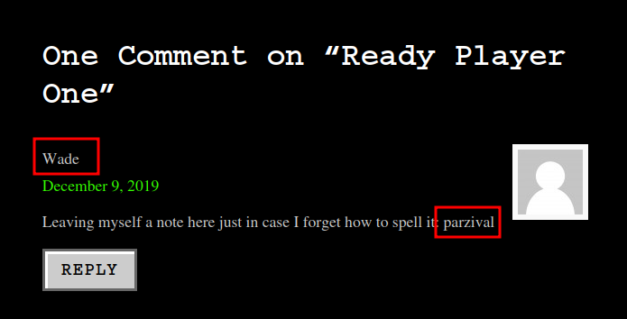

# Blaster

In this room we are going to attempt the **Blaster** machine which is a remake of the previous machine "Retro" in which the Privilege Escalation vector used was CVE-2019-1388.

### Port Enumeration

```
nmap $ip -A -T4 -p-
```

> PORT     STATE SERVICE       VERSION
> **80/tcp   open  http          Microsoft IIS httpd 10.0**
> | http-methods: 
> |_  Potentially risky methods: TRACE
> |_http-server-header: Microsoft-IIS/10.0
> |_http-title: **IIS Windows Server**
> **3389/tcp open  ms-wbt-server Microsoft Terminal Services**
> | ssl-cert: Subject: commonName=RetroWeb
> | Not valid before: 2023-07-10T16:15:00
> |_Not valid after:  2024-01-09T16:15:00
> | rdp-ntlm-info: 
> |   Target_Name: RETROWEB
> |   NetBIOS_Domain_Name: RETROWEB
> |   NetBIOS_Computer_Name: RETROWEB
> |   DNS_Domain_Name: RetroWeb
> |   DNS_Computer_Name: RetroWeb
> |   Product_Version: 10.0.14393
> |_  System_Time: 2023-07-11T16:16:50+00:00
> |_ssl-date: 2023-07-11T16:16:55+00:00; 0s from scanner time.
> Service Info: OS: Windows; CPE: cpe:/o:microsoft:windows

**Question** How many ports are open on our target system?

> 2

**Question** Looks like there's a web server running, what is the title of the page we discover when browsing to it?

> IIS Windows Server

### Directory Enumeration

```
gobuster dir -u http://$ip -w /usr/share/wordlists/dirbuster/directory-list-2.3-medium.txt -t 30
```



**Question** Interesting, let's see if there's anything else on this web server by fuzzing it. What hidden directory do we discover?

> /retro

### Manual Enumeration

Checking one comment I was able to find a pair of credentials:



**Question** Navigate to our discovered hidden directory, what potential username do we discover?

> wade

**Question** Crawling through the posts, it seems like our user has had some difficulties logging in recently. What possible password do we discover?

> parzival

### Foothold

Login with RDP

```
xfreerdp /v:$ip /u:Wade /p:parzival
```

**Question** Log into the machine via Microsoft Remote Desktop (MSRDP) and read user.txt. What are it's contents?

> THM{HACK_PLAYER_ONE}

### Privilege Escalation

**Question** When enumerating a machine, it's often useful to look at what the user was last doing. Look around the machine and see if you can find the CVE which was researched on this server. What CVE was it?

> CVE-2019-1388

We can see the file we are going to use to escalate our privileges in the desktop.

**Question** Looks like an executable file is necessary for exploitation of this vulnerability and the user didn't really clean up very well after testing it. What is the name of this executable?

> hhupd

Run it, open the link. This should open a tab as system. Go to File > Save as...

```
C:\Windows\System32\*.*
```

Search this so that all files appear, right click on CMD and press Open.

You did it!

**Question** Now that we've spawned a terminal, let's go ahead and run the command 'whoami'. What is the output of running this?

> nt authority\system

**Question** Now that we've confirmed that we have an elevated prompt, read the contents of root.txt on the Administrator's desktop. What are the contents? Keep your terminal up after exploitation so we can use it in task four!

> THM{COIN_OPERATED_EXPLOITATION}
