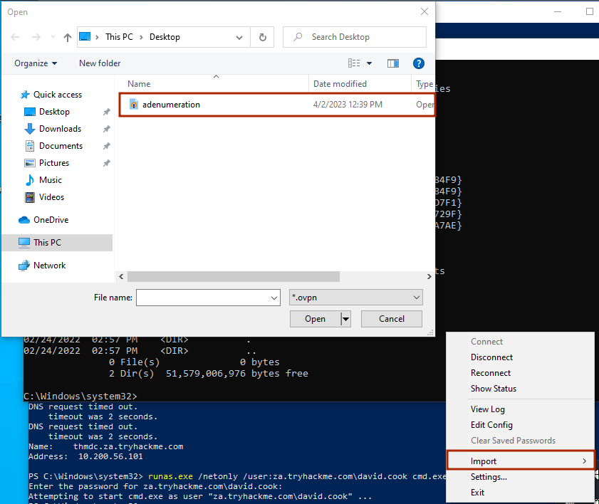
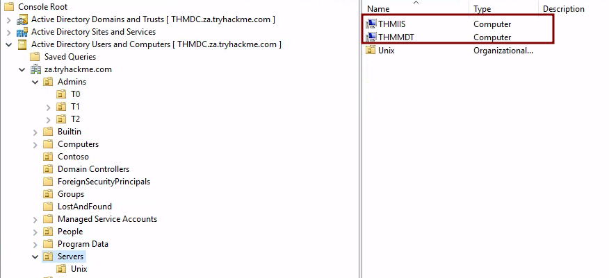
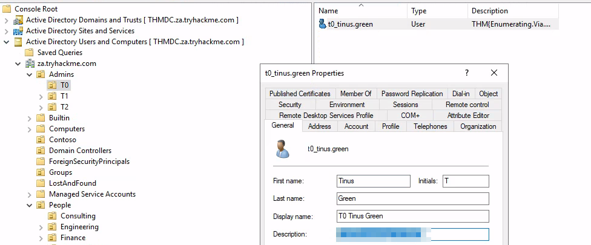
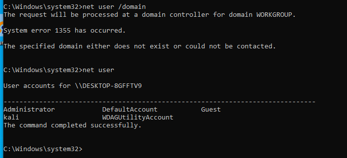
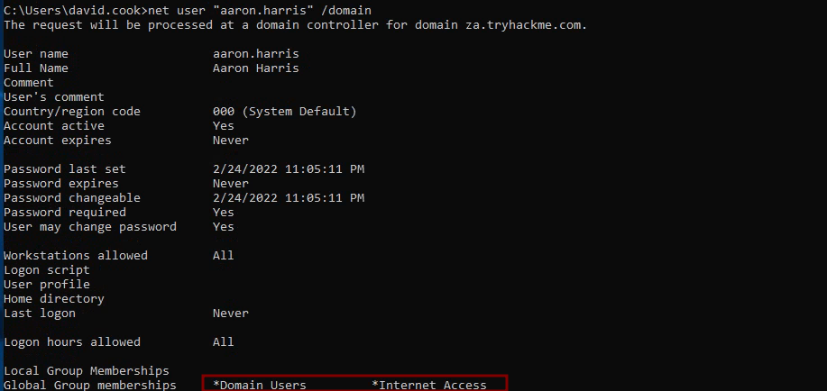
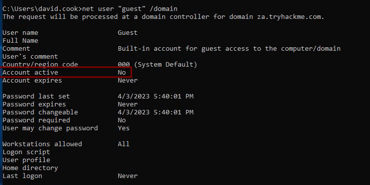
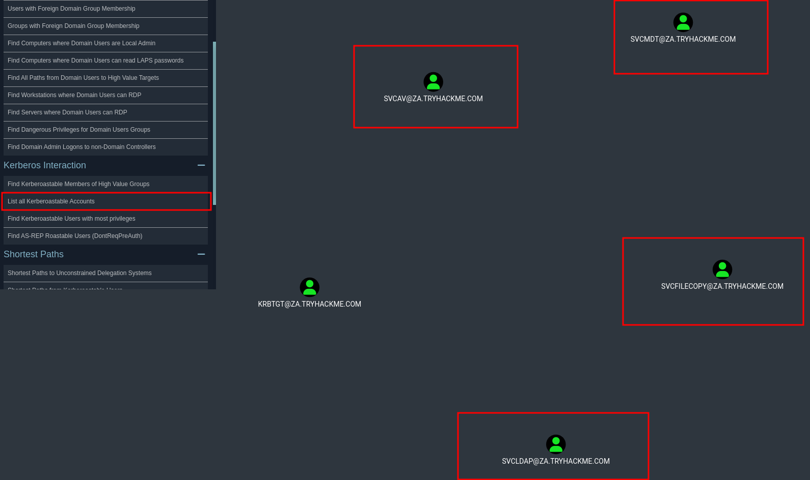
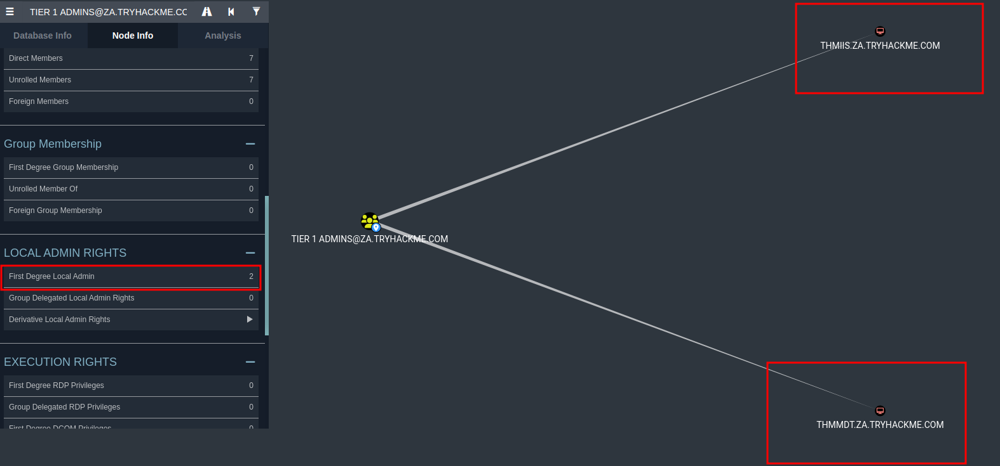

# Enumerating AD

In this room we are going to learn a set of AD enumeration techniques using different tools. Before we begin our exercise we need to configure our VPN and DNS. If you are curious how you can do this in Kali you can check my previous walkthrough on "Breaching AD".

In this room we are going to follow the setup on a Windows VM. We are going to do this, since a lot of enumeration techniques are best performed using Windows ("know your enemy"). 

### VPN Setup

Install OpenVPN on your Windows VM and import the configuration file from THM:



I performed the same two fixes I did on Kali (not sure if it is required) in order to get the connection to work:

1. I had to change the **dev enumad** to **dev tun** in the configuration file.
2. I had to change the **cipher AES-256-CBC** to **data-ciphers AES-256-CBC**. (only needed if you are on openvpn version 2.6)


### DNS Configuration

I first connected to the VPN using Kali and got a pair of credentials after visiting: http://distributor.za.tryhackme.com/creds

You can do this in your Windows machine after configuring DNS.

```
$dnsip = "<DC IP>"
$index = Get-NetAdapter -Name '<Interface>' | Select-Object -ExpandProperty 'ifIndex'
Set-DnsClientServerAddress -InterfaceIndex $index -ServerAddresses $dnsip
```

The interface should be the one that is connected to the THM network, you can check this using `ipconfig`.

After the configuration is set you can confirm the associated DNS server in `ipconfig /all`

We can check if we have configured DNS correctly by using:

```
nslookup za.tryhackme.com
```


### Credential Injection

We can check if the credentials we found are valid using the `runas.exe` binary.

```
runas.exe /netonly /user:za.tryhackme.com\<username> cmd.exe
```

Once you run this command, you will be prompted to supply a password. Note that since we added the /netonly parameter, **the credentials will not be verified directly by a domain controller so that it will accept any password**. We still need to confirm that the network credentials are loaded successfully and correctly.

Additionally, you should make sure that you run your first Command Prompt as Administrator. This will inject an Administrator token into CMD. If you run tools that require local Administrative privileges from your Runas spawned CMD, the token will already be available. This does not give you administrative privileges on the network, but will ensure that any local commands you execute, will execute with administrative privileges.

We can check if the credentials we found are valid by listing SYSVOL. Any AD account, no matter how low-privileged, can read the contents of the SYSVOL directory.

```
dir \\za.tryhackme.com\SYSVOL\
```

> As a side note, there is a difference between using the IP Address or the hostname of the target. According to THM,  it boils down to the authentication method being used. When we provide the hostname, network authentication will attempt first to perform Kerberos authentication. Since Kerberos authentication uses hostnames embedded in the tickets, if we provide the IP instead, we can force the authentication type to be NTLM. While on the surface, this does not matter to us right now, it is good to understand these slight differences since they can allow you to remain more stealthy during a Red team assessment. In some instances, organisations will be monitoring for OverPass- and Pass-The-Hash Attacks. Forcing NTLM authentication is a good trick to have in the book to avoid detection in these cases.\


**Question** What native Windows binary allows us to inject credentials legitimately into memory?

> runas.exe

**Question** What parameter option of the runas binary will ensure that the injected credentials are used for all network connections?

> /netonly

**Question** What network folder on a domain controller is accessible by any authenticated AD account and stores GPO information?

> SYSVOL

**Question** When performing dir \\za.tryhackme.com\SYSVOL, what type of authentication is performed by default?

> Kerberos Authentication


### Enumeration through Microsoft Management Console

We should now go to our Windows Machine **Install RSAT: Active Directory Domain Services and Lightweight Directory Tools**  and open the Microsoft Management Console with the command:

```
runas.exe /netonly /user:za.tryhackme.com\<username> mmc.exe
```

After doing this and configurating each entry with the correct domain we are going to answer some questions.

How many Computer objects are part of the Servers OU?

> 2
>
> 

How many Computer objects are part of the Workstations OU?

> 1
>
> 

How many departments (Organisational Units) does this organisation consist of?

> 7
>
> 

How many Admin tiers does this organisation have?

> 3
>
> 

What is the value of the flag stored in the description attribute of the t0_tinus.green account?

> \<Redacted\>
>
> 


### Enumerating through Command Prompt

CMD has a built-in command that we can use to enumerate information about AD, namely net. The net command is a handy tool to enumerate information about the local system and AD.

Unfortunately one of the drawbacks of enumerating using the Command Prompt is that it can only be performed from a domain-joined machine which is not the case of our local Windows Machine. Therefore, we must connect through RDP to perform this task.




**Question** Apart from the Domain Users group, what other group is the aaron.harris account a member of?

> Internet Access
>
> 

**Question** Is the Guest account active? (Yay,Nay)

> Nay
>
> 

**Question** How many accounts are a member of the Tier 1 Admins group?

> 7
>
> 

**Question** What is the account lockout duration of the current password policy in minutes?

> 30
>
> 


### Enumeration through Powershell

We can complete this task:

1. RDP in and execute Powershell
2. SSH in and launch powershell
3. On our local Windows VM launching powershell on a runas.exe launched powershell with our AD credentials

**Question** What is the value of the Title attribute of Beth Nolan (beth.nolan)?

> Senior
>
> 

**Question** What is the value of the DistinguishedName attribute of Annette Manning (annette.manning)?

> CN=annette.manning,OU=Marketing,OU=People,DC=za,DC=tryhackme,DC=com
>
> 

**Question** When was the Tier 2 Admins group created?

> 2/24/2022 10:04:41 PM (We have to take Timezone into consideration)
>
> 

**Question** What is the value of the SID attribute of the Enterprise Admins group?

> S-1-5-21-3330634377-1326264276-632209373-519
>
> 

**Question** Which container is used to store deleted AD objects?

> CN=Deleted Objects,DC=za,DC=tryhackme,DC=com
>
> 


### Enumeration through Bloodhound

The commands you should use to generate the set of Json files are:

```
SharpHound.exe --CollectionMethods All --Domain za.tryhackme.com --ExcludeDCs
```

And to launch BloodHound:

```
neo4j console start
bloodhound --no-sandbox
```

Import the output from SharpHound and answer the questions below:

**Question** What command can be used to execute Sharphound.exe and request that it recovers Session information only from the za.tryhackme.com domain without touching domain controllers?

> Sharphound.exe --CollectionMethods Session --Domain za.tryhackme.com --ExcludeDCs

**Question** Apart from the krbtgt account, how many other accounts are potentially kerberoastable?

> 4
>
> 

**Question** How many machines do members of the Tier 1 Admins group have administrative access to?

> 2
>
> 

**Question** How many users are members of the Tier 2 Admins group?

> 15
>
> 

Great we have finished enumerating AD!
