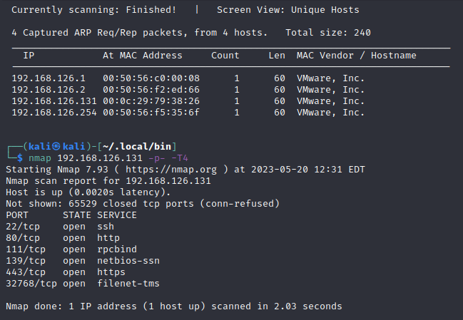
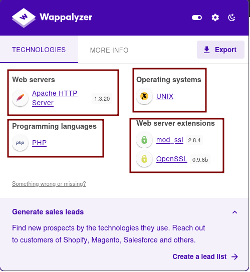
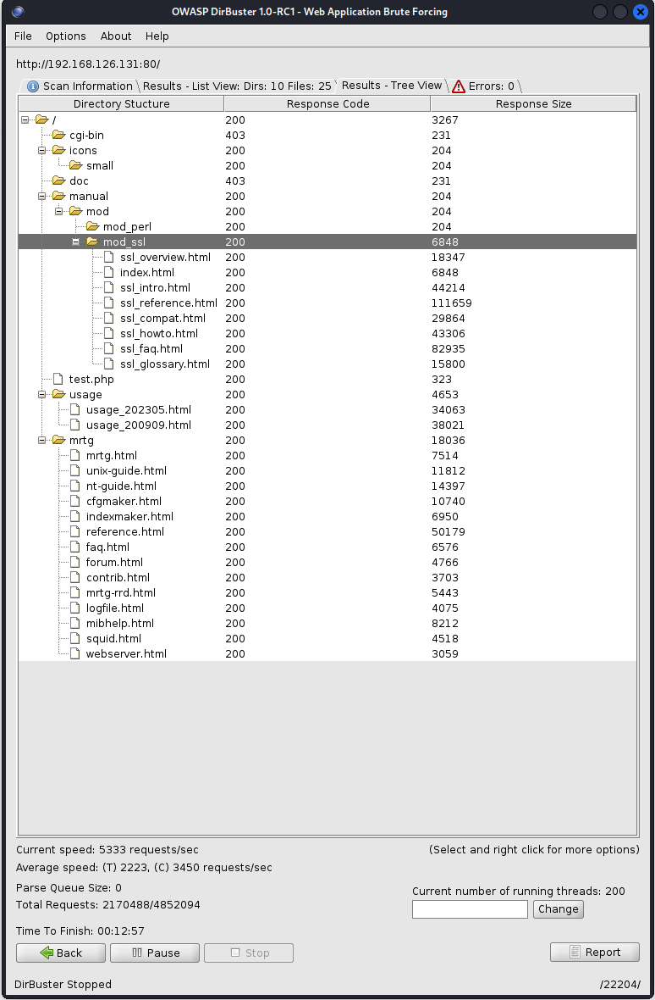
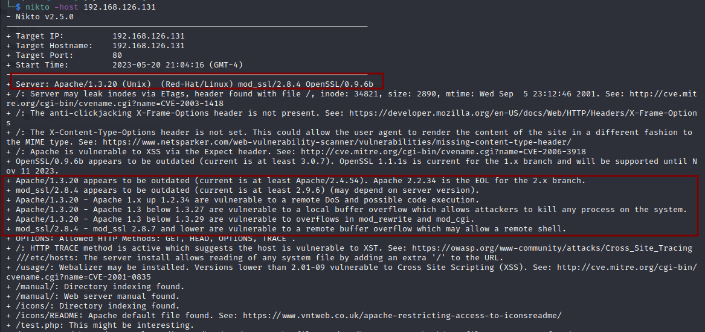
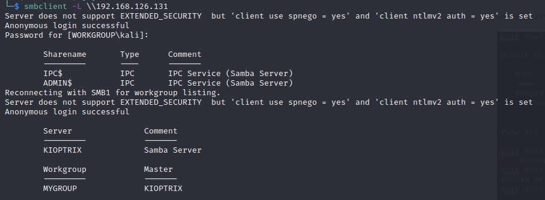
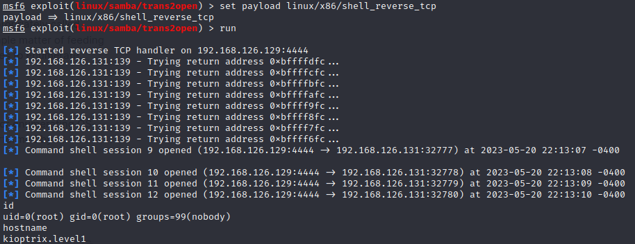

# Kloptrix Level 1

[TOC]

## Introduction

This Kioptrix VM Image are easy challenges. The object of the game is to acquire root access via any means possible (except actually hacking the VM server or player). The purpose of these games are to learn the basic tools and techniques in vulnerability assessment and exploitation. There are more ways then one to successfully complete the challenges.

## Enumeration

First we need to find out the IP Address of the target which is sitting in our network.

We can use nmap or netdiscover or fping to perform this task. In our case we are going to use netdiscover:

```
netdiscover -r 192.168.126.0/24
```

Great! According to the results we should

Let us start by performing an nmap scan on the target machine in order to know what services it is hosting.

```bash
nmap 192.168.126.131 -p- -T4
```

> Starting Nmap 7.93 ( https://nmap.org ) at 2023-05-20 12:28 EDT
> Nmap scan report for 192.168.126.131
> Host is up (0.00029s latency).
> Not shown: 65529 closed tcp ports (conn-refused)
> PORT      STATE SERVICE
> 22/tcp    open  ssh
> 80/tcp    open  http
> 111/tcp   open  rpcbind
> 139/tcp   open  netbios-ssn
> 443/tcp   open  https
> 32768/tcp open  filenet-tms



For the task at hand we are going to focus primarily on 3 services:

- HTTP on port 80
- SMB on port 139
- SSH on port 22

On this not a more aggressive enumeration with nmap using -A provided thee results below:

> PORT    STATE SERVICE     VERSION
> 22/tcp  open  ssh         **OpenSSH 2.9p2** (protocol 1.99)
> |_sshv1: Server supports SSHv1
> | ssh-hostkey: 
> |   1024 b8746cdbfd8be666e92a2bdf5e6f6486 (RSA1)
> |   1024 8f8e5b81ed21abc180e157a33c85c471 (DSA)
> |_  1024 ed4ea94a0614ff1514ceda3a80dbe281 (RSA)
> 80/tcp  open  http        **Apache httpd 1.3.20 ((Unix)  (Red-Hat/Linux) mod_ssl/2.8.4 OpenSSL/0.9.6b)**
> |_http-title: Test Page for the Apache Web Server on Red Hat Linux
> |_http-server-header: Apache/1.3.20 (Unix)  (Red-Hat/Linux) mod_ssl/2.8.4 OpenSSL/0.9.6b
> | http-methods: 
> |_  Potentially risky methods: TRACE
> 139/tcp open  **netbios-ssn Samba smbd** (workgroup: MYGROUP)
>
> Host script results:
> |_nbstat: NetBIOS name: KIOPTRIX, NetBIOS user: <unknown>, NetBIOS MAC: 000000000000 (Xerox)
> |_smb2-time: Protocol negotiation failed (SMB2)

## HTTP Enumeration

For HTTP Enumeration we are going to use:

1. Wappalyzer
2. Burp Suite
3. Dirbuster
4. Nikto

### Wappalyzer

Wappalyzer is a technology profiler tool used to identify the technologies and software being used on a website or web application. It provides information about the content management systems (CMS), e-commerce platforms, web servers, programming languages, analytics tools, and various other technologies employed by a website.

Therefore, by using this application which I as Firefox extension I was able to start the web server enumreation process by retrieving some useful information, such as, the OS and type of Web Server, Programming Language and extensions in use.




### Burp Suite

We can verify the findings above using Burp Suite and analyzing the server response from a GET response to the web server.


### Dirbuster

On top of Wappalyzer I also used Dirbuster, a web directory and file enumeration tool used for discovering hidden files and directories on a web server. 

From this point I opened some resources that I was able to discover using this tool and a couple of interesting findings are listed below.




- /mod - mod_ssl and OpenSSL
- /usage - The server may be using **Webalizer Version 2.01** to generate statistics related to web site usage.

- /mrtg - **Multi Router Traffic Grapher (MRTG)**, a tool to monitor the traffic load on network-links. MRTG generates HTML pages containing GIF images which provide a LIVE visual representation of this traffic.

An additional finding after navigating through the website:


### Nikto

Nikto is an open-source web vulnerability scanner that is widely used for security assessments and penetration testing of web servers. It is designed to identify potential vulnerabilities and misconfigurations in web applications.

A couple of interesting findings were highlighted on the screenshot below.



Great now that we have performed enumeration to the the HTTP web service, let's take note of this information and move on to SMB!


## SMB 

One information that we are lacking is the Samba version in use. In order to retrieve this information we can search for an auxiliary module in Metasploit that might help us to achieve our goal. Luckily, there is one and we can use it like it is displayed below to retrieve this information.

Samba Version (2.2.1a):


We can continue the enumeration proceess using smbclient or enum4linux. Below we are going tto list the shares available to us by trying an anonymous login using a blank password.



It worked! Can we login to any of the shares to access the files?


We were able to do so in IPC$ but we get an Access Denied error.

Now that we have gathered some interesting information related to SMB, let's move on to SSH.


## SSH

We can validate the information disclosed above by trying to connect to SSH using netcat.

```
nc 192.168.126.131 22   
```

> SSH-1.99-OpenSSH_2.9p2

Great! Alternatively, we could also try to SSH to the machine and hopefully a banner would be disclosed to the user providing the version in use.

With the information we have gathered above we can begin exploiting. There are many ways we can go with this and I am going to showcase the ones I found.


## Exploits

### Mod_SSL 2.8.4

If we research online vulnerabilities related to Mod_ssl 2.8.4 we can find [this Github](https://github.com/heltonWernik/OpenLuck) repository containing code to execute a Remote Buffer Overflow.

Unfortunately, after some troubleshooting I was not able to make this exploit work. I suspect the problems stems from the compilation step since it was generating a lot of warning and I think installed the correct library and did all the other steps correctly. 

You can try to perform this exploit by following the steps in the repository.

### Samba 2.2.1a

After searching online I easily found a vulnerability that would provide us with a shell. Luckily this exploit i integrated in Metasploit which helps us.

URL: https://www.rapid7.com/db/modules/exploit/linux/samba/trans2open/

exploit(linux/samba/trans2open)


Let's set the variables and try to get a shell!

My first attempt was a failure because the payload which was selected  by default was not stable for some reason:


In order to bypass this, I changed my payload to a non_staged one such as: linux/x86/shell_reverse_tcp:



We did it!
