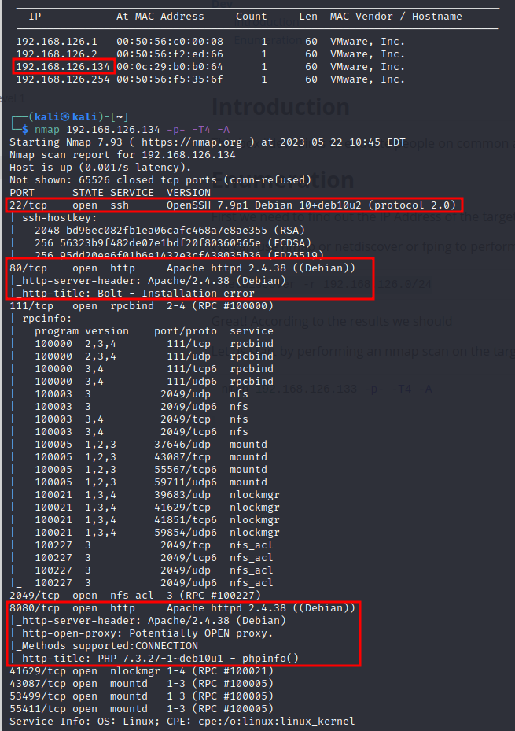
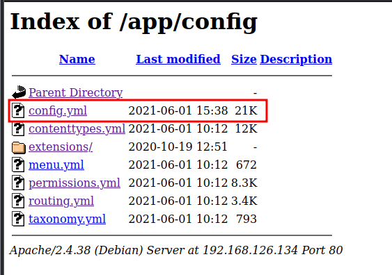
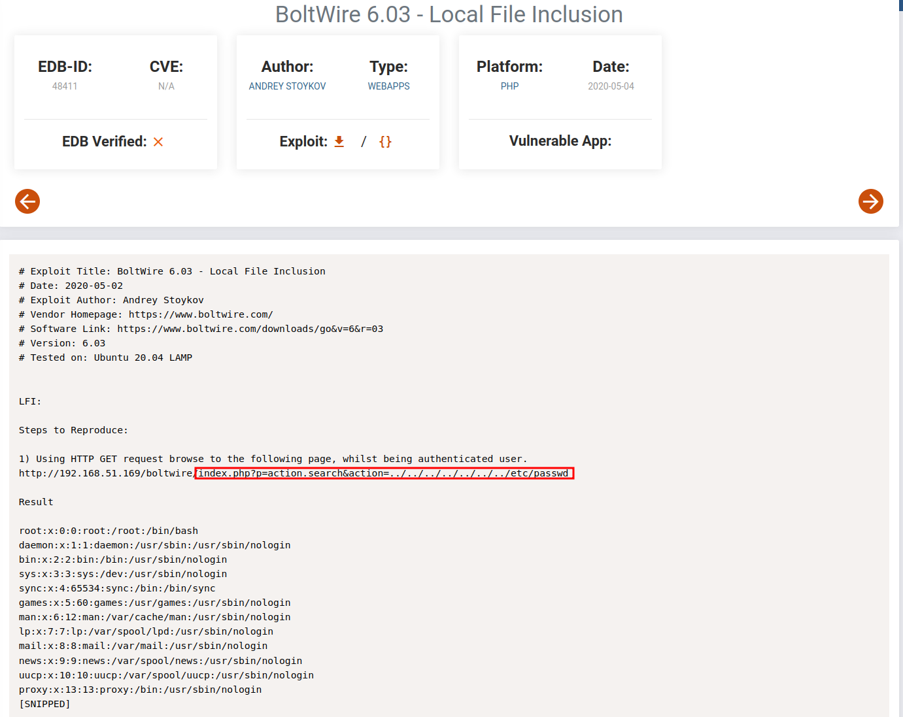
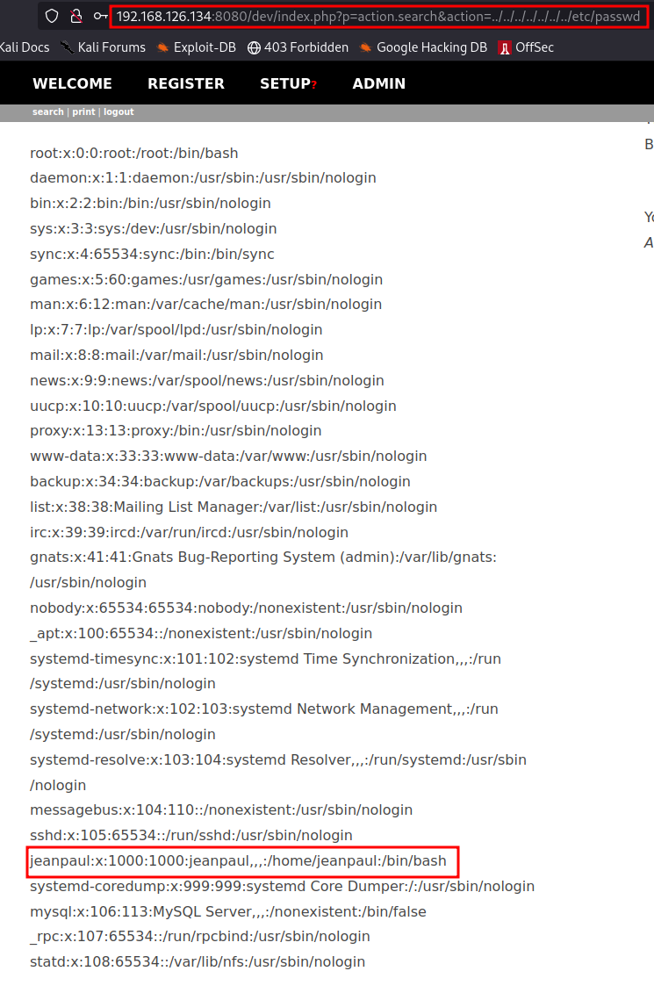
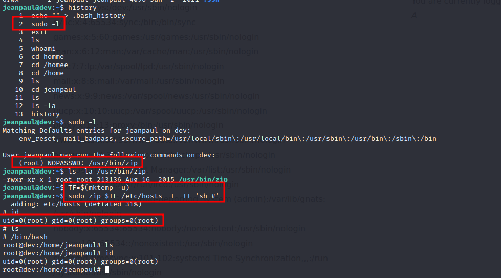

# Dev

[TOC]

## Introduction

This box "dev" aims to educate people on common and misconfigurations of a widely used developer tool.

## Enumeration

First we need to find out the IP Address of the target which is sitting in our network.

We can use nmap or netdiscover or fping to perform this task. In our case we are going to use netdiscover:

```
netdiscover -r 192.168.126.0/24
```

Great! According to the results we should

Let us start by performing an nmap scan on the target machine in order to know what services it is hosting.

```bash
nmap 192.168.126.133 -p- -T4 -A
```



For the task at hand we are going to focus primarily on 3 services:

- HTTP on port 80/8080
- NFS on port 2049
- SSH on port 22

### NFS

First thing's first let's check which folders are mountable on the target machine.


Great! Let's mount the folder and check its contents

```
mkdir tmp
sudo mount -t nfs 192.168.126.134:/srv/nfs /home/kali/Desktop/tmp
```

Great! Now we can access the folder and check its contents:

- save.zip

There is a zip file but if we try to `unzip save.zip` the file is password protected.

Let's perform a dictionary attack using john to try and crack this password.

First we generate a hash that we are going to try and crack with john:

```
zip2john save.zip > ziphash.txt
```

Now we attempt to crack the hash:

```
john --wordlist=/usr/share/wordlists/rockyou.txt ziphash.txt
```

We got the password!

After unzipping the file we find an id_rsa file which we can use in order to ssh into the target and a todo.txt which gives us a potential user name `jp`.

Unfortunately the command below does not grant us access:

```
ssh -i id_rsa jp@<ip>
```

We need to perform further enumeration then.


### HTTP

Moving on to HTTP on ports 80 and 8080. 

- Port 80 - Error Message related to Bolt CMS
- Port 8080 - PHP Version

Let's enumerate directories using Gobuster.

 

Some interesting results pop up. The /app directory contains a configuration file which discloses some information such as a database name, username and password.




The /dev website is the Boltwire CMS website but we are not able to login with the credentials above. Let's try to search online for vulnerabilities related to this CMS.



Unfortunately we need to be authenticated to use this exploit. Wait, we can just register a new account!



All that is left for us is to tie the previous information with this new one.

Let's SSH using id_rsa with JP aka jeanpaul and see what happens.

```
chmod 600 id_rsa
ssh -i id_rsa jeanpaul@<ip>
```

Wait we are being asked for a passphrase! Remember the password we found out in the configuration files! That's our key in!

Good job, you just got a foothold onto the machine. 

### Privilege Escalation

This privilege escalation vector is quite easy in the sense that the user left a clue in its history of bash commands to use the `sudo -l` command to verify if the current user can run any commands are sudo without a password.

We can see that the zip binary is here. Consulting GTFOBINS we can find an easy way to get root.



Congrats!
